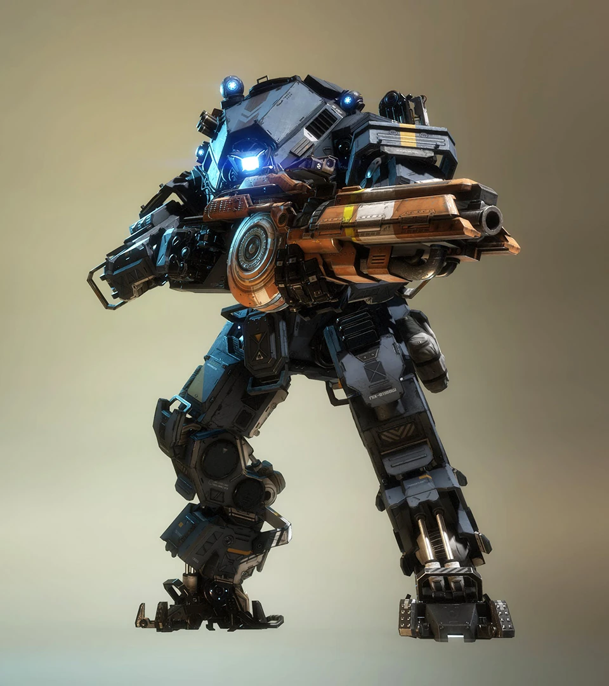
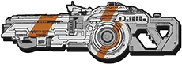

# 🛡️ Ion's Arsenal

## <mark style="color:yellow;">Ion</mark>

|                           Ion Loadout Screen                          |                                                                           Quote                                                                           |
| :-------------------------------------------------------------------: | :-------------------------------------------------------------------------------------------------------------------------------------------------------: |
|  | 
<em><strong>Ion uses its energy management abilities to divert power between its three weapons systems.</strong></em> — Old Website Description
 |



<figure><figcaption></figcaption></figure>



<figure><figcaption></figcaption></figure>







| General Information                                                                                           | Chassis & Loadout Specifications                                                                                                                            |
| ------------------------------------------------------------------------------------------------------------- | ----------------------------------------------------------------------------------------------------------------------------------------------------------- |
| <mark style="color:yellow;">**File Name:**</mark> Ajax                                                        | <mark style="color:yellow;">**Base Health:**</mark> 10,000                                                                                                  |
| <mark style="color:yellow;">**Class:**</mark> Ion                                                             | <mark style="color:yellow;">**Aegis Health:**</mark> 12,500                                                                                                 |
| <mark style="color:yellow;">**Type:**</mark> Titan                                                            | 
<mark style="color:yellow;"><strong>Dash Capacity:</strong></mark> 1 → 2 <mark style="color:yellow;"><strong>Dash Cooldown:</strong></mark> 6 sec
 |
| <mark style="color:yellow;">**Parent Chassis:**</mark> Atlas                                                  | <mark style="color:yellow;">**Primary Weapon:**</mark> Splitter Rifle                                                                                       |
| <mark style="color:yellow;">**Manufacturer:**</mark> Hammond Robotics                                         | <mark style="color:yellow;">**Ordnance Ability:**</mark> Laser Shot                                                                                         |
| <mark style="color:yellow;">**Sub-Variant:**</mark> Ion Prime                                                 | <mark style="color:yellow;">**Tactical Ability:**</mark> Tripwire                                                                                           |
| <mark style="color:yellow;">**User(s):**</mark> Slone, Pilots                                                 | <mark style="color:yellow;">**Defensive Ability:**</mark> Vortex Shield                                                                                     |
| <mark style="color:yellow;">**Conflict(s):**</mark> Frontier War                                              | <mark style="color:yellow;">**Core:**</mark> Laser Core                                                                                                     |
| <mark style="color:yellow;">**Appears in:**</mark> Titanfall 2, Titanfall: Assault, Stories from the Outlands | <mark style="color:yellow;">**Other Equipment:**</mark> Acolyte pod                                                                                         |

### <mark style="color:yellow;">Overview</mark>

Ion is a versatile, energy-based Titan built around precision management, mid-range control, and efficient damage output. Operating on the Atlas chassis, Ion balances mobility and durability while relying on a shared energy resource to power her abilities. This creates a unique playstyle focused on timing, resource control, and smart ability usage rather than raw sustained fire.

Ion excels in mid-range engagements where she can consistently apply pressure while managing her energy to both defend and attack. Being the best defensive Titan in the game, she can shield her teammates from the most destructive of firepower. Her kit rewards accuracy and discipline, but mistakes in energy management can leave her vulnerable at critical moments.

<mark style="color:yellow;">**Ion's Loadout**</mark>

* [**Splitter Rifle:**](ions-arsenal.md#splitter-rifle) Ion's primary weapon, firing weak energy shots that can be split into multiple beams for more damage but worse accuracy at the cost of increased energy consumption.
* <mark style="color:yellow;">**Energy Management System:**</mark> All of Ion’s abilities draw from a shared energy pool, making resource management a unique core part of her gameplay.
* [**Laser Shot:**](ions-arsenal.md#laser-shot) A high-damage singular shot precision beam that delivers strong burst damage.
* [**Tripwire:**](ions-arsenal.md#tripwire) Deploys laser-based traps that detonate when enemies pass through or destroy them, providing area control and defensive utility.
* [**Vortex Shield:**](ions-arsenal.md#vortex-shield) Absorbs incoming shots, projectiles, and entities, allowing her to reflect them back at the enemy, letting Ion to turn defense into offensive potential.
* [**Laser Core:**](ions-arsenal.md#laser-core) Ion’s core ability, unleashing a big continuous high-energy laser beam from her cockpit that melts enemy Titans in sustained bursts of damage.

Ion is a precision control Titan that rewards smart energy usage and calculated engagements. When played effectively, she can cycle between defense and offense seamlessly, maintaining pressure while punishing overextensions.

## <mark style="color:yellow;">Splitter Rifle</mark>&#x20;

<table data-full-width="false"><thead><tr><th align="center">HUD Icon</th><th align="center">Quote</th><th data-hidden></th></tr></thead><tbody><tr><td align="center"></td><td align="center"><em><strong>Rapid single-fire energy rifle with the ability to leverage the Ion's central energy system to fire 3 deadly shots at once.</strong></em> — Old Website Description</td><td></td></tr></tbody></table>

| General Information                                                           | Weapon Specifications                                                      |
| ----------------------------------------------------------------------------- | -------------------------------------------------------------------------- |
| <mark style="color:yellow;">**File Name:**</mark> particle accelerator        | <mark style="color:yellow;">**Fire Mode:**</mark> Fully automatic          |
| <mark style="color:yellow;">**Weapon Class:**</mark> Primary Weapon           | <mark style="color:yellow;">**Magazine Capacity:**</mark> 40 plasma rounds |
| <mark style="color:yellow;">**Weapon Type:**</mark> Energy rifle              | <mark style="color:yellow;">**Reload Time:**</mark> 3.75 sec               |
| <mark style="color:yellow;">**Manufacturer:**</mark> Brockhaurd Manufacturing | <mark style="color:yellow;">**Hit Registration:**</mark> Projectile        |
| <mark style="color:yellow;">**Special Feature:**</mark> Can split shots       | <mark style="color:yellow;">**Vortex Absorbable:**</mark> No               |

### <mark style="color:yellow;">Overview</mark>

The Splitter Rifle is Ion's primary weapon, providing reliable mid-range firepower through a fully automatic stream of energy projectiles. While effective on its own, the weapon's defining feature is its ability to split shots into multiple projectiles, allowing Ion to trade efficiency for increased close-range damage and wider coverage.

The Splitter Rifle draws from Ion's shared energy pool when firing split shots, making energy management an important part of maximizing its effectiveness. Its projectile-based rounds require leading targets at longer ranges but offer consistent pressure in most combat situations.

* <mark style="color:yellow;">Fully automatic energy rifle</mark> <mark style="color:yellow;">with a 40-round magazine</mark>
* <mark style="color:yellow;">Fires weak projectile-based energy rounds,</mark> <mark style="color:yellow;">requiring leading against mobile targets.</mark>
* <mark style="color:yellow;">Can split shots into</mark> <mark style="color:yellow;">three projectiles in a horizontal spread for</mark> <mark style="color:yellow;">more close-range damage.</mark>
* <mark style="color:yellow;">Split fire consumes energy from Ion's shared energy pool.</mark>
* <mark style="color:yellow;">Each splitshot projectile deals 70% base damage and 105% critical damage, totaling 210% base and 315% critical if all three shots hit.</mark>
* <mark style="color:yellow;">Effective at applying consistent pressure across various engagement ranges.</mark>
* <mark style="color:yellow;">Cannot be absorbed by Vortex Shield but can still be blocked.</mark>

The Splitter Rifle serves as a way to deal damage without energy cost, offering minor damage output while rewarding players who can balance weapon usage with careful energy management.

### <mark style="color:yellow;">Entangled Energy Kit</mark>

The Entangled Energy kit causes hits on Titan [weak points](../universal-mechanics/titan-weak-points.md) with the Splitter Rifle to give Ion energy. Only works for Splitter Rifle exclusively.

* <mark style="color:yellow;">3% energy gain with normal split shots.</mark>
* <mark style="color:yellow;">0.8% energy gain on split shot projectile, 2.4% total if all 3 projectiles in a shot hit.</mark>
* <mark style="color:yellow;">For reference split shots require 3% energy per shot, so hitting all crits will refund 2.4% energy of that shot, resulting in a mere 0.6% energy cost.</mark>

### <mark style="color:yellow;">Refraction Lens Kit</mark>

The Refraction Lens kit modifies the Splitter Rifle’s alt-fire mode, increasing the split projectile count to 5, increasing damage potential at the cost of higher energy consumption and a wider spread. This allows Ion to unleash devastating bursts of damage when all projectiles connect.

* <mark style="color:yellow;">5 shots instead of 3 with slightly lowered damage on each shot, more than normal alt fire.</mark>
* <mark style="color:yellow;">Higher energy cost per shot, limiting sustained fire.</mark>
* <mark style="color:yellow;">Increased spread, making it even less effective at longer ranges.</mark>

### <mark style="color:yellow;">Splitter Rifle Stats</mark>

<table><thead><tr><th width="295">Damage Type</th><th align="center" valign="middle">Base Damage</th><th align="center">Crit. (1.5x) Headshot (1x)</th></tr></thead><tbody><tr><td><mark style="color:yellow;">Titan Close</mark> <mark style="color:orange;">(far)</mark></td><td align="center" valign="middle"><mark style="color:yellow;">80</mark> <mark style="color:orange;">(60)</mark></td><td align="center"><mark style="color:yellow;">120</mark> <mark style="color:orange;">(90)</mark></td></tr><tr><td><mark style="color:yellow;">Entity Close</mark> <mark style="color:orange;">(far)</mark></td><td align="center" valign="middle"><mark style="color:yellow;">25</mark> <mark style="color:orange;">(20)</mark></td><td align="center">N.A.</td></tr><tr><td></td><td align="center" valign="middle"></td><td align="center"></td></tr><tr><td>Alt-Fire Mode (one projectile)</td><td align="center" valign="middle">70%</td><td align="center">105%</td></tr><tr><td><mark style="color:yellow;">Titan Close</mark> <mark style="color:orange;">(far)</mark></td><td align="center" valign="middle"><mark style="color:yellow;">56</mark> <mark style="color:orange;">(42)</mark></td><td align="center"><mark style="color:yellow;">84</mark> <mark style="color:orange;">(63)</mark></td></tr><tr><td><mark style="color:yellow;">Entity Close</mark> <mark style="color:orange;">(far)</mark></td><td align="center" valign="middle"><mark style="color:yellow;">17.5</mark> <mark style="color:orange;">(14)</mark></td><td align="center">N.A.</td></tr><tr><td>Alt-Fire Mode (total shot Dmg)</td><td align="center" valign="middle">210%</td><td align="center">315%</td></tr><tr><td><mark style="color:yellow;">Titan Close</mark> <mark style="color:orange;">(far)</mark></td><td align="center" valign="middle"><mark style="color:yellow;">168</mark> <mark style="color:orange;">(126)</mark></td><td align="center"><mark style="color:yellow;">252</mark> <mark style="color:orange;">(189)</mark></td></tr><tr><td><mark style="color:yellow;">Entity</mark> <mark style="color:yellow;">Close</mark> <mark style="color:orange;">(far)</mark></td><td align="center" valign="middle"><mark style="color:yellow;">52.5</mark> <mark style="color:orange;">(42)</mark></td><td align="center">N.A.</td></tr></tbody></table>

### <mark style="color:yellow;">Refraction Lenses Stats</mark>

<table><thead><tr><th width="295">Refraction Lenses Damage Type</th><th width="204" align="center">Base Damage</th><th align="center">Crit (1.5x) Headshot (1x)</th></tr></thead><tbody><tr><td>Alt-Fire Mode (one projectile)</td><td align="center">55%</td><td align="center">82.5%</td></tr><tr><td><mark style="color:yellow;">Titan Close</mark> <mark style="color:orange;">(far)</mark></td><td align="center"><mark style="color:yellow;">44</mark> <mark style="color:orange;">(33)</mark></td><td align="center"><mark style="color:yellow;">66</mark> <mark style="color:orange;">(50)</mark></td></tr><tr><td><mark style="color:yellow;">Entity Close</mark> <mark style="color:orange;">(far)</mark></td><td align="center"><mark style="color:yellow;">13.75</mark> <mark style="color:orange;">(11)</mark></td><td align="center">N.A.</td></tr><tr><td>Alt-Fire Mode (Total Shot Dmg)</td><td align="center">275%</td><td align="center">412.5%</td></tr><tr><td><mark style="color:yellow;">Titan Close</mark> <mark style="color:orange;">(far)</mark></td><td align="center"><mark style="color:yellow;">220</mark> <mark style="color:orange;">(165)</mark></td><td align="center"><mark style="color:yellow;">330</mark> <mark style="color:orange;">(248)</mark></td></tr><tr><td><mark style="color:yellow;">EntityClose</mark> <mark style="color:orange;">(far)</mark></td><td align="center"><mark style="color:yellow;">68.75</mark> <mark style="color:orange;">(55)</mark></td><td align="center">N.A.</td></tr></tbody></table>

<h2 align="center"><mark style="color:yellow;">Laser Shot</mark></h2>

<figure><figcaption></figcaption></figure>

<table data-card-size="large" data-column-title-hidden data-view="cards"><thead><tr><th>General Information</th><th>Ability Specifications</th></tr></thead><tbody><tr><td><mark style="color:yellow;"><strong>File Name:</strong></mark> laser lite</td><td><mark style="color:yellow;"><strong>Ability Mode:</strong></mark> Deploy / Hold</td></tr><tr><td><mark style="color:yellow;"><strong>Weapon Class:</strong></mark> Ordnance</td><td><mark style="color:yellow;"><strong>Max Hold Duration:</strong></mark> 3 sec</td></tr><tr><td><mark style="color:yellow;"><strong>Weapon Type:</strong></mark> Precision laser</td><td><mark style="color:yellow;"><strong>Cooldown:</strong></mark> N.A. <mark style="color:yellow;"><strong>Energy Cost:</strong></mark> 550 (55%)</td></tr></tbody></table>

### <mark style="color:yellow;">Overview</mark>

Laser Shot is Ion's ordnance ability, firing a singular shot of a concentrated beam of energy that delivers high burst damage with pinpoint accuracy. Unlike the Splitter Rifle, Laser Shot is designed for precision strikes, allowing Ion to quickly punish exposed enemies or finish off weakened targets from a distance.

The beam is fired instantly from her left shoulder-mounted acolyte pod and travels in a straight line, making it highly effective against both Titans and Pilots. However, Laser Shot consumes a significant portion of Ion's shared energy pool, requiring careful timing and resource management to avoid leaving herself without energy for defensive abilities.

* <mark style="color:yellow;">Fires a</mark> <mark style="color:yellow;">singular shot</mark> <mark style="color:yellow;">high-precision laser capable of piercing through multiple Pilots.</mark>
* <mark style="color:yellow;">Can one-shot Pilots and can crit Titans.</mark>
* <mark style="color:yellow;">Hits instantly with no projectile travel time.</mark>
* <mark style="color:yellow;">Consumes 55% of Ion's shared energy pool per use.</mark>
* <mark style="color:yellow;">Effective at long-range engagements and finishing weakened targets.</mark>
* <mark style="color:yellow;">The max range is approximately half the size of the Homestead map.</mark>
* <mark style="color:yellow;">It can be held for up to 3 seconds before firing and melee'ed to cancel the shot.</mark>
* <mark style="color:yellow;">Aiming down sights is available for better accuracy when holding it.</mark>
* <mark style="color:yellow;">Produces a loud charge-up sound that can be heard through walls.</mark>
* <mark style="color:yellow;">Rewards accuracy and careful energy management.</mark>
* <mark style="color:yellow;">Small flat splash on impact that can only hit enemies touching the ground.</mark>
* <mark style="color:yellow;">Fired from the left shoulder.</mark>

Laser Shot is one of Ion's most powerful offensive tools, providing reliable burst damage at virtually any range. When used wisely, it allows Ion to apply constant pressure while capitalizing on enemy mistakes.

### <mark style="color:yellow;">Laser Shot Stats</mark>

| Damage Type                               |                Base Damage               |        Crit (1.5x) Headshot (N.A.)       |
| ----------------------------------------- | :--------------------------------------: | :--------------------------------------: |
| <mark style="color:yellow;">Titan</mark>  | <mark style="color:yellow;">1,200</mark> | <mark style="color:yellow;">1,800</mark> |
| <mark style="color:yellow;">Entity</mark> |  <mark style="color:yellow;">300</mark>  |                   N.A.                   |
| Splash Damage                             |           Same Damage for Both           |                   N.A.                   |

<h2 align="center"><mark style="color:yellow;">Tripwire</mark></h2>

<figure><figcaption></figcaption></figure>

<table data-card-size="large" data-column-title-hidden data-view="cards"><thead><tr><th>General Information</th><th>Ability Specifications</th></tr></thead><tbody><tr><td><mark style="color:yellow;"><strong>File Name:</strong></mark> laser trip</td><td><mark style="color:yellow;"><strong>Ability Mode:</strong></mark> Deploy</td></tr><tr><td><mark style="color:yellow;"><strong>Weapon Class:</strong></mark> Tactical</td><td><mark style="color:yellow;"><strong>Max Duration:</strong></mark> 12 sec</td></tr><tr><td><mark style="color:yellow;"><strong>Weapon Type:</strong></mark> Mine</td><td><mark style="color:yellow;"><strong>Cooldown:</strong></mark> 10 sec (no refill start delay)</td></tr><tr><td><mark style="color:yellow;"><strong>Function:</strong></mark> Block off enemy path, vaporize Pilots</td><td><mark style="color:yellow;"><strong>Max Durability:</strong></mark> 250 Titan health <mark style="color:yellow;"><strong>Energy Cost:</strong></mark> 350 (35%)</td></tr></tbody></table>

### <mark style="color:yellow;">Overview</mark>

Tripwire is Ion's tactical ability, deploying 3 explosive pylons that detonate when one touches the energy beam connected between them. Designed for area denial and defensive control, Tripwire can briefly block off pathways, discourage enemy advances, and punish Titans or Pilots that attempt to pass through it.

Once deployed, the mines remain active for a limited time, creating a hazardous zone that can deal significant damage to enemy Titans while instantly eliminating any Pilots. Because Tripwire consumes energy from Ion's shared energy pool, it must be used thoughtfully alongside her other abilities.

* <mark style="color:yellow;">Deploys a laser-based trap that consists of 3 explosive pylons interconnected via a laser beam.</mark>
* <mark style="color:yellow;">Explodes when anything touches the laser beam or destroys one of the pylons.</mark>
* <mark style="color:yellow;">Instantly vaporizes Pilots in a large explosion, even one rodeoing a Titan that goes through one.</mark>
* <mark style="color:yellow;">Effective for forcing the enemy to back off briefly or take good damage for low energy.</mark>
* <mark style="color:yellow;">It can be used defensively or to pressure enemies into unfavorable positions.</mark>
* <mark style="color:yellow;">Tossing the Tripwire into enemy E-Smoke or Thermal Shield will cause it to detonate.</mark>
* <mark style="color:yellow;">Remains active for up to 12 seconds.</mark>
* <mark style="color:yellow;">Consumes 35% energy from Ion's shared energy pool when deployed.</mark>

Tripwire provides Ion with valuable battlefield control, allowing her to limit enemy movement and create safer engagement zones. When placed strategically, it can force opponents to either take damage or alter their approach entirely.

### <mark style="color:yellow;">**Zero Point Energy Kit**</mark>

The Zero Point Energy kit eliminates Tripwire’s energy cost, allowing for more frequent and unrestricted deployment.

* <mark style="color:yellow;">Removes the 350 energy cost, making Tripwire free to use.</mark>
* <mark style="color:yellow;">Does not alter cooldown, duration, or damage values.</mark>

### <mark style="color:yellow;">Tripwire Stats</mark>

| Damage Type                               |                Base Damage               | Crit (N.A.) Headshot (N.A.) |
| ----------------------------------------- | :--------------------------------------: | :-------------------------: |
| <mark style="color:yellow;">Titan</mark>  | <mark style="color:yellow;">1,500</mark> |             N.A.            |
| <mark style="color:yellow;">Entity</mark> |  <mark style="color:yellow;">100</mark>  |             N.A.            |

<h2 align="center"><mark style="color:yellow;">Vortex Shield</mark></h2>

<figure><figcaption></figcaption></figure>

<table data-card-size="large" data-column-title-hidden data-view="cards"><thead><tr><th>General Information</th><th>Ability Specifications</th></tr></thead><tbody><tr><td><mark style="color:yellow;"><strong>File Name:</strong></mark> vortex shield ion</td><td><mark style="color:yellow;"><strong>Ability Mode:</strong></mark> Charge</td></tr><tr><td><mark style="color:yellow;"><strong>Weapon Class:</strong></mark> Defensive</td><td><mark style="color:yellow;"><strong>Max Duration:</strong></mark> 8 sec</td></tr><tr><td><mark style="color:yellow;"><strong>Weapon Type:</strong></mark> Energy shield</td><td><mark style="color:yellow;"><strong>Cooldown:</strong></mark> 12 sec</td></tr><tr><td><mark style="color:yellow;"><strong>Function:</strong></mark> Catch projectiles, bullets, and throwable entities, and fire them back</td><td><mark style="color:yellow;"><strong>Max Durability:</strong></mark> 1000 energy  <mark style="color:yellow;"><strong>Max Ammo:</strong></mark> 31 bullets and 31 projectiles</td></tr></tbody></table>

### <mark style="color:yellow;">Overview</mark>

Vortex Shield is Ion's defensive ability, generating an energy field capable of capturing incoming projectiles and returning them to their sender[^1]. Unlike traditional shields that simply absorb damage, Vortex Shield allows Ion to turn an opponent's firepower against them, making it the strongest and most versatile defensive tool in the game.

While active, the shield can catch bullets, projectiles, and many throwable entities and store them within the vortex. Releasing the shield launches the captured shots, projectiles, and entities forward, dealing damage to enemies. However, Vortex Shield draws from Ion's shared energy pool, requiring careful management to balance offense and defense.

* <mark style="color:yellow;">Catches bullets, projectiles, and many throwable entities.</mark>
* <mark style="color:yellow;">Can store up to 31 bullets and 31 projectiles separately</mark> <mark style="color:yellow;">(62 total shots)</mark><mark style="color:yellow;">.</mark>
* <mark style="color:yellow;">Fires back caught bullets, projectiles, and throwable entities when released.</mark>
* <mark style="color:yellow;">Converts ANY bullet into a vortex bullet that deals a set amount of damage.</mark>
* <mark style="color:yellow;">If at least 2 bullets are stored, they will be fired back in a cone like a Power Shot.</mark>
* <mark style="color:yellow;">Energy-based attacks like those from the Splitter Rifle and Laser Shot get destroyed upon contact.</mark>
* <mark style="color:yellow;">Uses Ion's shared energy pool while active.</mark>
* <mark style="color:yellow;">Has 8 seconds of duration and takes 12 seconds to fully recharge.</mark>
* <mark style="color:yellow;">Depletes over time and drains faster when hit by arc rounds and energy-draining core attacks.</mark>
* <mark style="color:yellow;">Effective against Titans that rely heavily on bullet-firing weapons.</mark>
* <mark style="color:yellow;">Vortex Shield has an absurdly large hitbox against projectiles that's not properly shown.</mark>
* <mark style="color:yellow;">Cannot</mark> [crit](../universal-mechanics/titan-weak-points.md#titan-weapon-ability-crit-table) <mark style="color:yellow;">enemy Titans.</mark>
* <mark style="color:yellow;">Cannot block explosions and</mark> [thermite droplets.](../scorch/scorch-tech/thermite-droplets-pierce-shield.md)

Vortex Shield is the cornerstone of Ion's defensive playstyle, rewarding good timing and awareness. When used effectively, it can completely negate enemy attacks while creating opportunities for powerful counterattacks.

### <mark style="color:yellow;">**Amped Vortex Kit**</mark>

The Amped Vortex kit enhances the Vortex Shield’s returning firepower, making it more lethal against Pilots and Titans. However, it does not increase the damage of reflected projectiles.

* <mark style="color:yellow;">Increases reflected bullet damage by 35%.</mark>
* <mark style="color:yellow;">New damage: 47.25 vs. Pilots, 189 vs. Titans.</mark>
* <mark style="color:yellow;">Does not enhance projectile damage.</mark>
* <mark style="color:yellow;">Maintains the same storage capacity and spread mechanics.</mark>

### <mark style="color:yellow;">Vortex Shield Stats</mark>

<table><thead><tr><th width="294">Vortex Fired Back Dmg Type</th><th align="center">Base Damage per x</th><th align="center">Crit. (1x) Headshot (1x)</th></tr></thead><tbody><tr><td><mark style="color:yellow;">Bullet: Titan</mark> <mark style="color:orange;">(Full Vortex)</mark></td><td align="center"><mark style="color:yellow;">140</mark> <mark style="color:orange;">(4,340)</mark></td><td align="center">N.A.</td></tr><tr><td><mark style="color:yellow;">Bullet: Entity</mark> <mark style="color:orange;">(Full Vortex)</mark></td><td align="center"><mark style="color:yellow;">35</mark> <mark style="color:orange;">(1,085)</mark></td><td align="center">N.A.</td></tr><tr><td>Projectile</td><td align="center">Depends on Projectile</td><td align="center">Depends on Projectile</td></tr><tr><td>Throwable Entity</td><td align="center">Converts to Friendly</td><td align="center">N.A.</td></tr></tbody></table>

### <mark style="color:yellow;">Amped Vortex Shield Stats</mark>

| Amped Vortex Fired Back                                                                            |                                    Base Damage                                    | Crit (1x) Headshot (1x) |
| -------------------------------------------------------------------------------------------------- | :-------------------------------------------------------------------------------: | :---------------------: |
| <mark style="color:yellow;">Bullet: Titan</mark> <mark style="color:orange;">(Full Vortex)</mark>  | <mark style="color:yellow;">189</mark> <mark style="color:orange;">(5,859)</mark> |           N.A.          |
| <mark style="color:yellow;">Bullet: Entity</mark> <mark style="color:orange;">(Full Vortex)</mark> |  <mark style="color:yellow;">47</mark> <mark style="color:orange;">(1,457)</mark> |           N.A.          |
| Projectile                                                                                         |                                 No Damage Increase                                |    No Damage Increase   |
| Throwable Entity                                                                                   |                                 No Damage Increase                                |           N.A.          |

<h2 align="center"><mark style="color:yellow;">Laser Core</mark></h2>

<figure><figcaption></figcaption></figure>

<table data-card-size="large" data-column-title-hidden data-view="cards"><thead><tr><th>General Information</th><th>Core Specifications</th></tr></thead><tbody><tr><td><mark style="color:yellow;"><strong>File Name:</strong></mark> laser cannon</td><td><mark style="color:yellow;"><strong>Core Type:</strong></mark> DPS core</td></tr><tr><td><mark style="color:yellow;"><strong>Weapon Class:</strong></mark> Titan Core Ability</td><td><mark style="color:yellow;"><strong>Max Duration:</strong></mark> 3.5 seconds  (5 seconds with Grand Cannon)</td></tr><tr><td><mark style="color:yellow;"><strong>Weapon Type:</strong></mark> Continuous laser beam</td><td><mark style="color:yellow;"><strong>Addition:</strong></mark> Hitscan, Laser Shot range</td></tr></tbody></table>

### <mark style="color:yellow;">Overview</mark>

coreLaser Core is Ion's core ability, unleashing a continuous high-energy laser beam capable of dealing devastating damage to enemy Titans. Unlike most core abilities, Laser Core fires instantly and uses a hitscan beam, allowing Ion to maintain precise damage output across long distances without worrying about projectile travel time.

The beam deals extremely high sustained damage and is particularly effective against defensive abilities. Particle Walls and Gun Shields are destroyed instantly, while defensive barriers such as Vortex Shield and Thermal Shield can be rapidly depleted under continuous fire. Because the beam is fired from Ion's head-level camera position rather than her chest, Laser Core can also be used to attack over certain pieces of cover that would normally block line of sight. Ion is unable to dash or do anything apart from walk and aim the Laser Core while it's active.

* <mark style="color:yellow;">Fires a continuous oversized</mark> [<mark style="color:yellow;">hitscan</mark>](#user-content-fn-2)[^2] <mark style="color:yellow;">laser beam.</mark>
* <mark style="color:yellow;">Fired from Ion's head position, allowing firing over some chest-height cover.</mark>
* <mark style="color:yellow;">Lasts for up to 3.5 seconds.</mark>
* <mark style="color:yellow;">Deals extremely high sustained damage to Titans.</mark>
* <mark style="color:yellow;">Instantly destroys Particle Walls and Gun Shields.</mark>
* <mark style="color:yellow;">Drains Thermal Shields and Vortex Shields within seconds.</mark>
* <mark style="color:yellow;">Limited range, similar to Laser Shot.</mark>
* <mark style="color:yellow;">Has similar splash damage to Laser Shot.</mark>
* <mark style="color:yellow;">It's the only core in the game to be able to kill a</mark> [Pilot rodeoing a shielded Titan.](../universal-mechanics/rodeo-guard.md)
* <mark style="color:yellow;">Has NO lag compensation, meaning you'll need to predict aim it like a projectile on worse ping.</mark>
  * (Uses some kind of sustained discharge code which doesn't use the typical weapon functions, hence why it has no lag compensation.)

Laser Core is a really destructive core if you manage to sustain fire onto an enemy. It combines exceptional damage output with perfect accuracy. When activated at the right moment, it can quickly dismantle enemy defenses and melt through even the toughest Titans, excluding Ronin using Sword Block.

### <mark style="color:yellow;">**Grand Cannon Kit**</mark>

The Grand Cannon kit extends the duration of the Laser Core, increasing its sustained damage potential.

* <mark style="color:yellow;">Increases Laser Core duration from 3.5 seconds to 5 seconds.</mark>
* <mark style="color:yellow;">Does not alter damage, range, and shield-draining properties.</mark>

### <mark style="color:yellow;">Laser Core Stats</mark>

| Damage Typ                                |               Base Damage              | Crit. (N.A.) Headshot (N.A.) |
| ----------------------------------------- | :------------------------------------: | :--------------------------: |
| <mark style="color:yellow;">Titan</mark>  | <mark style="color:yellow;">325</mark> |             N.A.             |
| <mark style="color:yellow;">Entity</mark> | <mark style="color:yellow;">325</mark> |             N.A.             |
| Splash Damage                             |              Same for Both             |             N.A.             |

[^1]: "Return to sender" achievement unlocked.

[^2]: Instant travel time, like bullets.
