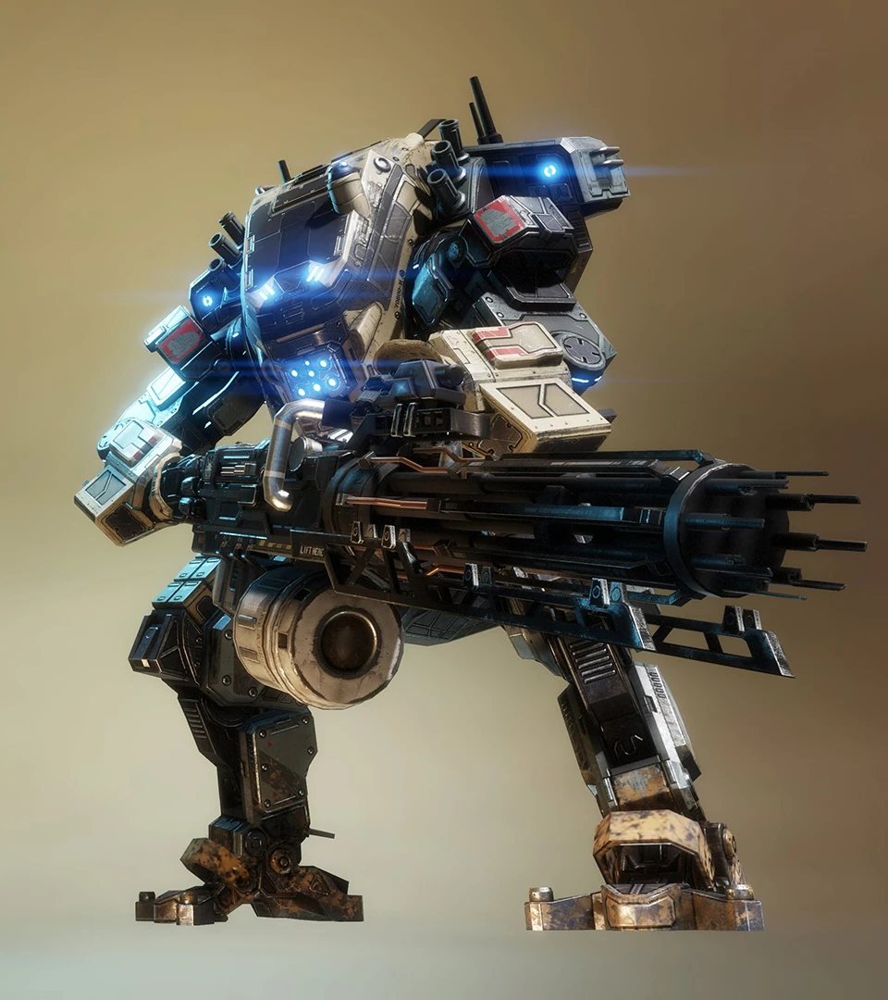
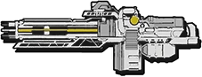

# 🛡️ Legion's Arsenal

## <mark style="color:yellow;">Legion</mark>

|                           Legion Loadout Screen                          |                                                                        Quote                                                                        |
| :----------------------------------------------------------------------: | :-------------------------------------------------------------------------------------------------------------------------------------------------: |
|  | 
<em><strong>Legion utilizes an assortment of ballistic abilities focusing on defense and control.</strong></em> — Old Website Description
 |



<figure><figcaption></figcaption></figure>



<figure><figcaption></figcaption></figure>







| General Information                                                                                                         | Chassis & Loadout Specifications                                                                                                                               |
| --------------------------------------------------------------------------------------------------------------------------- | -------------------------------------------------------------------------------------------------------------------------------------------------------------- |
| <mark style="color:yellow;">**File Name:**</mark> Deadbolt                                                                  | <mark style="color:yellow;">**Base Health:**</mark> 12,500                                                                                                     |
| <mark style="color:yellow;">**Class:**</mark> Legion                                                                        | <mark style="color:yellow;">**Aegis Health:**</mark> 15,000                                                                                                    |
| <mark style="color:yellow;">**Type:**</mark> Heavy Titan                                                                    | 
<mark style="color:yellow;"><strong>Dash Capacity:</strong></mark> 1 <mark style="color:yellow;"><strong>Dash Cooldown:</strong></mark> 10 -> 5 sec 
 |
| <mark style="color:yellow;">**Parent Chassis:**</mark> Ogre                                                                 | <mark style="color:yellow;">**Primary Weapon:**</mark> Predator Cannon                                                                                         |
| <mark style="color:yellow;">**Manufacturer:**</mark> Hammond Robotics                                                       | <mark style="color:yellow;">**Ordnance Ability:**</mark> Power Shot                                                                                            |
| <mark style="color:yellow;">**Sub-Variant:**</mark> Legion Prime                                                            | <mark style="color:yellow;">**Tactical Ability:**</mark> Mode Switch                                                                                           |
| <mark style="color:yellow;">**User(s):**</mark> Kuben Blisk, Pilots                                                         | <mark style="color:yellow;">**Defensive Ability:**</mark> Gun Shield                                                                                           |
| <mark style="color:yellow;">**Conflict(s):**</mark> Frontier War                                                            | <mark style="color:yellow;">**Core:**</mark> Smart Core                                                                                                        |
| <mark style="color:yellow;">**Appears In:**</mark> Titanfall 2, Titanfall: Assault, Stories from the Outlands, Apex Legends | <mark style="color:yellow;">**Other Equipment:**</mark> N.A.                                                                                                   |
| <mark style="color:yellow;">**Ogre Trait:**</mark> 25% knockback reduction from Plasma Railgun and melees                   |                                                                                                                                                                |

### <mark style="color:yellow;">Overview</mark>

Legion is a heavy offense-and-suppression Titan built for sustained frontline combat and overwhelming firepower. Wielding the massive Ogre chassis, Legion sacrifices mobility for extreme durability and unmatched sustained damage output. His loadout is designed to lock down areas, suppress enemy advances, and win extended firefights through sheer volume of fire.

Legion excels at controlling space through constant pressure, forcing enemies to either retreat or endure continuous damage. However, his slow movement and limited close-range adaptability make him vulnerable to pushes from multiple Titans at once and highly mobile Titans that can avoid his line of fire.

<mark style="color:yellow;">**Legion's Loadout**</mark>

* [**Predator Cannon:**](legions-arsenal.md#predator-cannon) Legion's primary weapon, a heavy minigun that delivers sustained, high-volume damage at the cost of mobility, with all abilities tied around the gun.
* [**Power Shot:**](legions-arsenal.md#power-shot) A powerful shot that changes based on firing mode:
  * Close-range shotgun-like blast that deals full damage to anything in its range.
  * Long-range Plasma Railgun-like projectile that also can pierce through multiple Titans and has a big splash area on impact.
* [**Mode Switch:**](legions-arsenal.md#mode-switch) Allows Legion to toggle between two firing modes, close-range and long-range:
  * Close-range fire with accuracy falloff over range.
  * Long-range precision fire that uses 2 bullets per shot.&#x20;
* [**Gun Shield:**](legions-arsenal.md#gun-shield) Deploys a frontal energy shield around the gun that absorbs incoming fire while allowing Legion to continue shooting, enabling powerful protected sustained fire.
* [**Smart Core:**](legions-arsenal.md#smart-core) Legion’s core ability, granting unlimited ammo, 20% increased damage to all damage, and fully automatic tracking for a short duration.

Legion is a pure suppression Titan that dominates through sustained firepower and area control. When positioned well, he can suppress enemies with unmatched sustained firepower, but he must rely on support or smart positioning to avoid being pushed by multiple Titans or outmaneuvered by faster Titans.

## <mark style="color:yellow;">Predator Cannon</mark>

|                                       HUD Icon                                      |                                                               Quote                                                              |
| :---------------------------------------------------------------------------------: | :------------------------------------------------------------------------------------------------------------------------------: |
|  | 
<em><strong>Powerful minigun with a long spin-up time before it starts firing.</strong></em> — Old Website Description
 |

| General Information                                                                                                         | Weapon Specifications                                                                                                                                                     |
| --------------------------------------------------------------------------------------------------------------------------- | ------------------------------------------------------------------------------------------------------------------------------------------------------------------------- |
| <mark style="color:yellow;">**File Name:**</mark> predator cannon                                                           | <mark style="color:yellow;">**Fire Mode:**</mark> Automatic                                                                                                               |
| <mark style="color:yellow;">**Weapon Class:**</mark> Primary Weapon                                                         | <mark style="color:yellow;">**Magazine Capacity:**</mark> 100 bulets                                                                                                      |
| <mark style="color:yellow;">**Weapon Type:**</mark> Rotary minigun                                                          | <mark style="color:yellow;">**Reload Time:**</mark> 4.1 sec                                                                                                               |
| <mark style="color:yellow;">**Manufacturer:**</mark> Lastimosa Armory                                                       | <mark style="color:yellow;">**Hit Registration:**</mark> Hitscan                                                                                                          |
| <mark style="color:yellow;">**Special Feature:**</mark> Changes accurary, 2 shot consumption, and abilites with mode switch | 
<mark style="color:yellow;"><strong>Vortex Absorbable:</strong></mark> Yes <mark style="color:yellow;"><strong>Fire Rate:</strong></mark> 15 bullets per second
 |

### <mark style="color:yellow;">Overview</mark>

The Predator Cannon is Legion’s primary weapon, a massive rotary minigun designed for sustained suppression and overwhelming firepower. Built for both close and long-range engagements, it delivers continuous ballistic damage that can melt through enemy Titans when kept on target.

Unlike precision-focused weapons, the Predator Cannon rewards sustained tracking and pressure. Its two firing modes allow Legion to adapt between long-range precision bursts and close-range shredding fire, making it a highly versatile tool for locking down lanes and winning extended firefights.

* <mark style="color:yellow;">Fully automatic rotary minigun.</mark>
* <mark style="color:yellow;">Switchable firing modes for close-range and long-range combat.</mark>
* <mark style="color:yellow;">Delivers sustained high DPS when tracking targets effectively.</mark>
* <mark style="color:yellow;">Deals more DPS than Laser Core and XO-16 Chaingun via crits.</mark>
* <mark style="color:yellow;">Excels at singular Titan suppression.</mark>
* <mark style="color:yellow;">Legion walks at 55% walking speed movement when aiming down the Predator Cannon.</mark>
* <mark style="color:yellow;">Requires sustained aim to maximize damage output.</mark>
* <mark style="color:yellow;">Has the slowest reload in the game, making him there the most vulnerable.</mark>
* <mark style="color:yellow;">Has a long gun revving animation and needs to be fully reved in via zoom to fire.</mark>
* <mark style="color:yellow;">Fires yellow tracers in close range mode and is inaccurate.</mark>
* <mark style="color:yellow;">Fires red tracers in long-range mode and is accurate but consumes 2 bullets per shot.</mark>
* <mark style="color:yellow;">The two modes have no effect on damage stats and damage falloff range.</mark>

The Predator Cannon defines Legion’s role as a frontline suppression Titan, turning prolonged engagements into a war of attrition where consistent firepower decides the outcome.

### <mark style="color:yellow;">Enhanced Ammo Capacity Kit</mark>

The Enhanced Ammo Capacity kit increases Legion's max magazine size from 100 to 140 bullets. Letting him suppress enemies for far longer between reloads.

### <mark style="color:yellow;">Light-Weight Alloys Kit</mark>

The Light-Weight Alloys kit lets Legion move noticably faster with the Predator Cannon fully reved up.  The movement speed penalty is reduced from 55% to 75% of base walking speed when aiming down sights. Letting Legion comfortably backpedal Scorches and push more aggresively.

### <mark style="color:yellow;">Predator Cannon Stats</mark>

| Damage Type                                                                              |                              Base Damage per Shot                              |                           Crit (1.5x) / Headshot (1.5x)                           |
| ---------------------------------------------------------------------------------------- | :----------------------------------------------------------------------------: | :-------------------------------------------------------------------------------: |
| <mark style="color:yellow;">Titan Close</mark> <mark style="color:orange;">(far)</mark>  | <mark style="color:yellow;">100</mark> <mark style="color:orange;">(72)</mark> |  <mark style="color:yellow;">150</mark> <mark style="color:orange;">(108)</mark>  |
| <mark style="color:yellow;">Entity Close</mark> <mark style="color:orange;">(far)</mark> |  <mark style="color:yellow;">35</mark> <mark style="color:orange;">(25)</mark> | <mark style="color:yellow;">52,5</mark> <mark style="color:orange;">(37,5)</mark> |


Predator Cannon deals at close range 1,500 Titan DPS, 2,250 DPS with crits, and\
525 Entity DPS.


<h2 align="center"><mark style="color:yellow;">Power Shot</mark></h2>

<figure><figcaption></figcaption></figure>

<table data-card-size="large" data-view="cards"><thead><tr><th></th><th></th></tr></thead><tbody><tr><td><mark style="color:yellow;"><strong>File Name:</strong></mark> power shot</td><td><mark style="color:yellow;"><strong>Ability Mode:</strong></mark> Deploy <mark style="color:yellow;"><strong>Weapon Type:</strong></mark>  Programmable kinetic payload</td></tr><tr><td><mark style="color:yellow;"><strong>Weapon Class:</strong></mark> Ordnance</td><td><mark style="color:yellow;"><strong>Hit Registration:</strong></mark>  Close-range: Hitscan Long-range: Projectile</td></tr><tr><td></td><td><mark style="color:yellow;"><strong>Cooldown:</strong></mark> 8 sec (1 sec refill start delay)  <mark style="color:yellow;"><strong>Vortex Absorbable:</strong></mark> Yes  Close-range: 1-16 bullets Long-range: 1 bullet</td></tr><tr><td> <mark style="color:yellow;"><strong>Special:</strong></mark> Has 2 different mods: Close-range -> fires a high knockback shotgun blast Long-range -> fires a long range piercing explosive railgun shot</td><td></td></tr></tbody></table>

### <mark style="color:yellow;">Overview</mark>

Power Shot is Legion’s ordnance ability, firing one of two different kinetic payloads from the Predator Cannon that can either knockback enemies via a shotgun blast or fire a single long-range explosive piercing Railgun shot. It is designed as a utility tool for dealing massive burst damage at any range, creating space, and punishing Titans that get too close.

Close-range Power Shot is designed for knocking back and hitting multiple Titans heavily at once and also to vaporize ejecting Pilots. While the long-range Power Shot is meant for dealing heavy damage to any Titans standing in a line of the singular projectile and to also kill any Pilots hiding behind cover or pulling a battery carelessly.

* <mark style="color:yellow;">Close-range Power Shot fires a wide shotgun blast that deals heavy damage and knocks back enemy Titans.</mark>
* <mark style="color:yellow;">Long-range Power Shot fires a singular high damage infinite-penetrating explosive Railgun projectile with no damage falloff over range.</mark>
* <mark style="color:yellow;">Close-range Power Shot can easily kill ejecting Pilots, even cloaked Pilots, if timed right.</mark>
* <mark style="color:yellow;">Long-range Power Shot can hit enemies behind cover and pierce through Titans.</mark>
* <mark style="color:yellow;">Close-range Power Shot has no limit to how many enemies it can hit at once, and</mark>&#x20;
* <mark style="color:yellow;">Long-range Power Shot has identical velocity to Plasma Railgun and similar damage.</mark>
* <mark style="color:yellow;">The close-range Power Shot gives full knockback at any range, regardless of damage.</mark>
* <mark style="color:yellow;">Useful for interrupting aggressive pushes.</mark>
* <mark style="color:yellow;">Most satisfying ability sound in the game.</mark>
* <mark style="color:yellow;">Both Power Shots can hit an infinite amount of enemies in the shot's direction and are strong in their field, long-range for long-range engagements, and close-range for close-range engagements.</mark>

Power Shot gives Legion a critical defensive tool in close combat, allowing him to reset engagements and maintain control when enemies get within dangerous range.

### <mark style="color:yellow;">Hidden Compartment Kit</mark>

The Hidden Compartment kit lets you hold up to 2 Power Shots, but it gives you a 15% damage reduction on them as a tradeoff. But do keep in mind that just like with the Thunderstorm kit, this theoretically gives you a faster Power Shot cooldown by letting you recharge the 2nd Power Shot when firing the first one or deciding to fire it later. It's a small but noticeable speed-up. Furthermore, long-range Power Shot splash damage is unaffected by the 15% Power Shot damage reduction.

### <mark style="color:yellow;">Power Shot Stats</mark>

<table data-search="false"><thead><tr><th>Damage Type</th><th align="center">Base Damage</th><th align="center">Crit (1.5x) Headshot (N.A.)</th></tr></thead><tbody><tr><td>Close-Range Power Shot</td><td align="center"></td><td align="center"></td></tr><tr><td><mark style="color:yellow;">Titan</mark></td><td align="center"><mark style="color:yellow;">2,000</mark></td><td align="center"><mark style="color:yellow;">3,000</mark></td></tr><tr><td><mark style="color:yellow;">Entity</mark> <mark style="color:orange;">(far)</mark><mark style="color:orange;"><strong>⟨1⟩</strong></mark></td><td align="center"><mark style="color:yellow;">200</mark> <mark style="color:orange;">(55)</mark></td><td align="center">N.A.</td></tr><tr><td>Long-Range Power Shot</td><td align="center"></td><td align="center"></td></tr><tr><td><mark style="color:yellow;">Titan</mark></td><td align="center"><mark style="color:yellow;">2,000</mark></td><td align="center"><mark style="color:yellow;">3,000</mark></td></tr><tr><td><mark style="color:yellow;">Entity</mark></td><td align="center"><mark style="color:yellow;">200</mark></td><td align="center">N.A.</td></tr><tr><td>Long-Range Explosion</td><td align="center"></td><td align="center"></td></tr><tr><td><mark style="color:yellow;">Titan</mark></td><td align="center"><mark style="color:yellow;">2,000-0</mark></td><td align="center">N.A.</td></tr><tr><td><mark style="color:yellow;">Entity</mark><mark style="color:orange;"><strong>⟨2⟩</strong></mark></td><td align="center"><mark style="color:yellow;">200-0</mark></td><td align="center">N.A.</td></tr></tbody></table>


<mark style="color:orange;">**⟨1⟩**<mark style="color:orange;"> <mark style="color:yellow;">After certain range close-range Power Shot stops one shotting Pilots.</mark>

<mark style="color:orange;">**⟨2⟩**<mark style="color:orange;"> <mark style="color:yellow;">Explosive damage ignores shield abilities, so the entity damage is intended for small targets like Tether Trap and Pilots.</mark>


<h2 align="center"><mark style="color:yellow;">Mode Switch</mark></h2>

<figure><figcaption></figcaption></figure>

<table data-card-size="large" data-column-title-hidden data-view="cards"><thead><tr><th>General Information</th><th>Ability Specifications</th></tr></thead><tbody><tr><td><mark style="color:yellow;"><strong>File Name:</strong></mark> ammo swap</td><td><mark style="color:yellow;"><strong>Ability Mode:</strong></mark> Deploy</td></tr><tr><td><mark style="color:yellow;"><strong>Weapon Class:</strong></mark> Tactical</td><td><mark style="color:yellow;"><strong>Max Duration:</strong></mark> 1 sec</td></tr><tr><td><mark style="color:yellow;"><strong>Weapon Type:</strong></mark>  Programmable Ammo</td><td><mark style="color:yellow;"><strong>Cooldown:</strong></mark> 2 sec (time before you can reuse)</td></tr><tr><td><mark style="color:yellow;"><strong>Function:</strong></mark> Switch between ammo functions for normal fire and Power Shot ability</td><td><mark style="color:yellow;"><strong>Charges:</strong></mark> infinite</td></tr></tbody></table>

### <mark style="color:yellow;">Overview</mark>

Mode Switch is Legion’s tactical ability, allowing him to swap between his long-range and close-range firing configurations. This system changes the behavior of the Predator Cannon, altering its ammo usage and accuracy depending on combat range. It also alters Power Shot ability characteristics.

In long-range mode, Legion gains improved accuracy, a tighter spread, and a zoomed view at the cost of 2 bullets per shot, enabling more consistent pressure at a distance. In close-range mode, the weapon sacrifices precision for better ammo economy and wider spread, making it highly effective in close-quarters brawls for long fire suppression and damage. This flexibility allows Legion to adapt to different engagement ranges without changing much his core playstyle of sustained suppression.

* <mark style="color:yellow;">Switches Predator Cannon between long-range and close-range modes.</mark>
* <mark style="color:yellow;">Long-range mode improves accuracy and effective distance at the cost of 2 bullets per shot.</mark>
* <mark style="color:yellow;">Close-range mode increases ammo economy and fire spread.</mark>
* <mark style="color:yellow;">Allows adaptation to both open-field and close-quarters combat.</mark>
* <mark style="color:yellow;">Works in synergy with Power Shot changing them to match the ammo type.</mark>
* <mark style="color:yellow;">2 sec cooldown, enabling frequent tactical adjustments.</mark>
* <mark style="color:yellow;">Can walk at</mark> [100% walking movement](legion-tech/full-gun-shield-movement.md) <mark style="color:yellow;">speed when changing modes.</mark>
* <mark style="color:yellow;">Changes HUD color and Power Shot ability icon depending on mode.</mark>
* <mark style="color:yellow;">Predator Cannon fires yellow tracers in close-range mode, red tracers in long-range mode.</mark>
* <mark style="color:yellow;">Can use Mode Switch without having the Predator Cannon fully reved, but it'll force you to unrev your gun as it activates.</mark>
* <mark style="color:yellow;">Mode Switch can be used at any point, even during reload, except for when firing a Power Shot.</mark>

Mode Switch enhances Legion’s versatility, allowing him to remain effective across multiple engagement ranges while maintaining constant suppressive fire.

<h2 align="center"><mark style="color:yellow;">Gun Shield</mark></h2>

<figure><figcaption></figcaption></figure>

<table data-card-size="large" data-column-title-hidden data-view="cards"><thead><tr><th>General Information</th><th>Ability Specifications</th></tr></thead><tbody><tr><td><mark style="color:yellow;"><strong>File Name:</strong></mark> gun shield</td><td><mark style="color:yellow;"><strong>Ability Mode:</strong></mark> Hold</td></tr><tr><td><mark style="color:yellow;"><strong>Weapon Class:</strong></mark> Defensive</td><td><mark style="color:yellow;"><strong>Max Duration:</strong></mark> 6 sec</td></tr><tr><td><mark style="color:yellow;"><strong>Weapon Type:</strong></mark> Attached particle shield</td><td><mark style="color:yellow;"><strong>Cooldown:</strong></mark> 8 sec (no refill start delay)</td></tr><tr><td><mark style="color:yellow;"><strong>Special:</strong></mark> Stays attached to your gun and doesn't prevent shooting and mode switching</td><td><mark style="color:yellow;"><strong>Durability:</strong></mark> 2,500 entity health</td></tr></tbody></table>

### <mark style="color:yellow;">Overview</mark>

Gun Shield is Legion’s defensive ability, deploying a frontal hexagon-shaped particle shield that absorbs incoming fire while allowing him to continue firing the Predator Cannon. It is designed to let Legion advance through heavy resistance, maintain pressure in open engagements, and win sustained firefights through attrition.

While active, Gun Shield provides strong frontal protection against ballistic and projectile damage but does not cover Legion’s front left side, front feet, sides and rear, making positioning and awareness important. It is especially effective when used to push lanes or hold chokepoints where incoming fire is primarily frontal.

* <mark style="color:yellow;">Deploys a medium-sized hexagonal frontal particle shield while allowing weapon fire.</mark>
* <mark style="color:yellow;">Absorbs only incoming</mark> [<mark style="color:yellow;">hitscan</mark>](#user-content-fn-1)[^1] <mark style="color:yellow;">and projectile fire from the front.</mark>
* <mark style="color:yellow;">Enables sustained offensive pressure during engagements.</mark>
* <mark style="color:yellow;">From the front can be hit in the corners and from below.</mark>
* <mark style="color:yellow;">Does not protect against flanking or rear attacks.</mark>
* <mark style="color:yellow;">Best used for pushing lanes and holding choke points.</mark>
* <mark style="color:yellow;">Synergizes with Predator Cannon’s sustained damage output.</mark>
* <mark style="color:yellow;">Most useful for tanking Plasma Railgun shots, Tracker Rockets, and Salvo Core missiles.</mark>
* <mark style="color:yellow;">Despite the hexagonal shape, it actually uses a</mark> <mark style="color:yellow;">spherical hitbox</mark> <mark style="color:yellow;">similar to Vortex and Thermal Shield.</mark>
* <mark style="color:yellow;">Feels more like a Spartan shield since your gun is held on your right side, so your right side is more protected.</mark>
* <mark style="color:yellow;">Crouching helps protect exposed feet, but if you want to really protect your left side, aim your gun directly at the source of the attack.</mark>

Gun Shield is a core part of Legion’s frontline identity, allowing him to trade damage effectively while maintaining constant fire on enemy Titans.

### <mark style="color:yellow;">Bulwark Kit</mark>

The bulwark kit lets you block twice as much damage, from 2,500 to 5,000 damage, aka. 2 bars of health. The kit is incredibly niche since the Gun Shield rarely gets broken outside of Tracker Rocket Rocket Barrage kit attacks, Plasma Railgun full charge + a 3 charge hit, and Salvo Core. Unless there is a strong amount of Tones or Northstars present, then it's not recommended to take.

<h2 align="center"><mark style="color:yellow;">Smart Core</mark></h2>

<figure><figcaption></figcaption></figure>

<table data-card-size="large" data-column-title-hidden data-view="cards"><thead><tr><th>General Information</th><th>Core Specifications</th></tr></thead><tbody><tr><td><mark style="color:yellow;"><strong>File Name:</strong></mark> siege mode</td><td><mark style="color:yellow;"><strong>Core Type:</strong></mark> Ultimatum</td></tr><tr><td><mark style="color:yellow;"><strong>Weapon Class:</strong></mark> Titan core ability</td><td><mark style="color:yellow;"><strong>Max Duration:</strong></mark> 12 sec</td></tr><tr><td><mark style="color:yellow;"><strong>Weapon Type:</strong></mark> Smart Targeting System</td><td><mark style="color:yellow;"><strong>Special:</strong></mark> Homing bullets, infinite ammo, and 20% general damage boost </td></tr></tbody></table>

### <mark style="color:yellow;">Overview</mark>

Smart Core is Legion’s core ability, transforming the Predator Cannon into a fully automated tracking system that locks onto enemy Titans and Pilots within range. During activation, Legion’s weapon automatically aims at center mass, allowing for consistent and sustained damage output without manual tracking.

However, Smart Core has a notable limitation: it only targets center body mass, meaning enemies can exploit chest-height cover to fully negate damage by breaking line of sight. Despite this, its raw sustained firepower is significantly enhanced, making it one of the strongest suppression tools in the game.

While Smart Core is active, Legion also gains a 20% damage increase to all outgoing damage, further amplifying both his weapon fire and ability-based pressure.

* <mark style="color:yellow;">The bullets automatically track enemy Titans and Pilots within range from where you're looking.</mark>
* <mark style="color:yellow;">Bullets fly exclusively at center body mass.</mark>
* <mark style="color:yellow;">Keynote bullets, since it doesn't force you to aim your gun at the enemies.</mark>
* <mark style="color:yellow;">Close-range and long-range Power Shots have no smart tracking.</mark>
* <mark style="color:yellow;">Extremely effective for Pilot eject killing, pilot suppression, and multi-target pressure.</mark>
* <mark style="color:yellow;">Enemies can avoid damage by using chest-height cover or line-of-sight breaks like</mark> [e-smoke.](../universal-mechanics/e-smoke-mechanics.md#break-archer-smart-core-mtms-lock-on)
* <mark style="color:yellow;">Your HUD changes and you even get a little kill counter at the top of the HUD to feel cooler.</mark>
* <mark style="color:yellow;">If there are multiple Titans, it'll split shots equally between all targets, 1 shot before switching.</mark>
* <mark style="color:yellow;">Can look away from targets to have locks on different ones to focus fire on that target.</mark>
* <mark style="color:yellow;">Smart Core has a max range for locking onto targets roughly the range of a Laser Shot.</mark>
* <mark style="color:yellow;">Being in either close or long-range mode has no effect on targeting, only on the Power Shot.</mark>
* <mark style="color:yellow;">Unless you're on uneven terrain or</mark> [free aiming,](legion-tech/smart-core-free-aiming.md) [crits](../universal-mechanics/titan-weak-points.md) <mark style="color:yellow;">are very difficult to get in Smart Core.</mark>
* <mark style="color:yellow;">If a Pilot is locked on, Smart Core will apply multiple locks to guarantee kill priority over other targets, even a single shot will fire multiple bullets in a burst at the Pilot.</mark>
* <mark style="color:yellow;">As a bonus Smart Core grants a</mark> [20% increase](legion-tech/smart-core-20-damage-boost.md) <mark style="color:yellow;">to all damage excluding eject and nuclear eject damage.</mark>

Smart Core represents Legion’s peak combat output, turning him into a relentless suppression platform capable of overwhelming enemies through sheer sustained firepower—though still counterable through smart positioning and cover usage.

### <mark style="color:yellow;">Sensor Array Kit</mark>

The Sensor Array kit lets you enjoy Smart Core for 6 seconds longer, from 12 sec to 18 sec. Especially useful in modes involving Pilots like Capture The Flag mode, where you just want to shut down the area from Pilots moving around the map.

### <mark style="color:yellow;">Smart Core Stats</mark>

There is a whole page dedicated to that Smart Core 20% damage boost, check it out.\
[smart-core-20-damage-boost.md](legion-tech/smart-core-20-damage-boost.md "mention")

[^1]: Instant travel time, like a bullet
