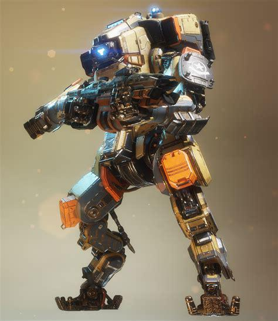
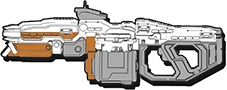
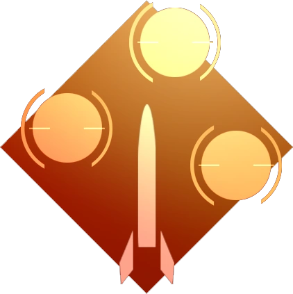
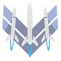
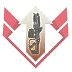

# 🛡️ Monarch's Arsenal

## <mark style="color:yellow;">Monarch</mark>

|                                                        Monarch                                                       |                                                                        In-Game Description                                                                        |
| :------------------------------------------------------------------------------------------------------------------: | :---------------------------------------------------------------------------------------------------------------------------------------------------------------: |
|  | 
<em><strong>Mid-range Vanguard-based Titan that can</strong></em> <em><strong>upgrade itself on the battlefield.</strong></em> - In-Game Description
 |



Respawn unfortunately never made promotional art of Monarch and her abilities, so sadly they will be shown generically.







| General Information                                                                                                         | Chassis & Loadout Specifications                                                                                                                            |
| --------------------------------------------------------------------------------------------------------------------------- | ----------------------------------------------------------------------------------------------------------------------------------------------------------- |
| <mark style="color:yellow;">**File name:**</mark> Vanguard                                                                  | <mark style="color:yellow;">**Base Health:**</mark> 10,000                                                                                                  |
| <mark style="color:yellow;">**Class:**</mark> Monarch                                                                       | <mark style="color:yellow;">**Aegis Health:**</mark> 12,500                                                                                                 |
| <mark style="color:yellow;">**Type:**</mark> Titan                                                                          | 
<mark style="color:yellow;"><strong>Dash Capacity:</strong></mark> 1 → 2 <mark style="color:yellow;"><strong>Dash Cooldown:</strong></mark> 6 sec
 |
| <mark style="color:yellow;">**Parent Chassis:**</mark> Vanguard                                                             | <mark style="color:yellow;">**Primary Weapon:**</mark> XO-16 Chaingun                                                                                       |
| <mark style="color:yellow;">**Manufacturer:**</mark> Frontier Militia (original vanguards), Vinson Dynamics (Modifications) | <mark style="color:yellow;">**Ordnance Ability:**</mark> Rocket Salvo                                                                                       |
| <mark style="color:yellow;">**Sub-Variant:**</mark> N.A.                                                                    | <mark style="color:yellow;">**Tactical Ability:**</mark> Rearm                                                                                              |
| <mark style="color:yellow;">**User(s):**</mark> Sarah Briggs, Pilots                                                        | <mark style="color:yellow;">**Defensive Ability:**</mark> Energy Siphon                                                                                     |
| <mark style="color:yellow;">**Conflict(s):**</mark> Frontier War                                                            | <mark style="color:yellow;">**Core:**</mark> Upgrade Core                                                                                                   |
| <mark style="color:yellow;">**Appears in:**</mark> Titanfall 2, Titanfall: Assault, Stories from the Outlands               | <mark style="color:yellow;">**Other Equipment:**</mark> 2 Acolyte Pods                                                                                      |

### <mark style="color:yellow;">Overview</mark> 

Monarch is a highly adaptable Vanguard-based Titan built around sustain, customization, and battlefield evolution. Unlike other Titans that rely on a fixed loadout, Monarch gradually upgrades her loadout throughout a match by using her Upgrade Core, allowing her to scale into a powerful late-game threat. This makes her one of the weirdest Titans, being one of the weakest at the start but becoming the Apex Titan once she reaches her 3rd core.

Monarch thrives in prolonged engagements where she can build momentum and snowball her upgrades. However, her early game is relatively weak compared to other Titans, requiring careful positioning and survival-focused play until her full potential is unlocked.

<mark style="color:yellow;">**Monarch's Loadout**</mark>

* <mark style="color:yellow;">**XO-16 Chaingun:**</mark> Monarch's primary weapon, a sustained-fire ballistic Chaingun that deals consistent mid-range damage and benefits greatly from accuracy and mobility.
* <mark style="color:yellow;">**Rocket Salvo:**</mark> Fires a burst of unguided rockets that provide weak additional damage and serve more as an anti-Pilot/Tripwire/Tether-Trap tool.
* <mark style="color:yellow;">**Rearm:**</mark> Instantly refreshes Monarch’s abilities and dash cooldowns, allowing for rapid ability cycling and extended survivability in combat.
* <mark style="color:yellow;">**Energy Syphon:**</mark> Drains overshields from enemy Titans and briefly stuns them to restore her overshield, enhancing her survivability in prolonged fights.
* <mark style="color:yellow;">**Upgrade Core:**</mark> Monarch’s core ability, allowing her to select permanent upgrades during battle, progressively enhancing her weapon, survivability, and utility over time.

Monarch is a scaling Titan that rewards persistence and smart resource management. While weaker at the start of a match, she becomes increasingly dangerous as she upgrades, eventually evolving into an Apex Titan.

## <mark style="color:yellow;">XO-16 Chaingun</mark>

|                                   HUD Icon                                  |                                       In-Game Description                                      |
| :-------------------------------------------------------------------------: | :--------------------------------------------------------------------------------------------: |
|  | 
<em><strong>20 mm armor piercing automatic rifle.</strong></em> -In-Game Description
 |

| General Information                                                           | Weapon Specifications                                                |
| ----------------------------------------------------------------------------- | -------------------------------------------------------------------- |
| <mark style="color:yellow;">**File Name:**</mark> xo16 vanguard               | <mark style="color:yellow;">**Fire Mode:**</mark> Fully automatic    |
| <mark style="color:yellow;">**Weapon Class:**</mark> MK121282                 | <mark style="color:yellow;">**Magazine Capacity:**</mark> 40 bullets |
| <mark style="color:yellow;">**Weapon Type:**</mark> Chaingun                  | <mark style="color:yellow;">**Reload Time:**</mark> 2.46 sec         |
| <mark style="color:yellow;">**Manufacturer:**</mark> Brockhaurd Manufacturing | <mark style="color:yellow;">**Hit Registration:**</mark> Hitscan     |
| <mark style="color:yellow;">**Fire Rate:**</mark> 12 bullets per second       | <mark style="color:yellow;">**Vortex Absorbable:**</mark> Yes        |

### <mark style="color:yellow;">Overview</mark> 

The XO-16 Chaingun is Monarch’s primary weapon, designed for sustained automatic fire and consistent mid-range pressure. Unlike burst-focused Titan weapons, the XO-16 emphasizes reliability and continuous damage output, making it highly effective in extended engagements where tracking and positioning are key.

Firing hitscan rounds with a large magazine capacity, the XO-16 allows Monarch to maintain constant pressure on enemy Titans without relying on reload timing as frequently as other weapons. Its effectiveness increases significantly with accuracy, rewarding players who can stay on target during prolonged firefights.

* <mark style="color:yellow;">Fully automatic</mark> [<mark style="color:yellow;">hitscan</mark>](#user-content-fn-1)[^1] <mark style="color:yellow;">Chaingun.</mark>
* <mark style="color:yellow;">Holds a 40-round magazine for sustained fire.</mark>
* <mark style="color:yellow;">Excels at consistent close to mid-range damage output.</mark>
* <mark style="color:yellow;">Its shots can be reflected by Vortex Shield.</mark>
* <mark style="color:yellow;">Designed for continuous engagement rather than burst damage.</mark>
* <mark style="color:yellow;">It can be upgraded with Upgrade Core.</mark>
* <mark style="color:yellow;">It can out-</mark>[<mark style="color:yellow;">DPS</mark>](#user-content-fn-2)[^2] <mark style="color:yellow;">Laser Core with</mark> [crits](../universal-mechanics/titan-weak-points.md#titan-weapon-ability-crit-table) <mark style="color:yellow;">close range.</mark>

The XO-16 Chaingun forms the backbone of Monarch’s combat style, providing steady, dependable damage that scales well with her upgrade-based core system.

### <mark style="color:yellow;">XO-16 Chaingun Stats</mark>

| Damage Type                                                                              |                               Base Damage per Shot                              |                          Crit (1.5x)  / Headshot (1.5x)                         |
| ---------------------------------------------------------------------------------------- | :-----------------------------------------------------------------------------: | :-----------------------------------------------------------------------------: |
| <mark style="color:yellow;">Titan Close</mark> <mark style="color:orange;">(far)</mark>  | <mark style="color:yellow;">120</mark> <mark style="color:orange;">(100)</mark> | <mark style="color:yellow;">180</mark> <mark style="color:orange;">(150)</mark> |
| <mark style="color:yellow;">Entity Close</mark> <mark style="color:orange;">(far)</mark> |  <mark style="color:yellow;">45</mark> <mark style="color:orange;">(40)</mark>  | <mark style="color:yellow;">67.5</mark> <mark style="color:orange;">(60)</mark> |


XO-16 Chaingun deals at close range 1,440 Titan DPS, 2,160 DPS with crits, and\
550 Entity DPS.


## <mark style="color:yellow;">Rocket Salvo</mark>

|                                    HUD Icon                                    |                                     In-Game Description                                     |
| :----------------------------------------------------------------------------: | :-----------------------------------------------------------------------------------------: |
|  | 
<em><strong>Launches an unguided rocket swarm.</strong></em> -In-Game Description
 |

| General Information                                             | Ability Specifications                                                            |
| --------------------------------------------------------------- | --------------------------------------------------------------------------------- |
| <mark style="color:yellow;">**File Name:**</mark> salvo rockets | <mark style="color:yellow;">**Ability Mode:**</mark> Deploy                       |
| <mark style="color:yellow;">**Weapon Class:**</mark> Ordnance   | <mark style="color:yellow;">**Cooldown:**</mark> 6 sec (1 sec refill start delay) |
| <mark style="color:yellow;">**Weapon Type:**</mark> Rockets     | <mark style="color:yellow;">**Rocket Count:**</mark> 6                            |

### <mark style="color:yellow;">Overview</mark>

Rocket Salvo is Monarch’s ordnance ability, launching a burst of 6 unguided rockets to provide low burst damage. It actually causes her to [deal less damage if used during combat ](monarch-guides/written-guides.md#dinorush13s-classic-reddit-breakdown-of-rocket-salvo-vs.-xo-16-dps)instead of shooting the XO-16, Rocket Salvo serves more like a tool for killing grounded Pilots, Tripwires, Tether Traps, or even to finish off low Titans.

While not as precise as her primary weapon, Rocket Salvo is highly effective at punishing Ion and Ronin through their defensive abilities by baiting them to fight back after a melee. It works best when it's not used as a weapon for raw damage output but instead as a situational tool.

* <mark style="color:yellow;">Fires a burst of 6 unguided rockets.</mark>
* <mark style="color:yellow;">Provides short burst damage to punish enemy retaliation.</mark>
* <mark style="color:yellow;">Effective for finishing weakened enemy Titans, killing grounded Pilots, destroying Tripwires, and Tether Traps.</mark>
* <mark style="color:yellow;">It can be used to</mark> [tear down Particle Wall.](monarch-tech/rocket-variants-vs.-particle-shields.md)
* <mark style="color:yellow;">Intended to be used as a tool or a situational punishment instead of raw damage.</mark>
* [Lowers your damage output potential](monarch-guides/written-guides.md#dinorush13s-classic-reddit-breakdown-of-rocket-salvo-vs.-xo-16-dps) <mark style="color:yellow;">when used during combat instead of XO-16.</mark>
* <mark style="color:yellow;">Could use it before engagement as some surprise chip damage.</mark>
* <mark style="color:yellow;">Fired from the right shoulder.</mark>

Rocket Salvo adds an offensive tool to Monarch’s otherwise sustained damage kit, helping her get rid of hurdles or offer small punishments during extended fights.

### <mark style="color:yellow;">Rocket Salvo Stats</mark>

| Damage Type | Base Damage | Total Damage |
| ----------- | :---------: | :----------: |
| Titan       |     250     |     1,500    |
| Entity      |     250     |     1,500    |

## <mark style="color:yellow;">Rearm</mark>

|                                  HUD Icon                                 |                                                      In-Game Description                                                      |
| :-----------------------------------------------------------------------: | :---------------------------------------------------------------------------------------------------------------------------: |
|  | 
<em><strong>Refreshes the cooldown of your Dash, Ordnance and Defensive ability.</strong></em> -In-Game Description
 |

| General Information                                                  | Ability Specifications                                                             |
| -------------------------------------------------------------------- | ---------------------------------------------------------------------------------- |
| <mark style="color:yellow;">**File Name:**</mark> rearm              | <mark style="color:yellow;">**Ability Mode:**</mark> Deploy                        |
| <mark style="color:yellow;">**Weapon Class:**</mark> Tactical        | <mark style="color:yellow;">**Cooldown:**</mark> 17.6 sec (no refill start delay)  |
| <mark style="color:yellow;">**Weapon Type:**</mark> Gear replenisher | <mark style="color:yellow;">**Function:**</mark> Replenishes abilities and dashes  |

### <mark style="color:yellow;">Overview</mark>

Rearm is Monarch’s tactical ability, allowing her to instantly reset the cooldowns of her abilities and refresh all her dashes. This makes it a powerful tool for extending combat effectiveness, enabling rapid ability cycling and repeated engagement or escape sequences during a fight.

By restoring her abilities and dashes, Rearm significantly increases Monarch’s survivability and pressure potential. It allows her to reuse Energy Siphon and dash more frequently, creating strong momentum in prolonged engagements.

* <mark style="color:yellow;">Instantly refreshes Monarch’s abilities and dash charges.</mark>
* <mark style="color:yellow;">Enables repeated ability usage within a short time window.</mark>
* <mark style="color:yellow;">Strong synergy with Energy Siphon for sustained combat.</mark>
* <mark style="color:yellow;">Improves both offensive pressure and defensive survivability.</mark>
* <mark style="color:yellow;">You can cancel Rearm with melee.</mark>

Rearm is a key part of Monarch’s kit identity, allowing her to stay active in fights longer than most Titans by continuously resetting her combat resources.

### <mark style="color:yellow;">**Rapid Rearm Kit**</mark>

The Rapid Rearm kit supposedly reduces the cooldown of Rearm by 5 seconds, that's it. But that's oversimplified, it actually reduces it by 5.6 seconds. From 17.6 sec to 12 sec cooldown. An 11% faster cooldown reduction than otherwise stated.

## <mark style="color:yellow;">Energy Siphon</mark>

|                                     HUD Icon                                    |                                                             In-Game Description                                                             |
| :-----------------------------------------------------------------------------: | :-----------------------------------------------------------------------------------------------------------------------------------------: |
|  | 
<em><strong>Slows enemies and generates shields. Heavily armored targets generate more shield.</strong></em> -In-Game Description
 |

| General Information                                                                                    | Ability Specifications                                                             |
| ------------------------------------------------------------------------------------------------------ | ---------------------------------------------------------------------------------- |
| <mark style="color:yellow;">**File Name:**</mark> stun laser                                           | <mark style="color:yellow;">**Ability Mode:**</mark> Deploy / Hold                 |
| <mark style="color:yellow;">**Weapon Class:**</mark> Defensive                                         | <mark style="color:yellow;">**Max Hold Duration:**</mark> 3 sec                    |
| <mark style="color:yellow;">**Weapon Type:**</mark> Precision stun laser                               | <mark style="color:yellow;">**Cooldown:**</mark> 12 sec (1 sec refill start delay) |
| <mark style="color:yellow;">**Function:**</mark> Drain enemy overshield, regain own shield, stun enemy | <mark style="color:yellow;">**Bonus:**</mark> Ignores Sword Block                  |

### <mark style="color:yellow;">Overview</mark>

Energy Siphon is Monarch’s defensive ability, firing a singular shot precision stun laser that drains enemy overshield while restoring Monarch’s own. It is designed as both a sustain tool and a soft-disable ability, allowing Monarch to briefly disorient opponents while extending her survivability during sustained engagements.

When used on a target, Energy Siphon instantly destroys half of the enemy's overshield, even through Sword Block, while giving Monarch some overshield, making it especially effective in drawn-out fights. It also applies a brief stun effect, slowing the enemy's movement speed and aim sensitivity, creating openings for follow-up damage. It does not stop enemies from using dashes or getting movement from movement-based abilities like Hover or Phase Dash, unlike Arc Wave.

* <mark style="color:yellow;">Fires a singular shot precision energy beam that destroys half a bar of the enemy's overshield.</mark>
* <mark style="color:yellow;">Restores Monarch’s own shields during use, giving less on none Titan targets.</mark>
* <mark style="color:yellow;">Can briefly stun and disrupt enemy Titans and small entities.</mark>
* <mark style="color:yellow;">It can be held for up to 3 seconds before firing and melee'ed to cancel the shot.</mark>
* <mark style="color:yellow;">Aiming down sights is available for better accuracy when holding it.</mark>
* <mark style="color:yellow;">It can be upgraded with Upgrade Core.</mark>
* <mark style="color:yellow;">Effective for both survival and setting up engagements.</mark>
* <mark style="color:yellow;">Draining enemy overshield does NOT give you any core.</mark>
* <mark style="color:yellow;">The max range is approximately half the size of the Homestead map.</mark>
* <mark style="color:yellow;">Small flat splash on impact that can only hit enemies touching the ground.</mark>
* <mark style="color:yellow;">Fired from the left shoulder.</mark>

Energy Siphon is a core part of Monarch’s sustain-based design, allowing her to outlast opponents by crippling enemies to her advantage.

### <mark style="color:yellow;">**Shield Amplifier**</mark> <mark style="color:yellow;">Kit</mark>

Gives you a pathetic extra 25% overshield when siphoning an enemy.

* <mark style="color:yellow;">Works with the Energy Field core upgrade.</mark>
* <mark style="color:yellow;">Energy Transfer is weird, it only affects you when a Monarch heals you, not vice versa.</mark>

### <mark style="color:yellow;">Energy Siphon Stats</mark>

| Damage Type  | Base Damage | Crit. (N.A.) Headshot (N.A.) |
| ------------ | :---------: | :--------------------------: |
| Titan        |     100     |             N.A.             |
| Entity       |      20     |             N.A.             |
| Overshield   |     1250    |             N.A.             |


It may not be evident at first, but Energy Siphon deals some minor damage if target has no overshield.


### <mark style="color:yellow;">Energy Siphon Shield Regain</mark> (a bar is 2,500 HP)

| Target                         | Shield Gained | Stun |
| ------------------------------ | :-----------: | :--: |
| Humanoids                      |      250      |  Yes |
| Reapers, Dropships, and Titans |      750      |  Yes |

## <mark style="color:yellow;">Upgrade Core</mark> 

|                                   HUD Icon                                   |                                                                 In-Game Description                                                                 |
| :--------------------------------------------------------------------------: | :-------------------------------------------------------------------------------------------------------------------------------------------------: |
|  | 
<em><strong>Recharges your Titan's Shields and upgrades your Titan in the order of the upgrades above.</strong></em> -In-Game Description
 |

| General Information              | Core Specifications                                           |
| -------------------------------- | ------------------------------------------------------------- |
| File Name: Upgrade               | Core Type: Upgrade, overshield heal                           |
| Weapon Class: Titan Core Ability | Max Duration: Instant                                         |
| Weapon Type: Upgrade System      | Addition: 3 upgrades, then every core refills overshield only |

### <mark style="color:yellow;">Overview</mark>

Upgrade Core is Monarch’s unique core ability, allowing her to evolve throughout a match by selecting permanent upgrades that enhance her combat capabilities. Unlike other Titans, Monarch does not gain a traditional offensive core. Instead, each Upgrade Core activation grants a full overshield refill and access to one of several upgrade options, allowing players to customize her performance to suit their playstyle.

Monarch can progress through three upgrade tiers, with each tier offering three different upgrades to choose from. Once all three upgrade tiers have been unlocked, future core activations no longer grant upgrades and instead only restore Monarch's shields. Upgrade Core struggles hard against other Titans' cores due to a lack of massive damage output, most noticeable during short game modes like Last Titan Standing where ability to farm core is limited.

* <mark style="color:yellow;">Instantly restores all of Monarch's overshield on activation.</mark>
* <mark style="color:yellow;">Grants access to one of three upgrades per tier.</mark>
* <mark style="color:yellow;">Progresses through three upgrade tiers over the course of a match.</mark>
* <mark style="color:yellow;">Allows players to customize Monarch's strengths and playstyle.</mark>
* <mark style="color:yellow;">Additional core activations after Tier 3 provide shield restoration only.</mark>
* <mark style="color:yellow;">Weak against other Titan cores until you hit the 3rd core.</mark>
* <mark style="color:yellow;">The 3rd core, specifically the XO-16 Accelerator upgrade, makes Monarch a real Apex Titan that needs multiple Titans to kill.</mark>

Upgrade Core is the foundation of Monarch's progression system, rewarding players who can survive long enough to unlock her full potential. As Monarch advances through her upgrade tiers, she transforms from a relatively squishy Titan into an Apex Titan Accelerator upgrade, becoming the most versatile and self-sufficient Titan on the battlefield.

### <mark style="color:yellow;">Tier 1 Upgrade</mark>

The first upgrade tier focuses on improving Monarch's survivability, mobility, and core combat effectiveness. Players may choose one of three available upgrades. &#x20;



<h3 align="center"><mark style="color:yellow;"><strong>Arc Rounds</strong></mark></h3>

<figure><figcaption></figcaption></figure>

> _"XO-16 rounds deal more damage to Shields and drain energy from Vortex and Thermal Shields. Increases ammo capacity."_

Arc Rounds upgrade enhances the XO-16 by adding it electrical effects and increasing mag size from 40 to 50 bullets.

* <mark style="color:yellow;">Activating Arc Rounds adds 10 bullets to your current mag, even if empty.</mark>
* <mark style="color:yellow;">Deal roughly</mark> [3% drain effect per shot to charge based shields](monarch-tech/xo-16-chaingun-variants-vs.-shields.md) <mark style="color:yellow;">like Vortex, Thermal, and Inferno Shield.</mark>
* <mark style="color:yellow;">Deal roughly</mark> [50% extra damage to solid shields](monarch-tech/xo-16-chaingun-variants-vs.-shields.md) <mark style="color:yellow;">like overshield, Particle Wall, Gun Shield, Amped Wall, and Hard Cover.</mark>
* <mark style="color:yellow;">Electrical visual and audio effects.</mark>



<h3 align="center"><mark style="color:yellow;"><strong>Missile Racks</strong></mark></h3>

<figure><figcaption></figcaption></figure>

> _"Rocket Salvo fires twice the amount of missiles."_

Missile Racks upgrade enhances Rocket Salvo by making it stronger for punishing retaliating opponents and for more general coverage due to more rockets.

* <mark style="color:yellow;">From 6 to 12 rockets, 3000 damage total, and same cooldown time as Rocket Salvo.</mark>
* [Destroys Particle Wall, Reinforced Particle Wall, and Gun Shield in one barrage](monarch-tech/rocket-variants-vs.-particle-shields.md) <mark style="color:yellow;">unlike Rocket Salvo.</mark>
* <mark style="color:yellow;">Makes retaliation punishments against Ion and Ronin stronger.</mark>
* <mark style="color:yellow;">Despite the upgrade, it's still worse to</mark> [use just for damage.](monarch-guides/written-guides.md#dinorush13s-classic-reddit-breakdown-of-rocket-salvo-vs.-xo-16-dps)



<h3 align="center"><mark style="color:yellow;"><strong>Energy Transfer</strong></mark></h3>

<figure><figcaption></figcaption></figure>

> _"Hitting friendly Titans with Energy Siphon gives them shield."_

Energy Transfer enhances Energy Siphon with the ability to give teammate Titans overshield. The medic Monarch build is very lackluster since it forces you to give away your only defensive ability to give some overshield to your teammates, leaving you weaker to damage.

* <mark style="color:yellow;">Gives teammate Titan as much overshield as if you were to give yourself</mark> (750 HP)<mark style="color:yellow;">.</mark>
* <mark style="color:yellow;">You don't gain any overshield from energy-transfering your teammates.</mark>
* <mark style="color:yellow;">Even with</mark> [double-hit-energy-siphon.md](monarch-tech/double-hit-energy-siphon.md "mention") <mark style="color:yellow;">is the upgrade is lackluster.</mark>
* <mark style="color:yellow;">Stacks with Energy Field upgrade for energy-transfering multiple teammates at once, can even siphon enemies as well if they're in range.</mark>



### <mark style="color:yellow;">Tier 2 Upgrade</mark>

&#x20;The second upgrade tier enhances Monarch's utility and weapon systems, offering upgrades that improve her abilities and team support potential.



<h3 align="center"><mark style="color:yellow;"><strong>Rearm and Reload</strong></mark></h3>

<figure><figcaption></figcaption></figure>

> _"Faster Reload and Rearm speeds."_

Rearm and Reload upgrade gets really powerful when combined with Arc Rounds and XO-16 Accelerator upgrades, as it allows more shooting by making reloads and Rearm faster.

* <mark style="color:yellow;">Makes Rearm 60% faster.</mark>
* <mark style="color:yellow;">Makes reload 25% faster.</mark>
* <mark style="color:yellow;">Does not prevent</mark> [reload checkpoints](../universal-mechanics/reload-cancel-and-checkpoints.md) <mark style="color:yellow;">nor any tech involving Rearm.</mark>
* <mark style="color:yellow;">Strongly compliments Arc Rounds and XO-16 Accelerator upgrades.</mark>



<h3 align="center"><mark style="color:yellow;"><strong>Maelstorm</strong></mark></h3>

<figure><figcaption></figcaption></figure>

> _"Electric Smoke is intensified, dealing more damage to Titans and Pilots."_

Maelstorm upgrade makes E-Smoke quite lethal when stacked against Titans and Pilots, letting you even outright kill ogres with 3-4 Maelstorms.

* <mark style="color:yellow;">3x more damage to Titans.</mark>
* <mark style="color:yellow;">2x more damage to Pilots.</mark>
* <mark style="color:yellow;">Different audio effect after deployment.</mark>
* <mark style="color:yellow;">Strongest when stacked.</mark>



<h3 align="center"><mark style="color:yellow;"><strong>Energy Field</strong></mark></h3>

<figure><figcaption></figcaption></figure>

> _"Energy Siphon affects a large area around the point of impact."_

Energy Field upgrade lets you hit multiple enemies in a big area at source of impact, even letting you hit around corners.

* <mark style="color:yellow;">Ability to hit multiple things at once, boosting possible overshields gained and drained.</mark>
* <mark style="color:yellow;">Most useful when aiming at the ground instead of the Titan itself.</mark>
* [double-hit-energy-siphon.md](monarch-tech/double-hit-energy-siphon.md "mention") <mark style="color:yellow;">works with only 1 Titan at a time, anything else won't be hit twice.</mark>
* <mark style="color:yellow;">Works with Energy Transfer upgrade, even lets you heal teammates and hit enemies normally at the same time, potential teamplay mechanic, stun enemies and heal teammates in a radius?</mark>



### <mark style="color:yellow;">Tier 3 Upgrade</mark>

The final upgrade tier provides powerful endgame enhancements, significantly increasing Monarch's damage output, survivability, or battlefield presence.



<h3 align="center"><mark style="color:yellow;"><strong>Multi-Target Missile System</strong></mark> (MTMS)</h3>

<figure><figcaption></figcaption></figure>

> _"Hold Rocket Salvo to lock onto heavily armored targets. Missiles deal more damage."_

Multi-Target Missile System, or for short "MTMS", is an upgrade that really changes how the Rocket Salvo works. Increasing cooldown at cost of more damage, and ability to lock onto targets and curve missiles over obstacles. This upgrade makes Monarch a sort of Monarch-Tone hybrid, that fires a swarm of fast small missiles, but if not for the 3 times longer cooldown it would be an incredible upgrade.

* <mark style="color:yellow;">Changed stats and ability to lock onto targets and curve missiles around obstacles.</mark>
* <mark style="color:yellow;">Missile Racks upgrade stacks with this upgrade by letting you fire twice as many missiles.</mark>
* <mark style="color:yellow;">MTMS has 3x longer cooldown, worse damage</mark> [<mark style="color:yellow;">splash</mark>](#user-content-fn-3)[^3] <mark style="color:yellow;">falloff and it's barrage deals 2100 total damage, 4200 with Missile Racks upgrade.</mark>
* <mark style="color:yellow;">Curving is hard since you lose locks the moment you lose line of sight of the enemy, so you need to fire and then quickly look away.</mark>



<h3 align="center"><mark style="color:yellow;"><strong>Superior Chassis</strong></mark></h3>

<figure><figcaption></figcaption></figure>

> _"Upgrades Monarch's max Health and removes weak point vulnerabilities."_

Superior Chassis upgrade gives Monarch an additional bar of health and removes her [weak spots](../universal-mechanics/titan-weak-points.md), alongside her normal full overshield restore upon activation. She becomes a bit less squishy, but be warned, the extra bar of health won't undoom you if you activate it in doomstate.&#x20;

* <mark style="color:yellow;">A bar of health and removal of</mark> [weak spots.](../universal-mechanics/titan-weak-points.md)
* <mark style="color:yellow;">The bar of health won't undoom you if you're already doomed.</mark>
* <mark style="color:yellow;">Removal of weakspots makes fighting</mark> [Entangled Energy](../titan-kits-in-depth.md#ion-specific-kits) <mark style="color:yellow;">Ions a walk in the park.</mark>
* <mark style="color:yellow;">Superior Chassis gains very little value against Scorch and Tone due to them not really being able to crit you.</mark>



<h3 align="center"><mark style="color:yellow;"><strong>XO-16 Accelerator</strong></mark></h3>

<figure><figcaption></figcaption></figure>

> _"Installs the Accelerator mod for the XO-16, increasing its max fire rate and damage."_

XO-16 Accelerator upgrade is the upgrade that turns Monarch into an Apex Titan, giving her chaingun more damage per shot, and gives it an accelerator feature. Starts off with a slightly slower firerate than a normal XO-16 before it accelerates into insane speeds, but the 25% damage increase is more than enough to make up for it.&#x20;

The biggest weakness of Monarch by far are enemy cores, killing them faster helps prevent damage done by possible cores, on top of that dealing more damage also means more frequent future cores, meaning more overshield, thus better survivability.

* <mark style="color:yellow;">Makes XO-16 deal 25% more damage per shot, lowers spread in hipfire by 11-25% and in</mark> [<mark style="color:yellow;">ads</mark>](#user-content-fn-4)[^4] <mark style="color:yellow;">by 22-50%, and gives it a ramp up feature.</mark>
* <mark style="color:yellow;">Accelerator starts out at 8 shots per second, and increases to 18/s over 3 seconds. Default XO-16 is 12/s. So it starts off at lower</mark> [<mark style="color:yellow;">dps</mark>](#user-content-fn-5)[^5]<mark style="color:yellow;">, but matches dps after 0.48s, and continues to grow in dps afterwards.</mark>
* <mark style="color:yellow;">The 25% damage buff affects the Arc Rounds</mark> [50% damage increase against shields.](monarch-tech/xo-16-chaingun-variants-vs.-shields.md)
* <mark style="color:yellow;">2 shots Pilots to the body at any range, instead of 3 shots.</mark>
* <mark style="color:yellow;">XO-16 Accelerator sounds make you stand out and have enemies try to prioritize you.</mark>
* <mark style="color:yellow;">More damage output means more frequent cores, meaning more overshields and better survivability. More damage also helps kill Titans earlier, preventing future enemy cores.</mark>

#### <mark style="color:yellow;">Full XO-16 Upgrades Titan Damage Spreadsheet</mark>

<table><thead><tr><th width="166">XO-16 Type</th><th width="164" align="center">Titan Damage per Shot (crit)</th><th width="174" align="center">Titan DPS (crit)</th><th align="center">Total Titan Damage per Mag (crit)</th></tr></thead><tbody><tr><td>XO-16</td><td align="center"><mark style="color:yellow;">120</mark> <mark style="color:red;">(180)</mark></td><td align="center"><mark style="color:yellow;">1,440</mark> <mark style="color:red;">(2,160)</mark></td><td align="center"><mark style="color:yellow;">4,800</mark> <mark style="color:red;">(7,200)</mark></td></tr><tr><td>Arc Rounds</td><td align="center"><mark style="color:yellow;">120</mark> <mark style="color:red;">(180)</mark> + <a href="monarch-tech/xo-16-chaingun-variants-vs.-shields.md"><mark style="color:blue;">60 arc</mark></a></td><td align="center"><mark style="color:yellow;">1,440</mark> <mark style="color:red;">(2,160)</mark></td><td align="center"><mark style="color:yellow;">6,000</mark> <mark style="color:red;">(9,000)</mark></td></tr><tr><td>XO-16 Accelerator</td><td align="center"><mark style="color:yellow;">150</mark> <mark style="color:red;">(225)</mark></td><td align="center"><mark style="color:yellow;">1,200</mark> <mark style="color:red;">(1,800)</mark>  <mark style="color:yellow;">-></mark> <mark style="color:yellow;">2,700</mark> <mark style="color:red;">(4,050)</mark></td><td align="center"><mark style="color:yellow;">6,000</mark> <mark style="color:red;">(9,000)</mark></td></tr><tr><td>Arc Rounds + XO-16 Accelerator</td><td align="center"><mark style="color:yellow;">150</mark> <mark style="color:red;">(225)</mark> + <mark style="color:blue;">75 arc</mark></td><td align="center"><mark style="color:yellow;">1,200</mark> <mark style="color:red;">(1,800)</mark>  <mark style="color:yellow;">-></mark> <mark style="color:yellow;">2,700</mark> <mark style="color:red;">(4,050)</mark></td><td align="center"><mark style="color:yellow;">7,500</mark> <mark style="color:red;">(11,250)</mark></td></tr></tbody></table>



[^1]: Instant travel time, not a projectile.

[^2]: Damage Per Second

[^3]: Damage that enemy takes from it's explosion, not direct damage.

[^4]: "aim down sights", zooming in with the gun.

[^5]: damage per second
