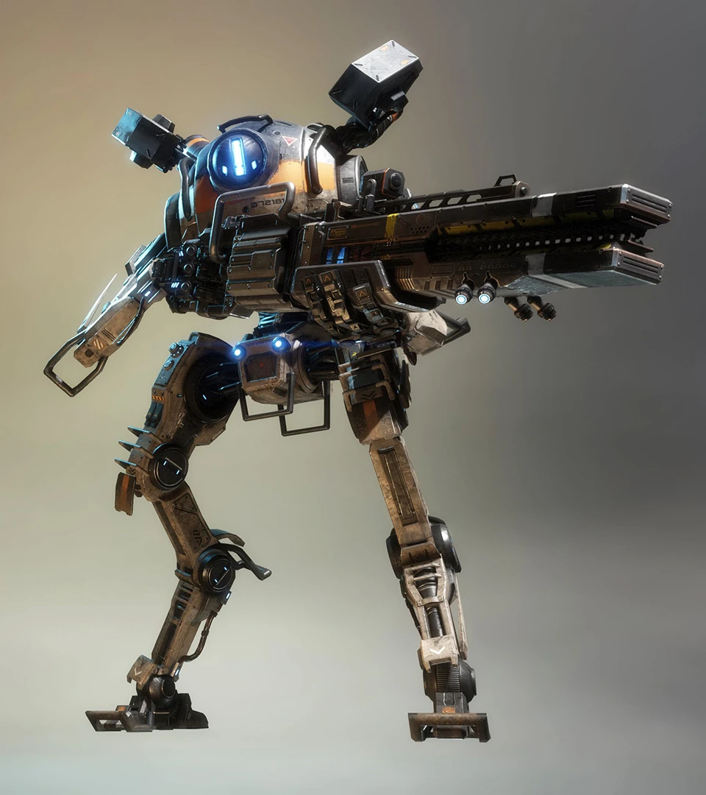
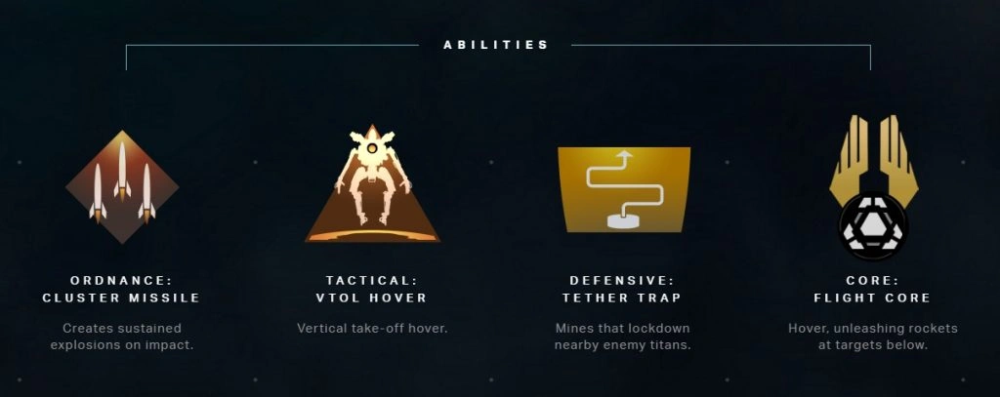
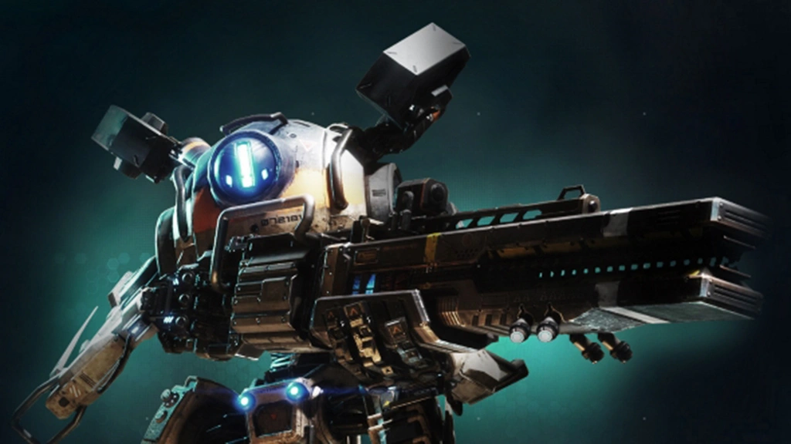
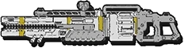

# 🛡️ Northstar's Arsenal

## <mark style="color:yellow;">Northstar</mark>

| Northstar Loadout Screen                                                                                    |                                                                     Quote                                                                     |
| ----------------------------------------------------------------------------------------------------------- | :-------------------------------------------------------------------------------------------------------------------------------------------: |
| 
<figure><figcaption></figcaption></figure>
 | 
<em><strong>Northstar is a master of both flight and precision kills, a sniper who can fly.</strong></em> — Old Website Description
 |



<figure><figcaption></figcaption></figure>



<figure><figcaption></figcaption></figure>







| General Information                                                                                     | Chassis & Loadout Specifications                                                                                                                            |
| ------------------------------------------------------------------------------------------------------- | ----------------------------------------------------------------------------------------------------------------------------------------------------------- |
| <mark style="color:yellow;">**File Name:**</mark> Raptor                                                | <mark style="color:yellow;">**Base Health:**</mark> 7,500                                                                                                   |
| <mark style="color:yellow;">**Class:**</mark> Northstar                                                 | <mark style="color:yellow;">**Aegis Health:**</mark> 10,000                                                                                                 |
| <mark style="color:yellow;">**Type:**</mark> Titan                                                      | 
<mark style="color:yellow;"><strong>Dash Capacity:</strong></mark> 2 → 3 <mark style="color:yellow;"><strong>Dash Cooldown:</strong></mark> 5 sec
 |
| <mark style="color:yellow;">**Parent Chassis:**</mark> Stryder                                          | <mark style="color:yellow;">**Primary Weapon:**</mark> PR-01 Plasma Railgun                                                                                 |
| <mark style="color:yellow;">**Manufacturer:**</mark> Hammond Robotics                                   | <mark style="color:yellow;">**Ordnance Ability:**</mark> Cluster Missile                                                                                    |
| <mark style="color:yellow;">**Sub-Variant:**</mark> Northstar Prime, Brute                              | <mark style="color:yellow;">**Tactical Ability:**</mark> VTOL Hover                                                                                         |
| <mark style="color:yellow;">**User(s):**</mark> Viper, Pilots                                           | <mark style="color:yellow;">**Defensive Ability:**</mark> Tether Trap                                                                                       |
| <mark style="color:yellow;">**Conflict(s):**</mark> Frontier War                                        | <mark style="color:yellow;">**Core:**</mark> Flight Core                                                                                                    |
| <mark style="color:yellow;">**Appears In:**</mark> Titanfall 2, Stories from the Outlands, Apex Legends | <mark style="color:yellow;">**Other Equipment:**</mark> 2 acolyte pods                                                                                      |

### <mark style="color:yellow;">Overview</mark>

Northstar is a long-range precision Titan built around high mobility, map control, and devastating single-shot damage. Designed on the agile Stryder chassis, she excels at picking off enemies from a distance, controlling sightlines, and peeking over obstacles with Hover to maintain optimal firing angles. Unlike most Titans, Northstar relies on accuracy and positioning rather than sustained fire or close-range combat.

Her kit rewards careful aim and smart positioning, allowing her to dominate open maps and punish exposed targets. However, her low durability makes her vulnerable in close-range engagements, requiring constant movement and awareness to survive.

<mark style="color:yellow;">**Northstar's Loadout**</mark>

* <mark style="color:yellow;">**Plasma Railgun:**</mark> Northstar's primary weapon, a charge-based sniper cannon that deals massive damage and close-range knockback on a fully charged shot. Rewards precision and timing over rapid fire.
* <mark style="color:yellow;">**Cluster Missile:**</mark> Fires a missile that detonates into multiple smaller explosives for a limited time, effective area damage and ability to flush out enemies from cover.
* <mark style="color:yellow;">**VTOL Hover:**</mark> Allows Northstar to hover in the air, enabling reaching spots to land on, improved sightlines, and evasive movement during combat.
* <mark style="color:yellow;">**Tether Trap:**</mark> Deploys a trap that restrains enemy Titans, slowing down their push and setting them up for follow-up damage.
* <mark style="color:yellow;">**Flight Core:**</mark> Northstar’s core ability, letting her hover for an extended period of time while raining down vast amounts of rockets.

Northstar is a specialist Titan that thrives on map control through mobility and distance. When played effectively, she can run away from chasing Titans while helping out her team from different angles, but she must avoid close-quarters fights where her fragility becomes a major liability.

## <mark style="color:yellow;">PR-01 Plasma Railgun</mark>

<table><thead><tr><th align="center" valign="middle">PR-01 Plasma Railgun</th><th align="center">Quote</th></tr></thead><tbody><tr><td align="center" valign="middle"></td><td align="center"><em><strong>Sniper Railgun that charges up while zoomed.</strong></em> — Old Website Description</td></tr></tbody></table>

| General Information                                                                                                                                                          | Weapon Specifications                                                              |
| ---------------------------------------------------------------------------------------------------------------------------------------------------------------------------- | ---------------------------------------------------------------------------------- |
| <mark style="color:yellow;">**File Name:**</mark> sniper                                                                                                                     | <mark style="color:yellow;">**Fire Mode:**</mark> Semi-automatic, charged shot     |
| <mark style="color:yellow;">**Weapon Class:**</mark> Primary Weapon                                                                                                          | <mark style="color:yellow;">**Magazine Capacity:**</mark> 6 Railgun shells         |
| <mark style="color:yellow;">**Weapon Type:**</mark> Plasma-based sniper                                                                                                      | <mark style="color:yellow;">**Reload Time:**</mark> 1.86 sec                       |
| <mark style="color:yellow;">**Manufacturer:**</mark> Wonyeon Defense                                                                                                         | <mark style="color:yellow;">**Hit Registration:**</mark> Projectile                |
| <mark style="color:yellow;">**Special Feature:**</mark> Damage and knockback scales with charge level, projectiles can grow twice, and there is no damage falloff over range | <mark style="color:yellow;">**Vortex Absorbable:**</mark> Yes                      |
| <mark style="color:yellow;">**Charge Levels:**</mark> 6 total                                                                                                                | <mark style="color:yellow;">**Charge Time:**</mark> 0.45s per charge (2.25s total) |

### <mark style="color:yellow;">Overview</mark>

The PR-01 Plasma Railgun is Northstar's primary weapon, a high-powered electromagnetic rifle designed for precision and long-range engagements. Unlike most Titan weapons, the Plasma Railgun can be charged before firing, significantly increasing its damage output at the cost of waiting before firing.

A fully charged shot is mostly equal to a Legion's Power Shot in terms of damage against Titans, making the Plasma Railgun exceptionally effective at punishing exposed targets from different angles and controlling sightlines. Her Railgun even offers strong knockback that gets stronger if the enemy Titan moves towards them and is within close range. However, its relatively slow rate of fire and reliance on accuracy leave Northstar vulnerable if enemies can close the distance.

* <mark style="color:yellow;">Precision Plasma Railgun with 6 levels of charge, only the last 5 charges get extra damage.</mark>
* <mark style="color:yellow;">Hipfire does the same damage as the 1st charge but also makes it really innacurate.</mark>
* <mark style="color:yellow;">Has no damage falloff over range and is 100% accurate with at least one charge.</mark>
* <mark style="color:yellow;">It's always better to fully charge for the best DPS, due to how strong</mark> [critical hits](../universal-mechanics/titan-weak-points.md) <mark style="color:yellow;">are on higher charges.</mark>
* <mark style="color:yellow;">The projectile is the size of a small bullet, but as it travels it can grow like twice in size making hitting Pilots easier but hitting crits harder over range.</mark>
* <mark style="color:yellow;">Delivers Power-Shot-like</mark><mark style="color:orange;">**⟨1⟩**<mark style="color:orange;"> <mark style="color:yellow;">damage when fully charged.</mark>
* <mark style="color:yellow;">Has 25% more velocity than the 40 mm Tracker Cannon, but the same velocity as the long-range Power Shot</mark><mark style="color:orange;">**⟨1⟩**<mark style="color:orange;"> <mark style="color:yellow;">and Kraber.</mark>
* <mark style="color:yellow;">High entity damage lets her tear down solid shields easily.</mark>
* <mark style="color:yellow;">Rewards accuracy, constant target switching, and careful positioning.</mark>
* <mark style="color:yellow;">Vortex Shield will always reflect a Plasma Railgun shot as a hipfire shot regardless of charge.</mark>
* <mark style="color:yellow;">Plasma Railgun knockback scales with damage</mark><mark style="color:orange;">**⟨2⟩**<mark style="color:orange;"> <mark style="color:yellow;">and has 2</mark> <mark style="color:yellow;">different types of knockback that can stack for a super knockback.</mark>
  * <mark style="color:yellow;">The default 33% of knockback always applies regardless of range.</mark>
  * <mark style="color:yellow;">The other 67% of knockback requires you to be moving toward the Railgun in a 180-degree arc, applying fully at 25.4 m and ending at 38.1 m with linear falloff.</mark>

The Plasma Railgun defines Northstar's role as a sniper Titan, allowing her to pressure enemies from a distance while punishing mistakes and unaware enemies with devastating precision shots.

### <mark style="color:yellow;">Piercing Shot Kit</mark>

The Piercing Shot kit lets you pierce through an unlimited number of Titans and entities alike before contacting map terrain or an object. Though it cannot pierce through any kind of shield, even solid shields. The Plasma Railgun knockback will affect all Titans it hits, can even apply the strong knockback to multiple Titans if they meet the criteria.

### <mark style="color:yellow;">Threat Optics Kit</mark>

The Threat Optics kit highlights enemy Pilots' and Titans' in red. It also lets you see enemies through electric smoke<mark style="color:orange;">**⟨3⟩**<mark style="color:orange;">, regardless of who deployed it. Threat Optics does NOT let you see cloaked enemy Pilots.&#x20;

### <mark style="color:yellow;">Railgun Stats</mark>

<table><thead><tr><th width="291">Charge Level + Damage Type</th><th width="206">Base Damage</th><th>Crit (1.5x) Headshot (N.A.)</th></tr></thead><tbody><tr><td>Hipfire: <mark style="color:yellow;">Titan</mark> </td><td><mark style="color:yellow;">550</mark> + inaccurate<mark style="color:orange;"><strong>⟨4⟩</strong></mark></td><td><mark style="color:red;">825</mark> + inaccurate<mark style="color:orange;"><strong>⟨4⟩</strong></mark></td></tr><tr><td>Charge 1: <mark style="color:yellow;">Titan</mark></td><td> <mark style="color:yellow;">550</mark></td><td><mark style="color:red;">825</mark> </td></tr><tr><td>Charge 2: <mark style="color:yellow;">Titan</mark> </td><td> <mark style="color:yellow;">850</mark></td><td><mark style="color:red;">1,275</mark></td></tr><tr><td>Charge 3: <mark style="color:yellow;">Titan</mark> </td><td> <mark style="color:yellow;">1,150</mark></td><td><mark style="color:red;">1,725</mark><mark style="color:orange;"><strong>⟨5⟩</strong></mark></td></tr><tr><td>Charge 4: <mark style="color:yellow;">Titan</mark> </td><td> <mark style="color:yellow;">1,450</mark></td><td><mark style="color:red;">2,175</mark></td></tr><tr><td>Charge 5: <mark style="color:yellow;">Titan</mark></td><td> <mark style="color:yellow;">1,750</mark> </td><td><mark style="color:red;">2,625</mark></td></tr><tr><td>Charge 6: <mark style="color:yellow;">Titan</mark> </td><td><mark style="color:yellow;">2,050</mark> </td><td><mark style="color:red;">3,075</mark></td></tr><tr><td></td><td></td><td></td></tr><tr><td>Hipfire: <mark style="color:yellow;">Entity</mark></td><td><mark style="color:yellow;">500</mark> + inaccurate<mark style="color:orange;"><strong>⟨4⟩</strong></mark></td><td>N.A.</td></tr><tr><td>Charge 1: <mark style="color:yellow;">Entity</mark></td><td><mark style="color:yellow;">500</mark></td><td>N.A.</td></tr><tr><td>Charge 2: <mark style="color:yellow;">Entity</mark></td><td><mark style="color:yellow;">750</mark></td><td>N.A.</td></tr><tr><td>Charge 3: <mark style="color:yellow;">Entity</mark></td><td><mark style="color:yellow;">1,000</mark></td><td>N.A.</td></tr><tr><td>Charge 4: <mark style="color:yellow;">Entity</mark></td><td><mark style="color:yellow;">1,250</mark></td><td>N.A.</td></tr><tr><td>Charge 5: <mark style="color:yellow;">Entity</mark></td><td><mark style="color:yellow;">1,500</mark></td><td>N.A.</td></tr><tr><td>Charge 6: <mark style="color:yellow;">Entity</mark></td><td><mark style="color:yellow;">1,750</mark></td><td>N.A.</td></tr></tbody></table>

### <mark style="color:yellow;">Nerdy Stats for Sword Block Interactions</mark>

Here's a nerdy table for showcasing Railgun vs. Sword Block (70% damage reduction) with and without Sword Core 85% damage reduction. Removed hipfire and Pilot damage from the table since it's useless for this. Good Ronins can block full charge shots on reaction, so sometimes it's better to sneak in smaller charge shots when he unblocks to move or attack.&#x20;

This list should show you the difference in damage dealt vs. Sword Block. Numbers for damage are rounded up or down, since that's what the game seems to do ingame.

> If you like this, tell me in [feedback-form.md](../welcome-to-the-titanfall-2-handbook/feedback-form.md "mention"), then I might someday make such spreadsheets for each Titan for all abilities, cores, and weapons. All in its own separate page.



#### <mark style="color:yellow;">Railgun Charges vs. Sword Block</mark> (70% damage reduction)

<table><thead><tr><th width="286">Charge Level + Damage</th><th width="201" align="center">Base Damage</th><th align="center">Actual Damage Done</th></tr></thead><tbody><tr><td>Charge 1 <mark style="color:red;">(with crits)</mark></td><td align="center"><mark style="color:yellow;">550</mark> <mark style="color:red;">(825)</mark></td><td align="center"><mark style="color:yellow;">165</mark> <mark style="color:red;">(248)</mark></td></tr><tr><td>Charge 2 <mark style="color:red;">(with crits)</mark></td><td align="center"><mark style="color:yellow;">850</mark> <mark style="color:red;">(1,275)</mark></td><td align="center"><mark style="color:yellow;">255</mark> <mark style="color:red;">(383)</mark></td></tr><tr><td>Charge 3 <mark style="color:red;">(with crits)</mark></td><td align="center"><mark style="color:yellow;">1,150</mark> <mark style="color:red;">(1,725)</mark></td><td align="center"><mark style="color:yellow;">345</mark> <mark style="color:red;">(518)</mark></td></tr><tr><td>Charge 4 <mark style="color:red;">(with crits)</mark></td><td align="center"><mark style="color:yellow;">1,450</mark> <mark style="color:red;">(2,175)</mark></td><td align="center"><mark style="color:yellow;">435</mark> <mark style="color:red;">(653)</mark></td></tr><tr><td>Charge 5 <mark style="color:red;">(with crits)</mark></td><td align="center"><mark style="color:yellow;">1,750</mark> <mark style="color:red;">(2,625)</mark></td><td align="center"><mark style="color:yellow;">525</mark> <mark style="color:red;">(788)</mark></td></tr><tr><td>Charge 6 <mark style="color:red;">(with crits)</mark></td><td align="center"><mark style="color:yellow;">2,050</mark> <mark style="color:red;">(3,075)</mark></td><td align="center"><mark style="color:yellow;">615</mark> <mark style="color:red;">(923)</mark></td></tr></tbody></table>



#### <mark style="color:yellow;">Railgun Charges vs. Sword Core Sword Block</mark> (85% damage reduction)

<table><thead><tr><th width="286">Charge Level + Damage</th><th width="201" align="center">Base Damage</th><th align="center">Actual Damage Done</th></tr></thead><tbody><tr><td>Charge 1 <mark style="color:red;">(with crits)</mark></td><td align="center"><mark style="color:yellow;">550</mark> <mark style="color:red;">(825)</mark></td><td align="center"><mark style="color:yellow;">83</mark> <mark style="color:red;">(124)</mark></td></tr><tr><td>Charge 2 <mark style="color:red;">(with crits)</mark></td><td align="center"><mark style="color:yellow;">850</mark> <mark style="color:red;">(1,275)</mark></td><td align="center"><mark style="color:yellow;">128</mark> <mark style="color:red;">(191)</mark></td></tr><tr><td>Charge 3 <mark style="color:red;">(with crits)</mark></td><td align="center"><mark style="color:yellow;">1,150</mark> <mark style="color:red;">(1,725)</mark></td><td align="center"><mark style="color:yellow;">173</mark> <mark style="color:red;">(259)</mark></td></tr><tr><td>Charge 4 <mark style="color:red;">(with crits)</mark></td><td align="center"><mark style="color:yellow;">1,450</mark> <mark style="color:red;">(2,175)</mark></td><td align="center"><mark style="color:yellow;">218</mark> <mark style="color:red;">(326)</mark></td></tr><tr><td>Charge 5 <mark style="color:red;">(with crits)</mark></td><td align="center"><mark style="color:yellow;">1,750</mark> <mark style="color:red;">(2,625)</mark></td><td align="center"><mark style="color:yellow;">263</mark> <mark style="color:red;">(394)</mark></td></tr><tr><td>Charge 6 <mark style="color:red;">(with crits)</mark></td><td align="center"><mark style="color:yellow;">2,050</mark> <mark style="color:red;">(3,075)</mark></td><td align="center"><mark style="color:yellow;">308</mark> <mark style="color:red;">(461)</mark></td></tr></tbody></table>



#### <mark style="color:yellow;">Shots Needed to Deal a Bar of Damage</mark> (Normal vs. Sword Block vs. Sword Core Sword Block)

<table><thead><tr><th width="202">Charge Level + Damage</th><th width="156" align="center">Normal</th><th width="177" align="center">Sword Block</th><th align="center">Sword Core Sword Block</th></tr></thead><tbody><tr><td>Charge 1 <mark style="color:red;">(with crits)</mark></td><td align="center"><mark style="color:yellow;">4.55</mark> <mark style="color:red;">(3.03)</mark></td><td align="center"><mark style="color:yellow;">15.15</mark> <mark style="color:red;">(10.10)</mark></td><td align="center"><mark style="color:yellow;">30.30</mark> <mark style="color:red;">(20.20)</mark></td></tr><tr><td>Charge 2 <mark style="color:red;">(with crits)</mark></td><td align="center"><mark style="color:yellow;">2.94</mark> <mark style="color:red;">(1.96)</mark></td><td align="center"><mark style="color:yellow;">9.8</mark> <mark style="color:red;">(6.54)</mark></td><td align="center"><mark style="color:yellow;">19.61</mark> <mark style="color:red;">(13.07)</mark></td></tr><tr><td>Charge 3 <mark style="color:red;">(with crits)</mark></td><td align="center"><mark style="color:yellow;">2.17</mark> <mark style="color:red;">(1.45)</mark></td><td align="center"><mark style="color:yellow;">7.25</mark> <mark style="color:red;">(4.83)</mark></td><td align="center"><mark style="color:yellow;">14.49</mark> <mark style="color:red;">(9.66)</mark></td></tr><tr><td>Charge 4 <mark style="color:red;">(with crits)</mark></td><td align="center"><mark style="color:yellow;">1.72</mark> <mark style="color:red;">(1.15)</mark></td><td align="center"><mark style="color:yellow;">5.75</mark> <mark style="color:red;">(3.83)</mark></td><td align="center"><mark style="color:yellow;">11.49</mark> <mark style="color:red;">(7.66)</mark></td></tr><tr><td>Charge 5 <mark style="color:red;">(with crits)</mark></td><td align="center"><mark style="color:yellow;">1.43</mark> <mark style="color:red;">(0.95)</mark></td><td align="center"><mark style="color:yellow;">4.76</mark> <mark style="color:red;">(3.17)</mark></td><td align="center"><mark style="color:yellow;">9.52</mark> <mark style="color:red;">(6.35)</mark></td></tr><tr><td>Charge 6 <mark style="color:red;">(with crits)</mark></td><td align="center"><mark style="color:yellow;">1.22</mark> <mark style="color:red;">(0.81)</mark></td><td align="center"><mark style="color:yellow;">4.07</mark> <mark style="color:red;">(2.71)</mark></td><td align="center"><mark style="color:yellow;">8.13</mark> <mark style="color:red;">(5.42)</mark></td></tr></tbody></table>



#### <mark style="color:yellow;">Simplified: Shots Needed to Deal a Bar of Damage</mark> (Normal vs. Sword Block vs. Sword Core Sword Block)

This version is simplified if you prefer to see rounded-up numbers instead. This version uses the “ceiling” round-up function, which will always round up the decimal value to the higher number, even if lower than 0.5. So it'll look like this: “1 -> 1,” “1.5 -> 2,” “1.1 -> 2.”&#x20;

This is to prevent mistakes like thinking that you need only one shot to deal a bar, because you technically need 1.2 shots, which would be normally rounded down to 1 shot. With a “ceiling”, it'll require at minimum 2 shots to deal a bar.

<table><thead><tr><th width="202">Charge Level + Damage</th><th width="156" align="center">Normal</th><th width="177" align="center">Sword Block</th><th align="center">Sword Core Sword Block</th></tr></thead><tbody><tr><td>Charge 1 <mark style="color:red;">(with crits)</mark></td><td align="center"><mark style="color:yellow;">5</mark> <mark style="color:red;">(4)</mark></td><td align="center"><mark style="color:yellow;">16</mark> <mark style="color:red;">(11)</mark></td><td align="center"><mark style="color:yellow;">31</mark> <mark style="color:red;">(21)</mark></td></tr><tr><td>Charge 2 <mark style="color:red;">(with crits)</mark></td><td align="center"><mark style="color:yellow;">3</mark> <mark style="color:red;">(2)</mark></td><td align="center"><mark style="color:yellow;">10</mark> <mark style="color:red;">(7)</mark></td><td align="center"><mark style="color:yellow;">20</mark> <mark style="color:red;">(14)</mark></td></tr><tr><td>Charge 3 <mark style="color:red;">(with crits)</mark></td><td align="center"><mark style="color:yellow;">3</mark> <mark style="color:red;">(2)</mark></td><td align="center"><mark style="color:yellow;">8</mark> <mark style="color:red;">(5)</mark></td><td align="center"><mark style="color:yellow;">15</mark> <mark style="color:red;">(10)</mark></td></tr><tr><td>Charge 4 <mark style="color:red;">(with crits)</mark></td><td align="center"><mark style="color:yellow;">2</mark> <mark style="color:red;">(2)</mark></td><td align="center"><mark style="color:yellow;">6</mark> <mark style="color:red;">(4)</mark></td><td align="center"><mark style="color:yellow;">12</mark> <mark style="color:red;">(8)</mark></td></tr><tr><td>Charge 5 <mark style="color:red;">(with crits)</mark></td><td align="center"><mark style="color:yellow;">2</mark> <mark style="color:red;">(1)</mark></td><td align="center"><mark style="color:yellow;">5</mark> <mark style="color:red;">(4)</mark></td><td align="center"><mark style="color:yellow;">10</mark> <mark style="color:red;">(7)</mark></td></tr><tr><td>Charge 6 <mark style="color:red;">(with crits)</mark></td><td align="center"><mark style="color:yellow;">2</mark> <mark style="color:red;">(1)</mark></td><td align="center"><mark style="color:yellow;">5</mark> <mark style="color:red;">(3)</mark></td><td align="center"><mark style="color:yellow;">9</mark> <mark style="color:red;">(6)</mark></td></tr></tbody></table>




<mark style="color:orange;">**⟨1⟩**<mark style="color:orange;"> <mark style="color:yellow;">Railgun is a lot more similar to long-range Power Shot than people realize. Not only does the projectile deal a bit more damage than a Power Shot, but it also has the same flight velocity. What sets them apart is the fact that Railgun can't splash nor pierce enemies, but in exchange it does a ton of entity damage, letting her tear down solid shields with just 2 shots.</mark>

<mark style="color:orange;">**⟨2⟩**<mark style="color:orange;"> <mark style="color:yellow;">Crits do in fact affect the knockback too, and this damage for knockback value fully ignores Sword Block damage reduction, so Ronin will take the same knockback as if he was shot without Sword Block.</mark>

<mark style="color:orange;">**⟨3⟩**<mark style="color:orange;"> <mark style="color:yellow;">Not a</mark> <mark style="color:yellow;">Threat Optics kit feature but important to know. Your Plasma</mark> <mark style="color:yellow;">Railgun glow gets more visible the higher the charge, with</mark> <mark style="color:yellow;">max charge being most visible. So keep it in mind to avoid waiting with a full charge if you plan to utilize this kit with electric smoke.</mark>

<mark style="color:orange;">**⟨4⟩**<mark style="color:orange;"> <mark style="color:yellow;">Hipfire shot deals as much as charge 1 but is incredibly inaccurate. A single charge is required to make Railgun 100% accurate despite what the crosshair might imply.</mark>

<mark style="color:orange;">**⟨5⟩**<mark style="color:orange;"> <mark style="color:yellow;">Charge 3 with crits is nearly as strong as charge 5 without crits. That's a big difference, and it only gets better with higher charges.</mark>


<h2 align="center"><mark style="color:yellow;">Cluster Missile</mark></h2>

<figure><figcaption></figcaption></figure>

<table data-card-size="large" data-view="cards"><thead><tr><th></th><th></th></tr></thead><tbody><tr><td><mark style="color:yellow;"><strong>File Name:</strong></mark> dumbfire rockets</td><td><mark style="color:yellow;"><strong>Ability Mode:</strong></mark> Deploy</td></tr><tr><td><mark style="color:yellow;"><strong>Weapon Class:</strong></mark> Ordnance</td><td><mark style="color:yellow;"><strong>Cluster Duration:</strong></mark> 3.75 sec</td></tr><tr><td><mark style="color:yellow;"><strong>Weapon Type:</strong></mark> Cluster munition</td><td><mark style="color:yellow;"><strong>Cooldown:</strong></mark> 9 sec (1 sec refill start delay)</td></tr><tr><td><mark style="color:yellow;"><strong>Special:</strong></mark> Blocks off enemy routes, flushes Pilots out of buildings, prevents battery pulls</td><td><mark style="color:yellow;"><strong>Hit Registration:</strong></mark> Projectile</td></tr><tr><td><mark style="color:yellow;"><strong>Max Sub-Explosion Spawn Range:</strong></mark> 6.35 m</td><td><mark style="color:yellow;"><strong>Max Explosion</strong></mark><mark style="color:orange;"><strong>⟨1⟩</strong></mark><strong> </strong><mark style="color:yellow;"><strong>Blast Range:</strong></mark> 5.59 m</td></tr></tbody></table>

### <mark style="color:yellow;">Overview</mark>

Cluster Missile is Northstar's ordnance ability, launching a high-impact projectile that detonates on contact, releasing a cluster of smaller explosives that rapidly explode in a fixed position on point of impact. Designed for area denial and pressure, it excels at flushing enemies out of cover and controlling movement in open or contested spaces.

Incredibly accurate, Cluster Missile provides valuable supplementary damage and forces enemies to reposition or risk sustained explosive damage. It is especially effective when combined with Tether Trap or for preventing enemy Pilots from grabbing batteries off platforms, not even Stim Pilot can survive it.

* <mark style="color:yellow;">Fires a missile that causes random cluster explosions around and inside the point of impact.</mark>
* <mark style="color:yellow;">Deals area-of-effect damage upon detonation that lasts for x seconds.</mark>
* <mark style="color:yellow;">Effective for flushing enemies out of cover.</mark>
* <mark style="color:yellow;">Useful for controlling chokepoints and open areas.</mark>
* <mark style="color:yellow;">The best ability in the game for denying enemy Pilot battery grabing.</mark>
* <mark style="color:yellow;">Cluster Missile explosions, like any other explosive, ignore enemy shield abilities.</mark>
* <mark style="color:yellow;">A full charge Plasma Railgun shot followed by a cluster missile impact will shred a particle wall.</mark>
* <mark style="color:yellow;">Synergizes well with Tether Trap and melees for great close-range damage, especially against Ronin in Sword Core.</mark>
* <mark style="color:yellow;">Fired from the right shoulder.</mark>

Cluster Missile gives Northstar valuable burst and area pressure, complementing her precision-focused kit by discouraging enemy movement and rewarding predictive aiming.

### <mark style="color:yellow;">**Enhanced Payload Kit**</mark>

The Enhanced Payload kit increases sub-explosions spawn range by 50%, the max spawn count by 12%, and the longer duration by 18.7%. But sadly there is a huge [double whammy downside](https://www.reddit.com/r/titanfall/comments/jrgnwo/enhanced_payload_is_terrible_and_you_should_not/?solution=4064e0409060b7344064e0409060b734\&js_challenge=1\&token=7afd7253fec22262ff1c52b1703fe9ec775b73cebb042f5daad68bfeda8915cb\&jsc_orig_r=) that makes this kit deal 10-20% less DPS, making it obsolete.&#x20;

There will be NO damage spreadsheet for the Enhanced Payload kit…

### <mark style="color:yellow;">Cluster Missile Direct Impact Stats</mark>

<table><thead><tr><th width="271">Damage Type</th><th width="178" align="center">Base Damage</th><th align="center">Crit (N.A.) Head Shot (N.A.)</th></tr></thead><tbody><tr><td><mark style="color:yellow;">Titan</mark></td><td align="center"><mark style="color:yellow;">300</mark></td><td align="center">N.A.</td></tr><tr><td><mark style="color:yellow;">Entity</mark></td><td align="center"><mark style="color:yellow;">300</mark></td><td align="center">N.A.</td></tr></tbody></table>

### <mark style="color:yellow;">Cluster Missile Explosion Stats</mark>

<table data-search="false"><thead><tr><th width="234">Damage Type</th><th width="181" align="center">Damage Up to 3.81m</th><th width="180" align="center">Damage From 3.81m to 5.59m</th><th align="center">Average DPS / Pilot Kill Time</th></tr></thead><tbody><tr><td>Missile Impact Explosion<mark style="color:orange;"><strong>⟨1⟩</strong></mark> </td><td align="center"></td><td align="center"></td><td align="center"></td></tr><tr><td><mark style="color:yellow;">Titan</mark></td><td align="center"><mark style="color:yellow;">150</mark></td><td align="center"><mark style="color:yellow;">149-0</mark><mark style="color:orange;"><strong>⟨2⟩</strong></mark></td><td align="center">N.A.</td></tr><tr><td><mark style="color:yellow;">Entity</mark></td><td align="center"><mark style="color:yellow;">66</mark></td><td align="center"><mark style="color:yellow;">65-0</mark></td><td align="center">N.A.</td></tr><tr><td>Sub-Explosion<mark style="color:orange;"><strong>⟨1⟩</strong></mark> </td><td align="center"></td><td align="center"></td><td align="center"></td></tr><tr><td><mark style="color:yellow;">Titan</mark> <mark style="color:orange;">(EP Kit)</mark><mark style="color:orange;"><strong>⟨3⟩</strong></mark> </td><td align="center"><mark style="color:yellow;">150</mark></td><td align="center"><mark style="color:yellow;">149-0</mark></td><td align="center"><mark style="color:yellow;">1000</mark> <mark style="color:orange;">(900)</mark></td></tr><tr><td><mark style="color:yellow;">Entity</mark> <mark style="color:orange;">(EP Kit)</mark></td><td align="center"><mark style="color:yellow;">66</mark></td><td align="center"><mark style="color:yellow;">65-0</mark></td><td align="center"><mark style="color:yellow;">0.21s</mark> <mark style="color:orange;">(0.33s)</mark><mark style="color:orange;"><strong>⟨4⟩</strong></mark></td></tr></tbody></table>


<mark style="color:orange;">**⟨1⟩**<mark style="color:orange;"> <mark style="color:yellow;">Cluster Missile impact explosion and the sub-explosions share the same damage and explosive stats.</mark>

<mark style="color:orange;">**⟨2⟩**<mark style="color:orange;"> <mark style="color:yellow;">The missile impact explosion and sub-explosions deal full damage up to a 3.81 m range. Damage starts to linearly go down all the way to the 5.59 m range, eventually reaching 0 damage.</mark>

<mark style="color:orange;">**⟨3⟩**<mark style="color:orange;"> <mark style="color:yellow;">EP Kit literally stands for Enhanced Payload kit which has lower dps.</mark>

<mark style="color:orange;">**⟨4⟩**<mark style="color:orange;"> <mark style="color:yellow;">Knowing the DPS for entity damage is worthless, since explosions ignore particle shields, so instead the time to kill for Pilots is displayed. Less than a second of time is needed to kill a Pilot, showing like 50% longer time to kill on average for Enhanced Payload.</mark>


<h2 align="center"><mark style="color:yellow;">VTOL Hover</mark></h2>

<figure><figcaption></figcaption></figure>

<table data-card-size="large" data-column-title-hidden data-view="cards"><thead><tr><th>General Information</th><th>Ability Specifications</th></tr></thead><tbody><tr><td><mark style="color:yellow;"><strong>File Name:</strong></mark> hover</td><td><mark style="color:yellow;"><strong>Ability Mode:</strong></mark> Deploy</td></tr><tr><td><mark style="color:yellow;"><strong>Weapon Class:</strong></mark> Tactical</td><td><mark style="color:yellow;"><strong>Weapon Type:</strong></mark> Aerial hover</td></tr><tr><td><mark style="color:yellow;"><strong>Max Duration:</strong></mark> 3 sec</td><td><mark style="color:yellow;"><strong>Hover Speed:</strong></mark> 250-300 u/s  (63-75% of <a data-footnote-ref href="#user-content-fn-1">sprint speed</a>)</td></tr><tr><td><mark style="color:yellow;"><strong>Cooldown:</strong></mark> 10 sec (no refill start delay)</td><td><mark style="color:yellow;"><strong>Function:</strong></mark> Acquire targets over obstacles, flee faster while charging your weapon, climb <a href="northstar-tech/hover-spots.md">hover spots</a></td></tr></tbody></table>

### <mark style="color:yellow;">Overview</mark>

VTOL Hover is Northstar's tactical mobility ability, allowing her to temporarily take flight and hover above the battlefield. While airborne, Northstar gains access to elevated firing positions and improved sightlines, enabling her to engage enemies from angles that would otherwise be inaccessible.

The ability is particularly effective when combined with her main weapon, as it allows Northstar to fly away from enemies that chase her while charging her Plasma Railgun. However, hovering also makes Northstar more visible and predictable, requiring careful timing and positioning to avoid incoming fire.

* <mark style="color:yellow;">Allows Northstar to hover above the battlefield for a short duration.</mark>
* <mark style="color:yellow;">Max hover speed can increase from 250 to 300 u/s by using</mark> [hover strafing.](northstar-tech/hover-mechanics.md#hover-strafing-0-97-0-56)
* <mark style="color:yellow;">Provides improved sightlines and elevated firing positions.</mark>
* <mark style="color:yellow;">Enables attacks over cover and terrain obstacles.</mark>
* <mark style="color:yellow;">Synergizes well with the Plasma Railgun's long-range playstyle.</mark>
* <mark style="color:yellow;">Lets you get good angles for clustering batteries in Last Titan Standing.</mark>
* <mark style="color:yellow;">Can flee with hover while charging the Plasma Railgun.</mark>
* <mark style="color:yellow;">It can be used to reposition or avoid certain cores like Flame Core and Sword Core.</mark>
* <mark style="color:yellow;">Can use Hover to climb and camp on</mark> [specific spots](northstar-tech/hover-spots.md) <mark style="color:yellow;">on the map for better visibilty.</mark>
* <mark style="color:yellow;">Makes</mark> [missile dodging](../dodging-homing-missiles/hover-missile-dodging.md) <mark style="color:yellow;">easier in the air.</mark>
* <mark style="color:yellow;">Makes you difficult to execute, only reachable by enemy Northstar.</mark>
* <mark style="color:yellow;">An Arc Wave and Arc Grenade will cause you to stick near the ground execution range.</mark>
* <mark style="color:yellow;">Leaves Northstar exposed while airborne if used carelessly.</mark>

VTOL Hover is a key part of Northstar's mobility toolkit, allowing her to control engagements through positioning and elevation. When used effectively, it helps maintain distance from enemies while creating opportunities for devastating precision shots.

### <mark style="color:yellow;">**Viper Thrusters Kit**</mark>

The Viper Thrusters kit is the best kit in the game, offering not only a strong buff to the Hover ability but also to Flight Core. It increases your VTOL Hover and Flight Core hover speed to match your sprint speed, assuming you combine it with [hover strafing.](northstar-tech/hover-mechanics.md#hover-strafing-0-97-0-56) Letting you move faster around buildings and flee faster while charging your Plasma Railgun.\
Making the following changes:

* VTOL Hover max speed is increased by 33.33% (from 300 to 400 u/s).
* Flight Core max speed is increased by 60% (from 250 to 400 u/s).

<h2 align="center"><mark style="color:yellow;">Tether Trap</mark></h2>

<figure><figcaption></figcaption></figure>

<table data-card-size="large" data-column-title-hidden data-view="cards"><thead><tr><th>General Information</th><th>Ability Specifications</th></tr></thead><tbody><tr><td><mark style="color:yellow;"><strong>File Name:</strong></mark> tether trap</td><td><mark style="color:yellow;"><strong>Ability Mode:</strong></mark> Deploy</td></tr><tr><td><mark style="color:yellow;"><strong>Weapon Class:</strong></mark> Defensive</td><td><mark style="color:yellow;"><strong>Charges:</strong></mark> 1</td></tr><tr><td><mark style="color:yellow;"><strong>Weapon Type:</strong></mark> Snare Trap</td><td><mark style="color:yellow;"><strong>Cooldown:</strong></mark> 20 sec (no refill start delay)</td></tr><tr><td><mark style="color:yellow;"><strong>Special:</strong></mark> Alerts you when ensnaring a Titan</td><td><mark style="color:yellow;"><strong>Max Durability:</strong></mark> 100 entity health</td></tr><tr><td><mark style="color:yellow;"><strong>Snare Duration:</strong></mark><strong> 3-5 sec</strong> <mark style="color:yellow;"><strong>Activation Delay After Landing:</strong></mark> 1.5 sec</td><td><mark style="color:yellow;"><strong>Max Lifetime:</strong></mark> 60 sec <mark style="color:yellow;"><strong>Max Tether Amount:</strong></mark> 4</td></tr><tr><td><mark style="color:yellow;"><strong>Detection Radius:</strong></mark> 350 units (Players), 450 units (NPC Titans)</td><td></td></tr></tbody></table>

### <mark style="color:yellow;">Overview</mark>

Tether Trap is Northstar's tactical ability, deploying a proximity mine that alerts her and anchors nearby enemy Titans to a fixed area. When triggered, the trap restrains its target for a short duration, limiting their movement and making them vulnerable to follow-up attacks.

The trap is commonly used to control key pathways, prevent enemy advances, or create opportunities for Northstar to land fully charged Plasma Railgun shots. While tethered enemies can still fight back, their reduced mobility often leaves them exposed to concentrated damage or area-denial abilities.

* <mark style="color:yellow;">Deploys a proximity-based tether mine.</mark>
* <mark style="color:yellow;">Alerts user and ensnares caught Titan.</mark>
* <mark style="color:yellow;">Strong enough to prevent Titans from breaking free with dashes and VTOL Hover.</mark>
* <mark style="color:yellow;">Phase Dash is the only Titan ability capable of breaking free out of Tethers.</mark>
* <mark style="color:yellow;">Tether Traps break after lasting the whole duration or when escaped via Phase Dash.</mark>
* <mark style="color:yellow;">Tether Traps are reliably broken with quick use of</mark> [electric smoke.](../universal-mechanics/e-smoke-mechanics.md#instantly-destroy-tether-traps-and-tripwires)
* <mark style="color:yellow;">Effective for controlling chokepoints and escape routes.</mark>
* <mark style="color:yellow;">Creates opportunities for follow-up attacks and charged Railgun shots.</mark>
* <mark style="color:yellow;">It can be easily destroyed before activation if spotted by enemies.</mark>
* <mark style="color:yellow;">There is an annoying bug that causes Tether Traps to break instantly when in contact with any</mark> [AoE attack while airborne](northstar-tech/weird-properties-of-tether-trap.md#being-instantly-broken-by-an-aoe-attack-of-any-kind)<mark style="color:yellow;">, regardless of whose.</mark>

despite the factTether Trap is Northstar's most underwhelming utility tool, despite that it allows her to dictate enemy movement and maintain the spacing needed to excel at long-range combat.

### <mark style="color:yellow;">**Twin Traps**</mark>

The Twin Traps kit causes Northstar to deploy 2 Tether Traps in a V-shape at an upwards angle \[\~17° or less, depending on pitch]. The kit also secretly raises the max allowed Tether Trap amount at once from 4 to 8.

<h2 align="center"><mark style="color:yellow;">Flight Core</mark></h2>

<figure><figcaption></figcaption></figure>

<table data-card-size="large" data-column-title-hidden data-view="cards"><thead><tr><th>General Information</th><th>Core Specifications</th></tr></thead><tbody><tr><td><mark style="color:yellow;"><strong>File Name:</strong></mark> flight core &#x26; flightcore rockets</td><td><mark style="color:yellow;"><strong>Core Type:</strong></mark> Ultimatum</td></tr><tr><td><mark style="color:yellow;"><strong>Weapon Class:</strong></mark> Titan core ability</td><td><mark style="color:yellow;"><strong>Weapon Type:</strong></mark> Ariel Missile Barrage</td></tr><tr><td><mark style="color:yellow;"><strong>Max Duration:</strong></mark> 6 sec (4.4 sec of firing) <mark style="color:yellow;"><strong>Firerate:</strong></mark> 12 rockets per sec</td><td><mark style="color:yellow;"><strong>Hover Speed:</strong></mark> 200-250 u/s  (74-93% of <a data-footnote-ref href="#user-content-fn-2">walk speed</a>)</td></tr><tr><td><mark style="color:yellow;"><strong>Max Explosion Blast Range:</strong></mark><strong> 3.81m</strong> <mark style="color:yellow;"><strong>Rocket Max Lifetime:</strong></mark> 10 sec</td><td><mark style="color:yellow;"><strong>Damage Falloff:</strong></mark> No <mark style="color:yellow;"><strong>Self Damage:</strong></mark> No </td></tr></tbody></table>

### <mark style="color:yellow;">Overview</mark>

Flight Core is Northstar’s core ability, transforming her into a fully airborne rocket platform with devastating aerial bombardment capabilities. When activated, Northstar gains sustained flight for the duration of the core, allowing her to tower over her opponents while delivering powerful rocket barrages onto enemy positions.

Unlike VTOL Hover, which is used for short bursts of elevation, Flight Core is designed for continuous aerial suppression. It enables Northstar to pressure enemies from above, control open areas, and safely disengage from melee-range threats while remaining highly lethal.

* <mark style="color:yellow;">Grants sustained hover for the duration of the Core.</mark>
* <mark style="color:yellow;">Replaces standard engagement with aerial rocket bombardment.</mark>
* <mark style="color:yellow;">Excellent for single-target damage and punishing clustered enemies.</mark>
* <mark style="color:yellow;">Deals enough damage to doom an Ogre chassis Titan with overshield.</mark><mark style="color:orange;">**⟨1⟩**<mark style="color:orange;">
* <mark style="color:yellow;">Rockets are fired in a random spread first, then quickly fly straight at the pointed positon.</mark>
* <mark style="color:yellow;">Aiming for feet with splash damage is much more consistent.</mark>
* <mark style="color:yellow;">Most effective directly in front of enemies with limited overhead cover.</mark>
* <mark style="color:yellow;">You have to wait 1.6 sec before being able to fire rockets, and also crouching is disabled.</mark>
* <mark style="color:yellow;">The Viper Thrusters kit is essential since otherwise you'll be moving at movement speed worse than walk speed instead of sprint speed.</mark>

Flight Core represents Northstar’s peak battlefield control potential, allowing her to dominate engagements from the air while forcing enemies to fight under constant explosive pressure.

### <mark style="color:yellow;">**Viper Thrusters Kit**</mark>

The Viper Thrusters kit is the best kit in the game, offering not only a strong buff to the Hover ability but also to Flight Core. It increases your VTOL Hover and Flight Core hover speed to match your sprint speed, assuming you combine it with [hover strafing.](northstar-tech/hover-mechanics.md#hover-strafing-0-97-0-56) Letting you move faster around buildings and flee faster while charging your Plasma Railgun.\
Making the following changes:

* VTOL Hover max speed is increased by 33.33% (from 300 to 400 u/s).
* Flight Core max speed is increased by 60% (from 250 to 400 u/s).

### <mark style="color:yellow;">Flight Core Stats</mark>

<table><thead><tr><th width="267">Damage Type</th><th align="center">Base Damage</th><th align="center">DPS</th></tr></thead><tbody><tr><td>Impact Damage</td><td align="center"></td><td align="center"></td></tr><tr><td><mark style="color:yellow;">Titan</mark></td><td align="center"><mark style="color:yellow;">300</mark></td><td align="center"><mark style="color:yellow;">3,600</mark></td></tr><tr><td><mark style="color:yellow;">Entity</mark></td><td align="center"><mark style="color:yellow;">300</mark></td><td align="center"><mark style="color:yellow;">3,600</mark></td></tr><tr><td>Explosion Damage after Impact</td><td align="center"></td><td align="center"></td></tr><tr><td><mark style="color:yellow;">Titan</mark></td><td align="center"><mark style="color:yellow;">300</mark></td><td align="center"><mark style="color:yellow;">3,600</mark></td></tr><tr><td><mark style="color:yellow;">Entity</mark></td><td align="center"><mark style="color:yellow;">55</mark></td><td align="center"><mark style="color:yellow;">660</mark></td></tr></tbody></table>


<mark style="color:orange;">**⟨1⟩**<mark style="color:orange;"> <mark style="color:yellow;">Due to the short damage immunity when getting doomed, some damage gets lost, you'll deal only 6 bars of damage instead of 6.36 bars. This only gets worse with higher ping, making you often times deal a bar less of damage.</mark>


[^1]: Sprint speed is 400 u/s, while walk speed is 270 u/s.

[^2]: Walk speed is 270 u/s, while sprint speed is 400 u/s.
