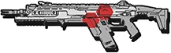

# Assault Rifles (ARs)

## <mark style="color:yellow;">R-201 Carbine</mark> 

|                                                 R-201 Carbine                                                |       Ingame Description       |
| :----------------------------------------------------------------------------------------------------------: | :----------------------------: |
| 
<figure><figcaption></figcaption></figure>
 | “Full-auto and high accuracy.” |

|   |   |
| - | - |
|   |   |
|   |   |
|   |   |

Use [https://pastebin.com/fe5UXrW9](https://pastebin.com/fe5UXrW9) and [https://strategywiki.org/wiki/Titanfall\_2/Weapons?utm\_source=chatgpt.com](https://strategywiki.org/wiki/Titanfall_2/Weapons?utm_source=chatgpt.com) for reference.
