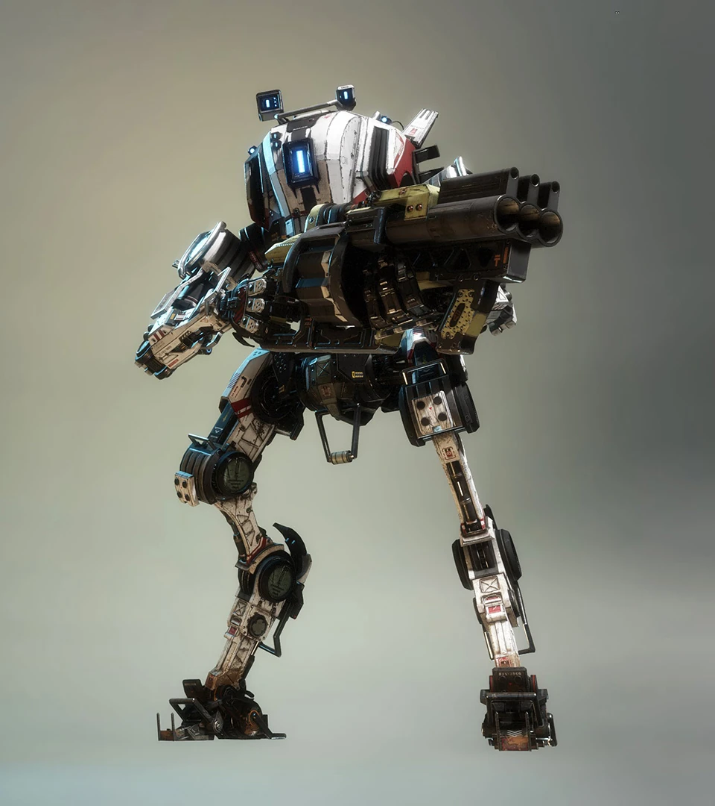
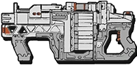

# 🛡️ Ronin's Arsenal

## <mark style="color:yellow;">Ronin</mark>

|                                             Ronin Loadout Screen                                            |                                                                         Quote                                                                         |
| :---------------------------------------------------------------------------------------------------------: | :---------------------------------------------------------------------------------------------------------------------------------------------------: |
| 
<figure><figcaption></figcaption></figure>
 | 
<em><strong>Ronin loves getting up close with its samurai vibe and quick-to-get in and out tactics.</strong></em> — Old Website Description
 |



<figure><figcaption></figcaption></figure>



<figure><figcaption></figcaption></figure>







| General Information                                                                                                         | Chassis & Loadout Specifications                                                                                                                            |
| --------------------------------------------------------------------------------------------------------------------------- | ----------------------------------------------------------------------------------------------------------------------------------------------------------- |
| <mark style="color:yellow;">**File Name:**</mark> Locust                                                                    | <mark style="color:yellow;">**Base Health:**</mark> 7,500                                                                                                   |
| <mark style="color:yellow;">**Class:**</mark> Ronin                                                                         | <mark style="color:yellow;">**Aegis Health:**</mark> 10,000                                                                                                 |
| <mark style="color:yellow;">**Type:**</mark> Titan                                                                          | 
<mark style="color:yellow;"><strong>Dash Capacity:</strong></mark> 2 → 3 <mark style="color:yellow;"><strong>Dash Cooldown:</strong></mark> 5 sec
 |
| <mark style="color:yellow;">**Parent Chassis:**</mark> Stryder                                                              | <mark style="color:yellow;">**Primary Weapon:**</mark> Leadwall                                                                                             |
| <mark style="color:yellow;">**Manufacturer:**</mark> Hammond Robotics                                                       | <mark style="color:yellow;">**Ordnance Ability:**</mark> Arc Wave                                                                                           |
| <mark style="color:yellow;">**Sub-Variant:**</mark> Ronin Prime, Arc Titan                                                  | <mark style="color:yellow;">**Tactical Ability:**</mark> Phase Dash                                                                                         |
| <mark style="color:yellow;">**User(s):**</mark> Ash, Pilots                                                                 | <mark style="color:yellow;">**Defensive Ability:**</mark> Sword Block                                                                                       |
| <mark style="color:yellow;">**Conflict(s):**</mark> Frontier War                                                            | <mark style="color:yellow;">**Core:**</mark> Sword Core                                                                                                     |
| <mark style="color:yellow;">**Appears In:**</mark> Titanfall 2, Titanfall: Assault, Stories from the Outlands, Apex Legends | <mark style="color:yellow;">**Other Equipment:**</mark> N.A.                                                                                                |

### <mark style="color:yellow;">Overview</mark>

Ronin excels as a highly mobile close-range Titan, specializing in aggressive hit-and-run tactics. Built on the agile Stryder chassis, Ronin sacrifices durability for speed, allowing him to quickly engage enemies, deal heavy burst damage, and reposition before taking significant retaliation. His arsenal revolves around closing the distance and overwhelming opponents through a combination of mobility, disruption, and powerful melee attacks. Despite his strong defensive ability he still bleeds health, good Ronins will learn to use cover to out-damage opponents at close range or even manipulate enemy Titans' movement to act as an obstacle for other enemies.

<mark style="color:yellow;">**Ronin's Loadout**</mark>

* [**Leadwall:**](ronins-arsenal.md#leadwall) A powerful shotgun that delivers devastating damage at close range, making it Ronin's primary source of damage.
* <mark style="color:yellow;">**Broadsword:**</mark> An oversized sword that enhances Ronin's melee attacks and becomes his primary weapon during Sword Core.
* [**Arc Wave:**](ronins-arsenal.md#arc-wave) Projects an electrical wave that damages, immobilizes, and disrupts enemies, creating opportunities to close the gap.
* [**Phase Dash:**](ronins-arsenal.md#phase-dash) Allows Ronin to temporarily phase out of reality, avoiding damage while repositioning or escaping dangerous situations.
* [**Sword Block:**](ronins-arsenal.md#sword-block) A defensive ability that significantly reduces incoming damage, helping compensate for Ronin's low health pool.
* [**Sword Core:**](ronins-arsenal.md#sword-core) Increases dash refill rate by a lot and empowers Ronin's Broadsword with increased damage and enhanced attacks, turning him into a deadly close-range threat.

While Ronin can dominate isolated targets and pressure slower Titans such as Scorch and Legion, he must be cautious against opponents capable of controlling space or dealing sustained/burst damage at range, such as Northstar, Legion, and Monarch.

Overall, Ronin is designed for players who enjoy fast-paced, aggressive gameplay. His combination of mobility, burst damage, and tactical survivability makes him one of the most rewarding but also one of the most demanding Titans to master.

## <mark style="color:yellow;">Leadwall</mark>

|                                                    HUD Icon                                                   |                                                                             Quote                                                                            |
| :-----------------------------------------------------------------------------------------------------------: | :----------------------------------------------------------------------------------------------------------------------------------------------------------: |
| 
<figure><figcaption></figcaption></figure>
 | 
<em><strong>High-power, low capacity shotgun that bounces off walls.</strong></em> — Old Website Description (Needs a kit to bounce off walls.)
 |

| General Information                                                                                      | Weapon Specifications                                                  |
| -------------------------------------------------------------------------------------------------------- | ---------------------------------------------------------------------- |
| <mark style="color:yellow;">**File Name:**</mark> leadwall                                               | <mark style="color:yellow;">**Fire Mode:**</mark> Semi-automatic       |
| <mark style="color:yellow;">**Weapon Class:**</mark> Primary Weapon                                      | <mark style="color:yellow;">**Magazine Capacity:**</mark> 4 leads      |
| <mark style="color:yellow;">**Weapon Type:**</mark> Shotgun                                              | <mark style="color:yellow;">**Reload Time:**</mark> 2.25 sec           |
| <mark style="color:yellow;">**Manufacturer:**</mark> Brockhaurd Manufacturing                            | <mark style="color:yellow;">**Hit Registration:**</mark> Projectile    |
| <mark style="color:yellow;">**Special Feature:**</mark> Fires 8 projectiles split into 2 horizontal rows | <mark style="color:yellow;">**Vortex Absorbable:**</mark> Yes          |
| <mark style="color:yellow;">**Default Max Range:**</mark> 44.7 m                                         | <mark style="color:yellow;">**Fire Rate:**</mark> 2.5 shots per second |

### <mark style="color:yellow;">Overview</mark>

The Leadwall is Ronin's primary weapon and serves as the foundation of his close-range playstyle. It is a semi-automatic shotgun that fires leads that consist of 8 projectiles split into two horizontal rows, dealing heavy burst damage at close range. While devastating up close, the Leadwall's projectiles are limited hard by their max range, encouraging Ronin to stay mobile and fight aggressively in close quarters.

The weapon holds four shots before requiring a reload, making ammunition management important during extended engagements. Due to its projectile-based nature, shots can be absorbed and reflected by Vortex Shield. Despite what the official description says, Leadwall pellets don't bounce off walls unless you're using the Ricochet Rounds kit.

* <mark style="color:yellow;">Fires 8 projectiles arranged in 2 horizontal rows.</mark>
* <mark style="color:yellow;">Deals its highest damage at close range.</mark>
* <mark style="color:yellow;">4</mark> [crit](../universal-mechanics/titan-weak-points.md) <mark style="color:yellow;">shots up close can deal absurd 2 bars of damage.</mark>
* <mark style="color:yellow;">Holds 4 shots before reloading.</mark>
* <mark style="color:yellow;">Projectiles can be absorbed and reflected by Vortex Shield.</mark>
* <mark style="color:yellow;">Best used in combination with Ronin's mobility tools to quickly close the distance.</mark>
* <mark style="color:yellow;">Projectile velocity scales by like 20% of your movement speed, dashing lets you get an extra 3.6% max range, and possibly even more damage due to less damage falloff.</mark>

Overall, the Leadwall is a simple but highly effective weapon that rewards aggressive positioning and precise close-range engagements.

### <mark style="color:yellow;">Leadwall Stats</mark>

<table data-full-width="false"><thead><tr><th width="243">Damage Type</th><th width="215" align="center">Base Damage</th><th align="center">Crit (1.5x) Headshot (N.A.)</th></tr></thead><tbody><tr><td>1 Projectile out of 8</td><td align="center"></td><td align="center"></td></tr><tr><td><mark style="color:yellow;">Titan Close</mark> <mark style="color:orange;">(far)</mark></td><td align="center"><mark style="color:yellow;">100</mark> <mark style="color:orange;">(75)</mark></td><td align="center"><mark style="color:yellow;">150</mark> <mark style="color:orange;">(113)</mark></td></tr><tr><td><mark style="color:yellow;">Entity Close</mark> <mark style="color:orange;">(far)</mark></td><td align="center"><mark style="color:yellow;">60</mark> <mark style="color:orange;">(25)</mark></td><td align="center">N.A.</td></tr><tr><td>Total of all 8 Projectiles</td><td align="center"></td><td align="center"></td></tr><tr><td><mark style="color:yellow;">Titan Close</mark> <mark style="color:orange;">(far)</mark></td><td align="center"><mark style="color:yellow;">800</mark> <mark style="color:orange;">(600)</mark></td><td align="center"><mark style="color:yellow;">1,200</mark> <mark style="color:orange;">(900)</mark></td></tr><tr><td><mark style="color:yellow;">Entity Close</mark> <mark style="color:orange;">(far)</mark></td><td align="center"><mark style="color:yellow;">480</mark> <mark style="color:orange;">(200)</mark></td><td align="center">N.A.</td></tr></tbody></table>

<h2 align="center"><mark style="color:yellow;">Arc Wave</mark></h2>

<figure><figcaption></figcaption></figure>

<table data-card-size="large" data-view="cards"><thead><tr><th></th><th></th></tr></thead><tbody><tr><td><mark style="color:yellow;"><strong>File Name:</strong></mark> arc wave</td><td><mark style="color:yellow;"><strong>Ability Mode:</strong></mark> Deploy / Hold</td></tr><tr><td><mark style="color:yellow;"><strong>Weapon Class:</strong></mark> Ordnance</td><td><mark style="color:yellow;"><strong>Max Hold Duration:</strong></mark> Infinite</td></tr><tr><td><mark style="color:yellow;"><strong>Weapon Type:</strong></mark> Stunning high voltage wave</td><td><mark style="color:yellow;"><strong>Cooldown:</strong></mark> 10 sec (1 sec refill start delay) <mark style="color:yellow;"><strong>Affected by Gravity:</strong></mark> Yes</td></tr><tr><td><mark style="color:yellow;"><strong>Special:</strong></mark> Slows entities, shreds Gun Shield &#x26; Particle Wall</td><td><mark style="color:yellow;"><strong>Vortex Absorbable:</strong></mark> No, but blockable</td></tr></tbody></table>

### <mark style="color:yellow;">Overview</mark>

Arc Wave is Ronin's ordnance ability, projecting a wave of high-voltage energy along the ground that damages and disrupts enemies caught in its path. In addition to dealing damage, Arc Wave briefly immobilizes affected targets, making it easier for Ronin to close the distance and capitalize on his close-range arsenal.

The ability travels as a projectile and can be held indefinitely before release, allowing Ronin to time its use precisely. Arc Wave is also particularly effective against defensive abilities, able to instantly break Gun Shields and Particle Walls while pressuring enemies out of defensive positions. It deals more damage and changes to an orange hue when in Sword Core.

* <mark style="color:yellow;">Fires a ground-traveling wave of electrical energy.</mark>
* <mark style="color:yellow;">Damages and immobilizes enemies caught in its path.</mark>
* <mark style="color:yellow;">Helps Ronin initiate and disengage engagements to reload safely.</mark>
* <mark style="color:yellow;">Instantly destroys Gun Shields and Particle Walls.</mark>
* <mark style="color:yellow;">It can be combined with Phase Dash to safely execute Titans.</mark>
* <mark style="color:yellow;">For some reason deals</mark> <mark style="color:yellow;">Titan damage against Particle Wall & Gun Shield.</mark>
* <mark style="color:yellow;">It can be held indefinitely before being released and melee'ed to cancel the throw.</mark>
* <mark style="color:yellow;">Deals extra damage and becomes orange in Sword Core.</mark>

Arc Wave is Ronin's primary tool for creating openings during combat. Whether used to begin an attack, interrupt an enemy's retreat, or weaken defensive setups, it provides valuable utility that complements Ronin's aggressive playstyle.

### <mark style="color:yellow;">Thunderstorm Kit</mark>

The Thunderstorm kit not only allows you to store a second Arc Wave but also preserves “cooldown progress” in the shared ammo pool. Any ammo regenerated beyond the first usable Arc Wave contributes toward the second, so its cooldown can be partially complete even before the first is fired.

Thunderstorm Arc Waves use the same ammo pool, meaning the 1-second refill delay only starts once you fire the Arc Wave. If you fire both charges back-to-back and use [Quickswap](../universal-mechanics/quickswap-crouch-tech.md), most of the delay has already elapsed during the time between shots, leaving only a small fraction (\~0.13 s) remaining before regeneration begins. Thereafter, both charges recharge simultaneously. Holding a recharged Arc Wave continues to contribute to the next one, so the second charge is often partially ready before the first is even used.

### <mark style="color:yellow;">Arc Wave Stats</mark>

| Damage Type |                Base Damage               |             Sword Core Damage            |
| ----------- | :--------------------------------------: | :--------------------------------------: |
| Titan       | <mark style="color:yellow;">1,000</mark> | <mark style="color:orange;">1,500</mark> |
| Entity      |   <mark style="color:yellow;">75</mark>  |  <mark style="color:orange;">113</mark>  |

<h2 align="center"><mark style="color:yellow;">Phase Dash</mark></h2>

<figure><figcaption></figcaption></figure>

<table data-card-size="large" data-column-title-hidden data-view="cards"><thead><tr><th>General Information</th><th>Ability Specifications</th></tr></thead><tbody><tr><td><mark style="color:yellow;"><strong>File Name:</strong></mark> phase dash</td><td><mark style="color:yellow;"><strong>Ability Mode:</strong></mark> Deploy</td></tr><tr><td><mark style="color:yellow;"><strong>Weapon Class:</strong></mark> Tactical</td><td><mark style="color:yellow;"><strong>Max Duration:</strong></mark> 1 sec</td></tr><tr><td><mark style="color:yellow;"><strong>Weapon Type:</strong></mark> Time teleport</td><td><mark style="color:yellow;"><strong>Cooldown:</strong></mark> 12.5 sec (no refill start delay)</td></tr><tr><td><mark style="color:yellow;"><strong>Function:</strong></mark> Move through entities, travel distances, damage immunity, instakill humanoids on exit</td><td><mark style="color:yellow;"><strong>Charges:</strong></mark> 1</td></tr></tbody></table>

### <mark style="color:yellow;">Overview</mark>

Phase Dash is Ronin's tactical ability, allowing him to briefly enter an alternate dimension and become completely immune to damage. During the Phase Dash, Ronin can move through Titans, entities, and projectiles before reappearing at his destination. But it doesn't let Ronin to phase-dash through map obstacles. This makes Phase Dash an excellent tool for repositioning, escaping dangerous situations, or aggressively pushing through enemy lines.

While phased, Ronin cannot interact with the battlefield and is unable to deal damage until he exits. Any Pilots occupying the space where Ronin reappears are instantly crushed, making Phase Dash a potential anti-Pilot tool in addition to its mobility applications.

* <mark style="color:yellow;">Grants complete damage immunity for up to 1 second, even against</mark> [rodeo damage.](ronin-tech/anti-rodeo-phase-tech.md)
* <mark style="color:yellow;">Allows Ronin to pass through Titans, entities, and projectiles, but not through map obstacles.</mark>
* <mark style="color:yellow;">It can be used to escape, reposition, or close the distance on enemies.</mark>
* <mark style="color:yellow;">Instantly kills Pilots that get caught at the Phase Dash exit point.</mark>
* <mark style="color:yellow;">Phasing into an enemy Titan, Reaper, and</mark> [blue barrel](../titan-competitive-stuff/questionable-strategies/barrel-spawn-trapping.md) <mark style="color:yellow;">can heavily damage you and even kill you.</mark>
* <mark style="color:yellow;">Lifts Ronin slightly off the ground, letting him get over small obstacles when combined with crouch.</mark>
* <mark style="color:yellow;">Often used to avoid high-damage abilities and core attacks.</mark>
* <mark style="color:yellow;">It can be combined with Arc Wave to safely execute Titans.</mark>
* <mark style="color:yellow;">Phase Dash drops any attached Firestars and thermite and destroys attached Tether Traps.</mark>
* <mark style="color:yellow;">Can trigger Tripwire laser while in phase, making them explode without harm to you.</mark>
* <mark style="color:yellow;">Phasing removes all Tone lock-ons but doesn't stop Tracker Rockets and Archer from following you.</mark>

Phase Dash is one of Ronin's most versatile abilities, providing both offensive and defensive utility. Mastering when and where to phase is essential to surviving engagements and maximizing Ronin's mobility advantage.

### <mark style="color:yellow;">**Temporal Anomaly Kit**</mark>

The Temporal Anomaly kit reduces the recharge time of Phase Dash by 33%, from 12 seconds to 8 seconds. Which actually lets you use Phase Dash twice during Sword Core since a Sword Core lasts 12 seconds.

<h2 align="center"><mark style="color:yellow;">Sword Block</mark></h2>

<figure><figcaption></figcaption></figure>

<table data-card-size="large" data-column-title-hidden data-view="cards"><thead><tr><th>General Information</th><th>Ability Specifications</th></tr></thead><tbody><tr><td><mark style="color:yellow;"><strong>File Name:</strong></mark> swordblock</td><td><mark style="color:yellow;"><strong>Ability Mode:</strong></mark> Hold</td></tr><tr><td><mark style="color:yellow;"><strong>Weapon Class:</strong></mark> Defensive</td><td><mark style="color:yellow;"><strong>Max Hold Duration:</strong></mark> Infinite</td></tr><tr><td><mark style="color:yellow;"><strong>Weapon Type:</strong></mark> Deflective sword</td><td><mark style="color:yellow;"><strong>Cooldown:</strong></mark> N.A.</td></tr><tr><td><mark style="color:yellow;"><strong>Special:</strong></mark> <a href="../monarch/monarch-tech/xo-16-chaingun-variants-vs.-shields.md">Arc Damage</a> can't pierce it</td><td><mark style="color:yellow;"><strong>Durability:</strong></mark> 70% flat damage reduction, 85% in Sword Core</td></tr></tbody></table>

### <mark style="color:yellow;">Overview</mark>

Sword Block is Ronin's primary defensive ability, allowing him to significantly reduce incoming damage by raising his Broadsword in a defensive stance. While active, Sword Block reduces all incoming damage by 70% from ANY angle but can be [swordpierced](ronin-tech/sword-pierce.md) from specific angles, making it one of the strongest defensive abilities in the game despite Ronin's relatively low health pool.

Unlike many defensive abilities, Sword Block has no cooldown and can be held indefinitely. This allows Ronin to survive otherwise lethal extended fire situations, safely retreat from unfavorable engagements, or absorb damage while closing the distance on enemies. During Sword Core, its damage reduction is further increased up to 85% damage reduction, making Ronin exceptionally difficult to take down.

* <mark style="color:yellow;">Reduces incoming damage by 70%.</mark>
* <mark style="color:yellow;">Damage reduction increases to 85% during Sword Core.</mark>
* <mark style="color:yellow;">Hides the hit marker, but doesn't stop you from</mark> [criting](../universal-mechanics/titan-weak-points.md) <mark style="color:yellow;">the Ronin.</mark>
* <mark style="color:yellow;">It can be held indefinitely with no cooldown.</mark>
* <mark style="color:yellow;">Blocks damage from all directions, though he can be</mark> [swordpierced](ronin-tech/sword-pierce.md) <mark style="color:yellow;">from very specific angles.</mark>
* [Arc-based attacks](../monarch/monarch-tech/xo-16-chaingun-variants-vs.-shields.md) <mark style="color:yellow;">from upgraded XO-16 cannot bypass Sword Block.</mark>
* <mark style="color:yellow;">Essential for surviving engagements and repositioning safely.</mark>
* <mark style="color:yellow;">One blocked bar of health would convert to roughly 3 bars of health, an easy way to remember.</mark>

Overall, Sword Block is the cornerstone of Ronin's survivability. Effective use of the ability often determines whether a Ronin successfully disengages from danger or becomes an easy target for enemy Titans.

### <mark style="color:yellow;">Sword Block Damage Needed for a Bar of Health</mark>

<table><thead><tr><th width="185">Normal vs. Crit.</th><th width="279" align="center">Normal DMG Reduction 70%</th><th align="center">Sword Core DMG Reduction 85%</th></tr></thead><tbody><tr><td><mark style="color:yellow;">Normal Damage</mark></td><td align="center"><mark style="color:yellow;">8,333</mark></td><td align="center"><mark style="color:yellow;">16,666</mark></td></tr><tr><td><a href="../universal-mechanics/titan-weak-points.md">1.5x Crit</a></td><td align="center"><mark style="color:red;">5,555</mark></td><td align="center"><mark style="color:red;">11,111</mark></td></tr></tbody></table>

<h2 align="center"><mark style="color:yellow;">Sword Core</mark></h2>

<figure><figcaption></figcaption></figure>

| General Information                                                     | Core Specifications                                                                                                          |
| ----------------------------------------------------------------------- | ---------------------------------------------------------------------------------------------------------------------------- |
| <mark style="color:yellow;">**File Name:**</mark> shift core            | <mark style="color:yellow;">**Core Type:**</mark> Ultimatum                                                                  |
| <mark style="color:yellow;">**Weapon Class:**</mark> Titan core ability | <mark style="color:yellow;">**Max Duration:**</mark> 12 sec                                                                  |
| <mark style="color:yellow;">**Weapon Type:**</mark> Empowered sword     | <mark style="color:yellow;">**Special:**</mark> Faster dash refill, stronger block, and more damage on melees and Arc Waves  |

### <mark style="color:yellow;">Overview</mark>

Sword Core is Ronin's core ability, which instantly refills all dashes, temporarily gives Ronin fast dash refill rate, and empowers his Broadsword transforming him into a devastating close-range monster. For 12 seconds, Ronin gains access to enhanced sword attacks, massively increased melee damage, increased Arc Wave damage, and a stronger Sword Block, allowing him to aggressively pressure enemy Titans while remaining surprisingly durable.

Unlike many core abilities that focus on ranged damage or area denial, Sword Core acts like a massive temporary booster that rewards direct engagement. When activated, Ronin becomes the most dangerous and powerful Titan at close quarters, capable of rapidly dealing damage and punishing isolated targets.

* <mark style="color:yellow;">Lasts for 12 seconds after activation.</mark>
* <mark style="color:yellow;">Instantly refills all dashes on activation and greatly increases the dash refill rate.</mark>
* <mark style="color:yellow;">Massively increases the damage of Ronin's melee attacks.</mark>
* <mark style="color:yellow;">Enhances Arc Wave, increasing its damage output, taking only 2 of them to deal a bar of HP.</mark>
* <mark style="color:yellow;">Improves Sword Block, increasing damage reduction from 70% to 85%.</mark>
* <mark style="color:yellow;">Excels at killing even high-health targets and winning close-range engagements.</mark>
* <mark style="color:yellow;">Most effective when combined with Ronin's mobility and defensive abilities.</mark>
* <mark style="color:yellow;">Secretly increases</mark> [Sword Core angle](../universal-mechanics/extended-melee-range-toe-tech.md)<mark style="color:yellow;">, letting you melee from farther away.</mark>
* <mark style="color:yellow;">One blocked bar of health in Sword Core would convert to roughly 6 bars of health, an easy way to remember.</mark>

Sword Core is the culmination of Ronin's aggressive playstyle, turning him into a highly mobile duelist capable of overwhelming opponents through relentless pressure, burst damage, and enhanced survivability.

### <mark style="color:yellow;">Highlander Kit</mark>

Titan kills give you back 8 sec Sword Core duration. The regained Sword Core duration cannot overfill your current duration, so getting a Titan kill at 10 sec duration left will give you only 2 sec core duration back. Titan ejects count as a kill if you doomed the Titan.

### <mark style="color:yellow;">Sword Core Melee and Arc Wave Stats</mark>

| Damage Type            |                Base Damage               |             Sword Core Damage            |
| ---------------------- | :--------------------------------------: | :--------------------------------------: |
| Titan & Entity (Melee) |  <mark style="color:yellow;">800</mark>  | <mark style="color:orange;">2,200</mark> |
| Titan (Arc Wave)       | <mark style="color:yellow;">1,000</mark> | <mark style="color:orange;">1,500</mark> |
| Entity (Arc Wave)      |   <mark style="color:yellow;">75</mark>  |  <mark style="color:orange;">113</mark>  |

### <mark style="color:yellow;">Sword Core Sword Block Damage Needed for a Bar of Health</mark>

<table><thead><tr><th width="185">Normal vs. Crit.</th><th width="279" align="center">Normal DMG Reduction (70%)</th><th align="center">Sword Core DMG Reduction (85%)</th></tr></thead><tbody><tr><td><mark style="color:yellow;">Normal Damage</mark></td><td align="center"><mark style="color:yellow;">8,333</mark></td><td align="center"><mark style="color:yellow;">16,666</mark></td></tr><tr><td><a href="../universal-mechanics/titan-weak-points.md">1.5x Crit</a></td><td align="center"><mark style="color:red;">5,555</mark></td><td align="center"><mark style="color:red;">11,111</mark></td></tr></tbody></table>
