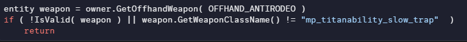

# 🔻 Canister Despawn

## <mark style="color:yellow;">Shield-Based Canister Despawning</mark>

You can partially/completely despawn Canister flames by occupying the space that the Canister's flame projectiles try to spawn at. It will not allow the flames to spawn after igniting and results in either partial or the entire trap being destroyed.

### <mark style="color:yellow;">**Current Abilities that Work**</mark>

* <mark style="color:yellow;">Vortex Shield.</mark>
* <mark style="color:yellow;">Thermal</mark> <mark style="color:yellow;">Shield.</mark>
* <mark style="color:yellow;">Gun Shield.</mark>
* <mark style="color:yellow;">Particle Wall.</mark>
* <mark style="color:yellow;">Hard Cover.</mark>
* <mark style="color:yellow;">Amped Wall.</mark>



### <mark style="color:yellow;">Vortex Shield Canister Despawn</mark>



### <mark style="color:yellow;">Vortex Shield with Crouch Canister Despawn</mark>



### <mark style="color:yellow;">Vortex Shield Angled Canister Despawn</mark>



### <mark style="color:yellow;">Vortex Shield Angled with Crouch Canister Despawn</mark>





### <mark style="color:yellow;">Thermal</mark> <mark style="color:yellow;">Shield Canister Despawn</mark>



### <mark style="color:yellow;">Thermal</mark> <mark style="color:yellow;">Shield with Crouch Canister Despawn</mark>



### <mark style="color:yellow;">Thermal</mark> <mark style="color:yellow;">Shield Angled Canister Despawn</mark>



### <mark style="color:yellow;">Thermal</mark> <mark style="color:yellow;">Shield Angled with Crouch Canister Despawn</mark>





### <mark style="color:yellow;">Gun Shield Angled Canister Despawn</mark>



### <mark style="color:yellow;">Gun Shield Angled with Crouch Canister Despawn</mark>





### <mark style="color:yellow;">Particle Wall Canister Despawn</mark>



### <mark style="color:yellow;">Hard Cover Canister Despawn</mark>



### <mark style="color:yellow;">A-Wall Canister Despawn</mark>





### <mark style="color:yellow;">Teammate</mark> <mark style="color:yellow;">Thermal</mark> <mark style="color:yellow;">Shield Canister Despawn</mark>



### <mark style="color:yellow;">Bonus</mark> <mark style="color:yellow;">Thermal</mark> <mark style="color:yellow;">Shield Melt Canister</mark>






* <mark style="color:yellow;">Surprisingly doesn't work with own canisters but works with teammate's canisters.</mark>
* <mark style="color:yellow;">Improper angles will cause the canister's flames to only partially despawn, similar to the Particle Wall.</mark>
* <mark style="color:yellow;">Gun Shield being the only held shield type to not work without angling the shield down.</mark>
* <mark style="color:yellow;">Pro Tip for Gun Shield: Aim your barrel towards the canister as shown; it's the easiest and most consistent method.</mark>


## <mark style="color:yellow;">Disembark Canister Despawn</mark>

There is a weird bug involving a disembark. Disembarking after placing an unlit canister will break said canister, not letting anyone be able to ignite it; igniting said canister will cause it to despawn.\
All methods to ignite said broken canister will cause it to despawn regardless of whether it's you, your Auto-Titan, a teammate, or even an enemy igniting it.

### <mark style="color:yellow;">**Line of code responsible for it**</mark>

<figure><figcaption></figcaption></figure>

As a Pilot, you don't have an offhand in that slot; hence why it doesn't work. If your enhanced Auto-Titan Scorch drops a canister, you can ignite it as normal.&#x20;

### <mark style="color:yellow;">**Weird Additional Canister Despawn Facts**</mark>

You can ignite an Auto-Scorch's canister yourself, but when your Auto-Scorch places a canister and you get back inside the Titan, the canister will instantly despawn. &#x20;




0:00-0:04 Firestar despawn.\
0:05-0:09 T-203 Thermite Launcher despawn.\
0:10-0:13 Thermal Shield despawn.\
0:14-0:19 Firewall despawn.\
0:20-0:28 Flame Core despawn.\
0:29-0:35 Auto-Scorch despawn.





0:00-0:09 Igniting Auto-Scorch's Canister\
0:10-0:21 Auto-Scorch canister despawning upon embark





Didn't include a clip of a canister trying to ignite a disembark bugged canister because it would make no difference.

