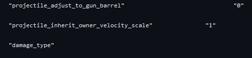

# 🟢 Long-Range Canister Throw

In the Code, [Tripwire](../../ion/ion-tech/long-range-tripwire-throw.md) and Incedinary Canister throw velocity scales with Titan velocity. Dashing and deploying an Incedinary Canister mid-dash will toss your canister a much larger distance away. Can even land an Incedinary Canister onto the opposite side of the Black Water Canal bridge, behind the head glitch spot.

* <mark style="color:yellow;">Dashing and sliding off something can further increase the throw range.</mark>
* <mark style="color:yellow;">Dashing and throwing the canister behind you or dashing off a ledge and throwing the canister behind you will reset your throw velocity to the default velocity.</mark>
* <mark style="color:yellow;">The default velocity is the velocity at which you throw a canister while standing still; you can't go lower than that velocity.</mark>

### <mark style="color:yellow;">**Line of code responsible for it**</mark>

<figure><figcaption></figcaption></figure>

### <mark style="color:yellow;">Video Showcasing Long-Range Canister Throws</mark>


0:00-0:11 Tossing canister onto Colony Tower side roof from top spawn.\
0:12-0:21 Tossing canister onto Colony Tower roof from hill drop.\
0:22-0:32 Tossing a canister from one side of the BWC bridge onto the other, making the Head Glitch inaccessible.

