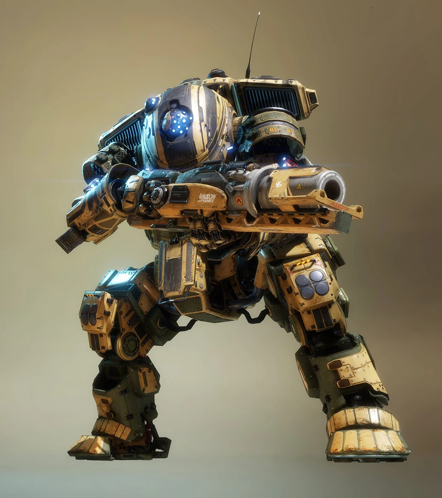
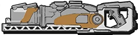

# 🛡️ Scorch's Arsenal

## <mark style="color:yellow;">Scorch</mark>

|                           Scorch Loadout Screen                          |                                                                       Quote                                                                       |
| :----------------------------------------------------------------------: | :-----------------------------------------------------------------------------------------------------------------------------------------------: |
|  | 
<em><strong>Scorch manipulates fire as its primary source of defensive and offensive abilities.</strong></em> — Old Website Description
 |



<figure><figcaption></figcaption></figure>



<figure><figcaption></figcaption></figure>







| General Information                                                                                       | Chassis & Loadout Specifications                                                                                                                               |
| --------------------------------------------------------------------------------------------------------- | -------------------------------------------------------------------------------------------------------------------------------------------------------------- |
| <mark style="color:yellow;">**File name:**</mark> Ogre                                                    | <mark style="color:yellow;">**Base Health:**</mark> 12,500                                                                                                     |
| <mark style="color:yellow;">**Class:**</mark> Scorch                                                      | <mark style="color:yellow;">**Aegis Health:**</mark> 15,000                                                                                                    |
| <mark style="color:yellow;">**Type:**</mark> Heavy Titan                                                  | 
<mark style="color:yellow;"><strong>Dash Capacity:</strong></mark> 1 <mark style="color:yellow;"><strong>Dash Cooldown:</strong></mark> 10 -> 5 sec 
 |
| <mark style="color:yellow;">**Parent Chassis:**</mark> Ogre                                               | <mark style="color:yellow;">**Primary Weapon:**</mark> T-203 Thermite Launcher                                                                                 |
| <mark style="color:yellow;">**Manufacturer:**</mark> Hammond Robotics                                     | <mark style="color:yellow;">**Ordnance Ability:**</mark> Firewall                                                                                              |
| <mark style="color:yellow;">**Sub-Variant:**</mark> Scorch Prime                                          | <mark style="color:yellow;">**Tactical Ability:**</mark> Incendiary Trap                                                                                       |
| <mark style="color:yellow;">**User(s):**</mark> Kane, Pilots                                              | <mark style="color:yellow;">**Defensive Ability:**</mark> Thermal Shield                                                                                       |
| <mark style="color:yellow;">**Conflict(s):**</mark> Frontier War                                          | <mark style="color:yellow;">**Core:**</mark> Flame Core                                                                                                        |
| <mark style="color:yellow;">**Appears in:**</mark> Titanfall 2, Titanfall: Assault                        | <mark style="color:yellow;">**Other Equipment:**</mark> N.A.                                                                                                   |
| <mark style="color:yellow;">**Ogre Trait:**</mark> 25% knockback reduction from Plasma Railgun and melees |                                                                                                                                                                |

### <mark style="color:yellow;">Overview</mark>

Scorch is a close-range area denial Titan built around controlling space with fire and punishing any enemy that gets too close. Equipped with the heavily modified Ogre chassis, Scorch sacrifices mobility for extreme durability and overwhelming zoning power. His entire loadout revolves around creating hazardous zones, forcing enemy movement, and winning fights through sustained burn damage rather than direct burst engagements.

Scorch excels in tight spaces, chokepoints, and defensive holds where his fire-based abilities can fully control the battlefield. However, his lack of mobility makes him vulnerable at long range, requiring careful positioning and timing to be effective.

<mark style="color:yellow;">**Scorch's Loadout**</mark>

* [**T-203 Thermite Launcher:**](scorchs-arsenal.md#t-203-thermite-launcher) Scorch's primary weapon, firing explosive thermite shells that spread burning droplets and ignite the battlefield for area control.
* [**Thermal Shield:**](scorchs-arsenal.md#thermal-shield) A defensive incendiary barrier that destroys incoming projectiles while burning nearby enemies and enabling close-range pushes.
* [**Incendiary Trap:**](scorchs-arsenal.md#incendiary-trap) A deployable flammable barrel that ignites on trigger, dealing area damage and flushing out enemies. It can chain ignite with other canisters.
* [**Firewall:**](scorchs-arsenal.md#firewall) Deploys a persistent wall of fire, blocking movement, controlling space, and igniting canisters.
* [**Flame Core:**](scorchs-arsenal.md#flame-core) A powerful core ability that releases a devastating wave of thermite, capable of overwhelming grouped enemies and finishing weakened Titans.

Scorch thrives when allowed to dictate the pace of a fight, turning the battlefield into a controlled hazard zone where enemy movement is heavily restricted. While slow and methodical, he becomes one of the most oppressive Titans when played in tight environments.

## <mark style="color:yellow;">T-203 Thermite launcher</mark>

|                                T-203 Thermite Launcher                                |                                                                     Quote                                                                     |
| :-----------------------------------------------------------------------------------: | :-------------------------------------------------------------------------------------------------------------------------------------------: |
|  | 
<em><strong>Lethal, single shot thermite projectiles that set ablaze anything within range.</strong></em> — Old Website Description
 |

| General Information                                                                             | Weapon Specifications                                                            |
| ----------------------------------------------------------------------------------------------- | -------------------------------------------------------------------------------- |
| <mark style="color:yellow;">**File Name:**</mark> meteor                                        | <mark style="color:yellow;">**Fire Mode:**</mark> Single-shot                    |
| <mark style="color:yellow;">**Weapon Class:**</mark> Primary Weapon                             | <mark style="color:yellow;">**Shell Capacity:**</mark> 1 incendiary mortar shell |
| <mark style="color:yellow;">**Weapon Type:**</mark> Thermite mortar                             | <mark style="color:yellow;">Reload Time:</mark> 2.25 sec                         |
| <mark style="color:yellow;">**Manufacturer:**</mark> Vinson Dynamics                            | <mark style="color:yellow;">**Hit Registration:**</mark> Projectile, explosive   |
| <mark style="color:yellow;">**Special Feature:**</mark> Explode into droplets, ignite canisters | <mark style="color:yellow;">**Vortex Absorbable:**</mark> Yes                    |

### <mark style="color:yellow;">Overview</mark>

The T-203 Thermite Launcher is Scorch's primary weapon, designed for igniting traps while also dealing strong damage to enemies and having the ability to [pierce through shields with thermite droplets.](scorch-tech/thermite-droplets-pierce-shield.md) It fires a single high-impact thermite shell that detonates on contact into 5 droplets, spreading burning droplets across the battlefield and igniting any canisters or surfaces it touches.&#x20;

Its thermite droplets can't stack for higher damage, so spreading them out more is generally better to hit more enemies. The 5th droplet is a unique droplet that can stick to Titans and terrain.&#x20;

* <mark style="color:yellow;">Fires a single thermite mortar shell that explodes on impact into 5 thermite droplets.</mark>
* <mark style="color:yellow;">Ignites canisters and synergizes with his abilities.</mark>
* <mark style="color:yellow;">Droplets can</mark> [pierce shields](scorch-tech/thermite-droplets-pierce-shield.md) <mark style="color:yellow;">but don't stick to Titans or terrain.</mark>
* <mark style="color:yellow;">Thermite droplets extinguish in 2-2.5 sec.</mark>
* <mark style="color:yellow;">Thermite droplet damage doesn't stack.</mark>
* <mark style="color:yellow;">Projectile-based and can be absorbed by Vortex Shield.</mark>
* <mark style="color:yellow;">One of the droplets will always be a unique droplet that will stick to terrain, look slightly different and will always last a full 2.5 secs before extinguishing.</mark>

The T-203 Thermite Launcher defines Scorch’s playstyle, rewarding deliberate shots and smart positioning to control the battlefield and apply constant pressure through fire.

### <mark style="color:yellow;">Wildfire Kit</mark>

On top of dealing more damage, the Wildfire kit allows the T-203 Launcher to scatter the area with even more thermite droplets and spread on impact.

* <mark style="color:yellow;">Wildfire kit makes the projectile deal 25% more Titan damage</mark> (800→1000)<mark style="color:yellow;">.</mark>
* <mark style="color:yellow;">Spawns 8 droplets total and in a 4x bigger spread around impact.</mark>
* <mark style="color:yellow;">One of the droplets is a unique droplet.</mark>

### <mark style="color:yellow;">Projectile Impact Stats</mark>

<table data-search="false"><thead><tr><th width="267">Damage Type </th><th align="center">Base Damage</th><th align="center">Crit. (N.A.) Headshot (N.A.)</th></tr></thead><tbody><tr><td>Impact Damage</td><td align="center"></td><td align="center"></td></tr><tr><td><mark style="color:yellow;">Titan</mark></td><td align="center"><mark style="color:yellow;">800</mark></td><td align="center">N.A.</td></tr><tr><td><mark style="color:yellow;">Entity</mark></td><td align="center"><mark style="color:yellow;">310</mark></td><td align="center">N.A.</td></tr><tr><td><mark style="color:orange;">Wildfire Kit</mark></td><td align="center"><mark style="color:orange;">1000 Titan dmg</mark></td><td align="center"><mark style="color:orange;">x4 thermite droplet spread</mark></td></tr><tr><td>Explosion Damage after Impact</td><td align="center"></td><td align="center"></td></tr><tr><td><mark style="color:yellow;">Titan</mark></td><td align="center"><mark style="color:yellow;">200</mark></td><td align="center">N.A.</td></tr><tr><td><mark style="color:yellow;">Entity</mark></td><td align="center"><mark style="color:yellow;">50</mark></td><td align="center">N.A.</td></tr></tbody></table>

### <mark style="color:yellow;">Thermite Droplet Stats</mark>

<table><thead><tr><th width="167">Damage Type</th><th width="176" align="center">Damage Tick (0.1 sec)</th><th width="175" align="center">DPS</th><th align="center">Full Duration (2-2.5 sec)</th></tr></thead><tbody><tr><td><mark style="color:yellow;">Titan</mark></td><td align="center"><mark style="color:yellow;">100</mark> </td><td align="center"><mark style="color:yellow;">1,000</mark></td><td align="center"><mark style="color:yellow;">2,200-2,500</mark></td></tr><tr><td><mark style="color:yellow;">Entity</mark></td><td align="center"><mark style="color:yellow;">20</mark></td><td align="center"><mark style="color:yellow;">200</mark></td><td align="center"><mark style="color:yellow;">400-500</mark> </td></tr><tr><td><mark style="color:orange;">1 Unique Droplet</mark></td><td align="center"><mark style="color:orange;">same</mark></td><td align="center"><mark style="color:orange;">same</mark></td><td align="center"><mark style="color:orange;">max duration</mark></td></tr><tr><td></td><td align="center"></td><td align="center"><mark style="color:orange;">sticks to terrain</mark></td><td align="center"><mark style="color:orange;">different visual</mark></td></tr></tbody></table>

<h2 align="center"><mark style="color:yellow;">Firewall</mark></h2>

<figure><figcaption></figcaption></figure>

<table data-card-size="large" data-column-title-hidden data-view="cards"><thead><tr><th>General Information</th><th>Ability Specifications</th></tr></thead><tbody><tr><td><mark style="color:yellow;"><strong>File Name:</strong></mark> flame wall</td><td><mark style="color:yellow;"><strong>Ability Mode:</strong></mark> Deploy</td></tr><tr><td><mark style="color:yellow;"><strong>Weapon Class:</strong></mark> Ordnance</td><td><mark style="color:yellow;"><strong>Max Duration:</strong></mark> 5.2 sec</td></tr><tr><td><mark style="color:yellow;"><strong>Weapon Type:</strong></mark> Incendiary wall</td><td><mark style="color:yellow;"><strong>Cooldown:</strong></mark> 10 sec (1 sec refill start delay)</td></tr><tr><td><mark style="color:yellow;"><strong>Function:</strong></mark> Block off enemy path, ignite canisters</td><td><mark style="color:yellow;"><strong>Affected by Gravity:</strong></mark> Yes</td></tr></tbody></table>

### <mark style="color:yellow;">Overview</mark>

Firewall is Scorch's ordnance ability, deploying a short wall of fire that rapidly ignites the battlefield and creates a persistent wall of fire. This ability is primarily used for igniting incendiary traps, area denial, blocking off key routes, and forcing enemy Titans and Pilots into unfavorable positions. It deals double the damage of Incendiary Traps.

Once deployed, it will ignite any canisters on contact and form a continuous burning barrier that damages anything passing through it. Because it is affected by gravity, Firewall will instantly drop onto the ground below, allowing Scorch to control space across uneven terrain and chokepoints. Despite its persistence, it can be easily [extinguished by E-Smoke.](../universal-mechanics/e-smoke-mechanics.md#extinguish-firewall-segments-and-firestars)

* <mark style="color:yellow;">Deploys a short line of fire that ignites canisters and burns enemies.</mark>
* <mark style="color:yellow;">Creates a persistent wall of fire for area denial.</mark>
* <mark style="color:yellow;">Deals double the damage of Incendiary Traps.</mark>
* <mark style="color:yellow;">Damages and pressures enemies passing through the flames.</mark>
* <mark style="color:yellow;">Can block off corridors, doors, and narrow chokepoints.</mark>
* <mark style="color:yellow;">Influenced by gravity, allowing varied placement on terrain.</mark>
* <mark style="color:yellow;">Useful for controlling enemy movement and setting up follow-up attacks.</mark>
* <mark style="color:yellow;">It can be easily</mark> [extinguished via E-Smoke.](../universal-mechanics/e-smoke-mechanics.md)

Firewall is a core part of Scorch's defensive and zoning toolkit, excelling at controlling space and punishing enemies who attempt to push through contested areas.

### <mark style="color:yellow;">Firewall Stats</mark>

<table><thead><tr><th width="177">Damage Type</th><th width="213" align="center">Damage Tick (0.1 sec)</th><th align="center">DPS</th><th align="center">Max Damage Duration</th></tr></thead><tbody><tr><td><mark style="color:yellow;">Titan close</mark> <mark style="color:orange;">(far)</mark></td><td align="center"><mark style="color:yellow;">100</mark></td><td align="center"><mark style="color:yellow;">1,000</mark> <mark style="color:orange;">(750)</mark></td><td align="center"><mark style="color:yellow;">5,200</mark> <mark style="color:orange;">(3,900)</mark></td></tr><tr><td><mark style="color:yellow;">Entity</mark> <mark style="color:orange;">(far)</mark></td><td align="center"><mark style="color:yellow;">20</mark></td><td align="center"><mark style="color:yellow;">200</mark> <mark style="color:orange;">(150)</mark></td><td align="center"><mark style="color:yellow;">1,040</mark> <mark style="color:orange;">(780)</mark></td></tr></tbody></table>

### <mark style="color:yellow;">Fuel for the Fire Kit</mark>

The kit simply reduces the Firewall cooldown by 2 seconds. From 10 to 8 seconds. It doesn't offer any practical use, even for tech involving timing for a [faster reload.](scorch-tech/advanced-reload-cancel.md)

<h2 align="center"><mark style="color:yellow;">Incendiary Trap</mark></h2>

<figure><figcaption></figcaption></figure>

<table data-card-size="large" data-column-title-hidden data-view="cards"><thead><tr><th>General Information</th><th>Ability Specifications</th></tr></thead><tbody><tr><td><mark style="color:yellow;"><strong>File Name:</strong></mark> slow trap</td><td><mark style="color:yellow;"><strong>Ability Mode:</strong></mark> Deploy</td></tr><tr><td><mark style="color:yellow;"><strong>Weapon Class:</strong></mark> Tactical</td><td><mark style="color:yellow;"><strong>Max Duration:</strong></mark> 5.2 sec</td></tr><tr><td><mark style="color:yellow;"><strong>Weapon Type:</strong></mark> Flammable gas barrel</td><td><mark style="color:yellow;"><strong>Cooldown:</strong></mark> 15 sec per canister [30 sec total](no refill start delay)</td></tr><tr><td><mark style="color:yellow;"><strong>Function:</strong></mark> Block off enemy path, flush out Pilots, ignite other canisters when lit</td><td><mark style="color:yellow;"><strong>Damage Stackable:</strong></mark> Yes</td></tr></tbody></table>

### <mark style="color:yellow;">Overview</mark>

secondsIncendiary Trap is Scorch's tactical ability, deploying a flammable gas canister designed to control space, disrupt enemy movement, and punish aggressive pushes. When ignited via thermite or fire, the trap ignites and spreads fire for 5.2 seconds in its area, forcing enemies to either reposition or take sustained damage over time. The traps can even be ignited by enemy thermite/fire.

Unlike Firewall, Incendiary Trap is more reactive and versatile, allowing Scorch to set hidden pressure points or chain ignition effects by lighting other nearby canisters. Its damage also stacks when multiple traps overlap, making it especially dangerous in tight spaces. The Incendiary Trap will bounce off Titans and their defensive shields but will be destroyed by an enemy Flame Shield.

The canister will explode once it runs out of gas after ignition, dealing an additional 400 explosive damage that ignores the Tempered Plating kit. The canister deals damage every 0.2 sec instead of 0.1 sec unlike other thermite sources, literally halving its DPS and total damage. Stepping onto the [outer ring](scorch-tech/overlapping-canister-damage-radius.md) still deals damage every 0.2 sec but double the damage.

* <mark style="color:yellow;">Deploys a flammable gas barrel that ignites for 5.2 seconds on contact with thermite/fire.</mark>
* <mark style="color:yellow;">It can be ignited even by an enemy.</mark>
* <mark style="color:yellow;">Creates a localized fire zone for area denial and zoning.</mark>
* <mark style="color:yellow;">Effective for flushing out hiding Pilots and controlling choke points.</mark>
* <mark style="color:yellow;">Can ignite other nearby canisters when triggered.</mark>
* <mark style="color:yellow;">Damage can stack when multiple traps overlap.</mark>
* <mark style="color:yellow;">Useful for setting traps in advance of enemy movement.</mark>
* <mark style="color:yellow;">Will bounce off Titans and shields, though the Flame Shield will destroy it mid-flight.</mark>
* <mark style="color:yellow;">The canister explodes after expiring, dealing an extra 400 explosive damage which ignores Tempered Plating.</mark>
* <mark style="color:yellow;">Damages every 0.2 tick instead of 0.1 tick.</mark>
* <mark style="color:yellow;">Deals double damage on the</mark> [outer ring.](scorch-tech/overlapping-canister-damage-radius.md)

Incendiary Trap complements Scorch’s defensive toolkit by rewarding prediction and map control, turning key areas into dangerous zones that punish careless movement.

### <mark style="color:yellow;">Incendiary Trap Stats</mark>

<table><thead><tr><th width="165">Damage Type</th><th width="202" align="center">Damage Tick (0.2 sec)</th><th width="125" align="center">DPS</th><th align="center">Max Damage Duration (5.2 sec)</th></tr></thead><tbody><tr><td><mark style="color:yellow;">Titan:</mark> <mark style="color:yellow;">Inside Ring</mark> <mark style="color:orange;">(outside ring)</mark></td><td align="center"><mark style="color:yellow;">100</mark> <mark style="color:orange;">(200)</mark></td><td align="center"><mark style="color:yellow;">500</mark> <mark style="color:orange;">(1,000)</mark></td><td align="center"><mark style="color:yellow;">2,600</mark> <mark style="color:orange;">(5,200)</mark></td></tr><tr><td><mark style="color:yellow;">Entity:</mark> <mark style="color:yellow;">Inside Ring</mark> <mark style="color:orange;">(outside ring)</mark></td><td align="center"><mark style="color:yellow;">20</mark> <mark style="color:orange;">(40)</mark></td><td align="center"><mark style="color:yellow;">100</mark> <mark style="color:orange;">(200)</mark></td><td align="center"><mark style="color:yellow;">520</mark> <mark style="color:orange;">(1,040)</mark></td></tr><tr><td>Explosion after expiring</td><td align="center">ignores Tempered Plating kit</td><td align="center">one explosion</td><td align="center">+400 Dmg</td></tr></tbody></table>

<h2 align="center"><mark style="color:yellow;">Thermal Shield</mark></h2>

<figure><figcaption></figcaption></figure>

<table data-card-size="large" data-column-title-hidden data-view="cards"><thead><tr><th>General Information</th><th>Ability Specifications</th></tr></thead><tbody><tr><td><mark style="color:yellow;"><strong>File Name:</strong></mark> heat shield</td><td><mark style="color:yellow;"><strong>Ability Mode:</strong></mark> Charge</td></tr><tr><td><mark style="color:yellow;"><strong>Weapon Class:</strong></mark> Defensive</td><td><mark style="color:yellow;"><strong>Max Duration:</strong></mark> 4 sec</td></tr><tr><td><mark style="color:yellow;"><strong>Weapon Type:</strong></mark> Incendiary shield</td><td><mark style="color:yellow;"><strong>Cooldown:</strong></mark> 8 sec</td></tr><tr><td><mark style="color:yellow;"><strong>Function:</strong></mark> Destroy bullets/projectiles/entities, burn Titans</td><td><mark style="color:yellow;"><strong>Special:</strong></mark> Ignite canisters</td></tr></tbody></table>

### <mark style="color:yellow;">Overview</mark>

Thermal Shield is Scorch's defensive ability, deploying an incendiary barrier that melts incoming damage while burning anything caught in proximity. When active, Thermal Shield destroys bullets and detonates explosive projectiles on contact while also dealing contact damage to enemies. It is primarily used to block incoming fire, destroy projectiles, and punish enemies that commit to close-range engagements.&#x20;

Despite appearing the same size as Vortex Shield, it actually has a [noticably smaller hitbox, especially against projectiles.](scorch-tech/thermal-shield-pierce.md) The Thermal Shield can damage enemies through shields, but unlike melee, it can't be [melee pinned.](../universal-mechanics/melee-tech.md#melee-pin-reset-counter) The Thermal Shield also has an activation cost unlike Vortex Shield.

* <mark style="color:yellow;">Melts bullets, projectiles and detonates explosive entities.</mark>
* <mark style="color:yellow;">Burns enemies upon contact.</mark>
* <mark style="color:yellow;">It can be used offensively to pressure enemies at close range.</mark>
* <mark style="color:yellow;">Can ignite canisters, enabling synergy with other abilities.</mark>
* <mark style="color:yellow;">Lasts up to 4 seconds and has an 8-second cooldown.</mark>
* <mark style="color:yellow;">Has a noticably</mark> [smaller shield hitbox than Vortex Shield, especially against projectiles.](scorch-tech/thermal-shield-pierce.md)
* <mark style="color:yellow;">Unlike melee, it can damage multiple Titans at once and can't be</mark> [melee pinned.](../universal-mechanics/melee-tech.md#melee-pin)
* <mark style="color:yellow;">Activating Thermal Shield consumes 5% fuel, so flickering is punishing.</mark>
* <mark style="color:yellow;">Cannot block explosions and</mark> [thermite droplets.](scorch-tech/thermite-droplets-pierce-shield.md)

Thermal Shield is a key part of Scorch’s survivability and close-range dominance, allowing him to advance through heavy fire while punishing any enemy that gets too close.

### <mark style="color:yellow;">Inferno Shield Kit</mark>

In its enhanced Inferno Shield state, the shield becomes more durable and lasts longer, making it even more effective for sustained pushes or defensive holds.

* <mark style="color:yellow;">Increases direct damage by 20%.</mark>
* <mark style="color:yellow;">Total duration increased by 50%</mark> (6 sec total)<mark style="color:yellow;">, and refill time increased by 50%</mark> (12 seconds total) <mark style="color:yellow;">to compensate.</mark>
* <mark style="color:yellow;">Deals 80% more total damage thanks to more damage and more max fuel.</mark>

### <mark style="color:yellow;">Thermal & Inferno Shield Stats</mark>

<table><thead><tr><th width="171">Damage Type</th><th width="217" align="center">Damage Tick (0.1 sec)</th><th width="158" align="center">DPS</th><th align="center">Full Duration Damage</th></tr></thead><tbody><tr><td><mark style="color:yellow;">Titan close</mark> <mark style="color:orange;">(far)</mark></td><td align="center"><mark style="color:yellow;">200</mark> <mark style="color:orange;">(150)</mark></td><td align="center"><mark style="color:yellow;">2,000</mark> <mark style="color:orange;">(1,500)</mark></td><td align="center"><mark style="color:yellow;">7,600</mark> <mark style="color:orange;">(6,000)</mark></td></tr><tr><td><mark style="color:yellow;">Entity close</mark> <mark style="color:orange;">(far)</mark></td><td align="center"><mark style="color:yellow;">25</mark> <mark style="color:orange;">(18.7)</mark></td><td align="center"><mark style="color:yellow;">250</mark> <mark style="color:orange;">(187)</mark></td><td align="center"><mark style="color:yellow;">950</mark> <mark style="color:orange;">(750)</mark></td></tr></tbody></table>

<table><thead><tr><th width="184">Inferno Kit Dmg Type</th><th width="209" align="center">Damage Tick (0.1 sec)</th><th align="center">DPS</th><th align="center">Full Duration Damage</th></tr></thead><tbody><tr><td><mark style="color:yellow;">Titan close</mark> <mark style="color:orange;">(far)</mark></td><td align="center"><mark style="color:yellow;">240</mark> <mark style="color:orange;">(136)</mark></td><td align="center"><mark style="color:yellow;">2,166</mark> <mark style="color:orange;">(1,360)</mark></td><td align="center"><mark style="color:yellow;">13,680</mark> <mark style="color:orange;">(10,800)</mark></td></tr><tr><td><mark style="color:yellow;">Entity close</mark> <mark style="color:orange;">(far)</mark></td><td align="center"><mark style="color:yellow;">30</mark> <mark style="color:orange;">(17)</mark></td><td align="center"><mark style="color:yellow;">260</mark> <mark style="color:orange;">(170)</mark></td><td align="center"><mark style="color:yellow;">1,710</mark><mark style="color:orange;"><strong>⟨1⟩</strong></mark> <mark style="color:orange;">(1,350)</mark></td></tr></tbody></table>


<mark style="color:orange;">**⟨1⟩**<mark style="color:orange;"> <mark style="color:yellow;">Inferno Shield kit increases Flame Shield's total damage by a flat 80% while also including the 5% fuel activation cost.</mark>


<h2 align="center"><mark style="color:yellow;">Flame Core</mark></h2>

<figure><figcaption></figcaption></figure>

<table data-card-size="large" data-column-title-hidden data-view="cards"><thead><tr><th>General Information</th><th>Core Specifications</th></tr></thead><tbody><tr><td><mark style="color:yellow;"><strong>File Name:</strong></mark> flame wave</td><td><mark style="color:yellow;"><strong>Core Type:</strong></mark> Burst</td></tr><tr><td><mark style="color:yellow;"><strong>Weapon Class:</strong></mark> Titan Core Ability</td><td><mark style="color:yellow;"><strong>Max Duration:</strong></mark> 1.5 sec</td></tr><tr><td><mark style="color:yellow;"><strong>Weapon Type:</strong></mark> Incendiary wall</td><td><mark style="color:yellow;"><strong>Addition:</strong></mark> Pierces, damage overflow</td></tr><tr><td><mark style="color:yellow;"><strong>Affected by Gravity:</strong></mark> Yes</td><td></td></tr></tbody></table>

### <mark style="color:yellow;">Overview</mark>

Flame Core is Scorch's core ability, unleashing a wave of three Arc-Wave-like projectiles of thermite that travel forward a medium distance. The wave deals heavy damage to anything caught in its path, making it one of the most powerful area-of-effect abilities in the game. Unlike Scorch's other abilities, Flame Core delivers its damage almost instantly, allowing it to punish grouped enemies or Titans trapped in confined spaces.

The thermite wave travels along the terrain and is affected by drops, instantly dropping onto the ground as it advances. It can overflow damage, letting it kill Titans before they're even doomed, and also pierces through enemies, allowing multiple targets to be damaged by a single activation.

* <mark style="color:yellow;">Launches a massive thermite wave across the ground.</mark>
* <mark style="color:yellow;">Deals extremely high burst damage to enemies in its path.</mark>
* <mark style="color:yellow;">It pierces through targets, allowing it to hit multiple enemies.</mark>
* <mark style="color:yellow;">Travels along terrain and instantly drops to the ground below.</mark>
* <mark style="color:yellow;">Particularly effective in narrow corridors and chokepoints.</mark>
* <mark style="color:yellow;">Can quickly turn the tide of a fight when multiple enemies are grouped together.</mark>
* <mark style="color:yellow;">Instantly destroys Gun Shields and Particle Walls.</mark>
* <mark style="color:yellow;">For some reason deals</mark> <mark style="color:yellow;">Titan damage against Particle Wall & Gun Shield.</mark>
* <mark style="color:yellow;">It having damage overflow lets Flame Core kill Titans before they're even doomed.</mark>

Flame Core embodies Scorch's area-denial playstyle, combining overwhelming damage with excellent crowd control potential. When used at the right moment, it can devastate entire enemy pushes and instantly shift the momentum of a battle.

### <mark style="color:yellow;">Scorched Earth Kit</mark>

The Scorched Earth kit spawns Firewalls along the Flame Core's path.

* <mark style="color:yellow;">3 Firewalls following the Flame Core's wave spread.</mark>
* <mark style="color:yellow;">The firewalls last only 1.5 seconds.</mark>

### <mark style="color:yellow;">Flame Core Stats</mark>

| Damage Type                               |                Base Damage               | Crit (N.A.) Headshot (N.A.) |
| ----------------------------------------- | :--------------------------------------: | :-------------------------: |
| <mark style="color:yellow;">Titan</mark>  | <mark style="color:yellow;">4,500</mark> |             N.A.            |
| <mark style="color:yellow;">Entity</mark> |  <mark style="color:yellow;">300</mark>  |             N.A.            |
