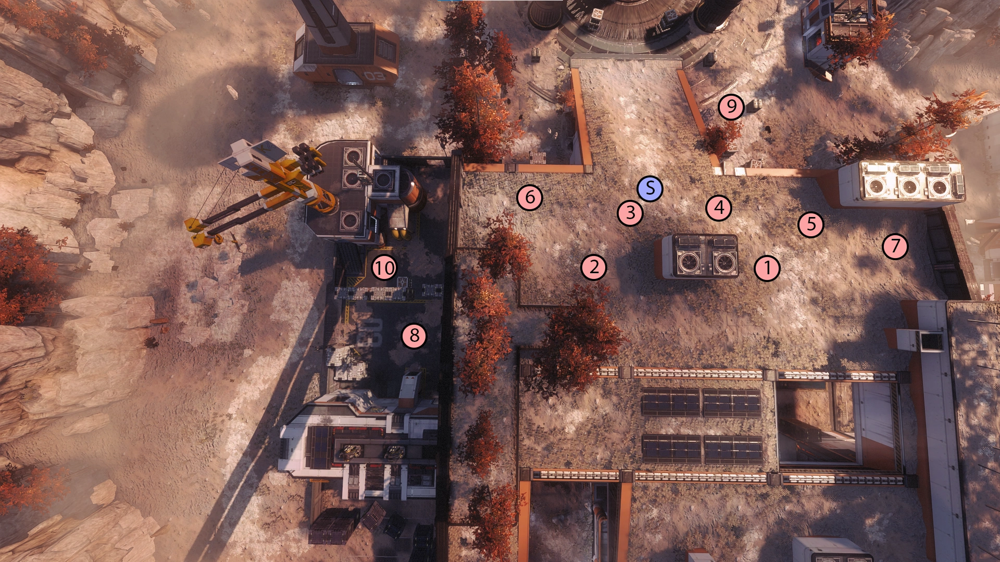

# 🌄 Forwardbase Kodai

Everything there is to spawn locations, enemy count and composition in waves, and pathfinding to Harvester.

> All of this is written by Tilaly, slightly changed by me for clarity. She let me implement it here.


Read [spawn-mechanics-explained-start-here.md](spawn-mechanics-explained-start-here.md "mention") first to understand the terms like “units,” “enemies remaining,” and “pool cap.”


## <mark style="color:yellow;">Forwardbase Kodai Wave 1</mark>

<figure><figcaption></figcaption></figure>

<mark style="color:yellow;">Standard 5-unit Pool Cap for Most of the Wave</mark>

* <mark style="color:yellow;">97 enemies remaining; spawn Stalkers</mark> (2 units)<mark style="color:yellow;">.</mark>
* <mark style="color:yellow;">57 enemies remaining; spawn Stalkers</mark> (2 units)<mark style="color:yellow;">.</mark>
* <mark style="color:yellow;">21 enemies remaining; spawn</mark> [<mark style="color:yellow;">Sniper Tone</mark>](#user-content-fn-1)[^1]<mark style="color:yellow;">, increasing the pool to 6.</mark>

### <mark style="color:yellow;">Drop Pod Spawn Locations</mark>

Spawning patterns follow a drop-pod availability algorithm: if spawn 1 is taken, go to spawn 2; if both are taken, go to spawn 3, etc.

Drop pods take 5 seconds from spawn to hit the ground, then another 15 seconds to disappear. There may be an 11th spawn, but you will most likely never hit it.

<figure><figcaption></figcaption></figure>


<mark style="color:yellow;">(S) stands for Sniper Titan, aka. Long-range camping, Tone.</mark>


## <mark style="color:yellow;">Forwardbase Kodai Wave 2</mark>

<figure><figcaption></figcaption></figure>

Wave 2 consists mostly of 2 subwaves, the “main” wave and a small side wave.\
The side wave consists of 2 Tone spawns on the side. Once both of them are dealt with, another similar wave spawns (2 Tones, 6 Reapers). This wave doesn't impact the main wave in any way; it will not make it faster or slower (besides reaching the unit cap).

#### <mark style="color:yellow;">Spawns Are As Follows:</mark>

1. <mark style="color:yellow;">Small Group</mark>
   1. 4 units of Ticks.
   2. 2 [Sniper Tones](#user-content-fn-2)[^2].
2. <mark style="color:yellow;">Wave Splits:</mark>\
   <mark style="color:yellow;">Secondary wave</mark>
   1. 2 Tones. (far right, far left)
   2. 2 Tones and 6 Reapers. (split evenly on the far-right and far-left sides, so 1 Tone and 3 Reapers on each side)

<mark style="color:yellow;">Main Wave</mark> (starts at the same time as Small Group)

1. 2 units of Mortar Spectres. (top)
2. 6 units of Grunt. (top)
3. 4 units of Ticks. (behind top)
4. 1 Tone. (far back)
5. 4 units of Grunts. (behind top)
6. 4 Reapers. (far back)
7. 2 Reapers and 2 units of Grunts on both far sides.
8. 1 Ion, 2 Reapers on both far sides.
9. 1 Legion, 2 Reapers on far back.
10. 1 Scorch, 2 Reapers split across both far sides.


The top spawns follow the same spawning pattern as wave 1, meaning if you are too fast, you can get grunt spawns pathing in the underpass.


## <mark style="color:yellow;">Forwardbase Kodai Wave 3</mark>

<figure><figcaption></figcaption></figure>

All spawns come from the right side except a [Sniper Tone](#user-content-fn-1)[^1] and a Monarch around the start of the wave. \
2 Legions and a Monarch, which spawn at the very end, come from far back.

<mark style="color:yellow;">2 Subwaves</mark> (I don't know which one the drones are part of yet)

* <mark style="color:yellow;">1st Subwave</mark>
  1. All grunts, coming at groups of 4 pods, so 3 groups in total.
     * (Need to find out how many pods need to be killed to spawn the next group.)
* <mark style="color:yellow;">2nd Subwave</mark>
  1. Ronin. :yellow\_circle:
  2. &#x20;4 Reapers. :green\_circle::red\_circle:
  3. 2 Ions, 2 Scorches. :green\_circle::red\_circle:
  4. Monarch and Sniper Tone in the far back. \
     (Gotta figure out when the next set of Reapers spawns in.)
  5. 2 Ronins :yellow\_circle:, 2 Tones. :green\_circle:
  6. 2 Legions. :green\_circle: (Spawn kind of randomly??)
  7. 2 Scorches. :red\_circle:
  8. 2 Tones. :yellow\_circle:
  9. 2 Legions and 1 Monarch at the far back.

### <mark style="color:yellow;">AI Pathfinding</mark>

Pathing of the AI depends on which side of the building they are going to pathfind through; the left side of the building means going to the right side of the Harvester, and the right side of the building means the left side of the Harvester.

<figure><figcaption></figcaption></figure>

> I have seen Plasma Drones spawn on either :green\_circle: or :red\_circle:, but only saw them coming from :green\_circle: toward the Harvester.
>
> **Caps may be around 12-13 units, as killing only the Ronin does not trigger the Monarch and Tone spawn right away.**

## <mark style="color:yellow;">Forwardbase Kodai Wave 4</mark>

<figure><figcaption></figcaption></figure>

### <mark style="color:yellow;">Enemy Spawn Locations</mark>

🟡: Stalkers (left).\
🔵: Reapers/Titans (left).\
🟢: Titans (left).\
🟣: Reapers (top).\
🔴: Reapers/Titans (top).\
🟠: Mortar Titans (right).

❗: A singular Ronin gets confused at the end and will do a weird rotation; see the AI pathfinding section.

<figure><figcaption></figcaption></figure>

### <mark style="color:yellow;">AI Pathfinding</mark> (not done)

🟢: A Titan, Reapers, and Stalkers (left).\
🟠: Stalker shortcuts.\
Dark 🔴: Specifically Nuke Titans (underpass).\
🩷: Reapers/Snipers (top).\
🔵: Sniper Tone spots.\
🟡: Mortar Titans.\
🔴: That one odd Ronin path.

<figure><figcaption></figcaption></figure>

## <mark style="color:yellow;">Forwardbase Kodai Wave 5</mark>

<figure><figcaption></figcaption></figure>

### <mark style="color:yellow;">Enemy Spawn Locations</mark>

🔴: Ticks (top).\
🟠: Stalkers (top).\
🟡: Reapers (top).\
🩷: Stalkers (underpass).\
🟣: Reapers/Titans (underpass).\
🟤: Titans (top back).\
🔵: Titans (right).\
🟢: Titans (left).

<figure><figcaption></figcaption></figure>

### <mark style="color:yellow;">AI Pathfinding</mark>

🔵: Ticks (first), Stalkers & Reapers (slowly spawn in), and then Titans (top).\
🟠: Sniper Titan spots.\
🟡: Stalkers, Reapers, and Titans (underpass).\
🔴: Titans (right).\
🟢: Titans (left).\
🟣: 1 Legion (left ⇾ underpass ⇾ start).

<figure><figcaption></figcaption></figure>

[^1]: Long-range Tone.

[^2]: Long-range Tones
