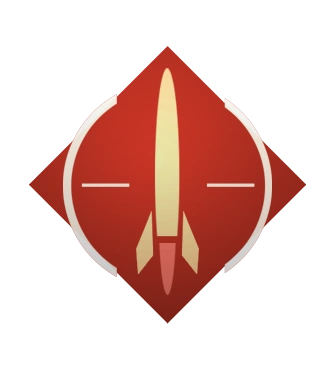
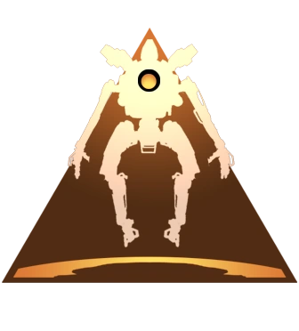
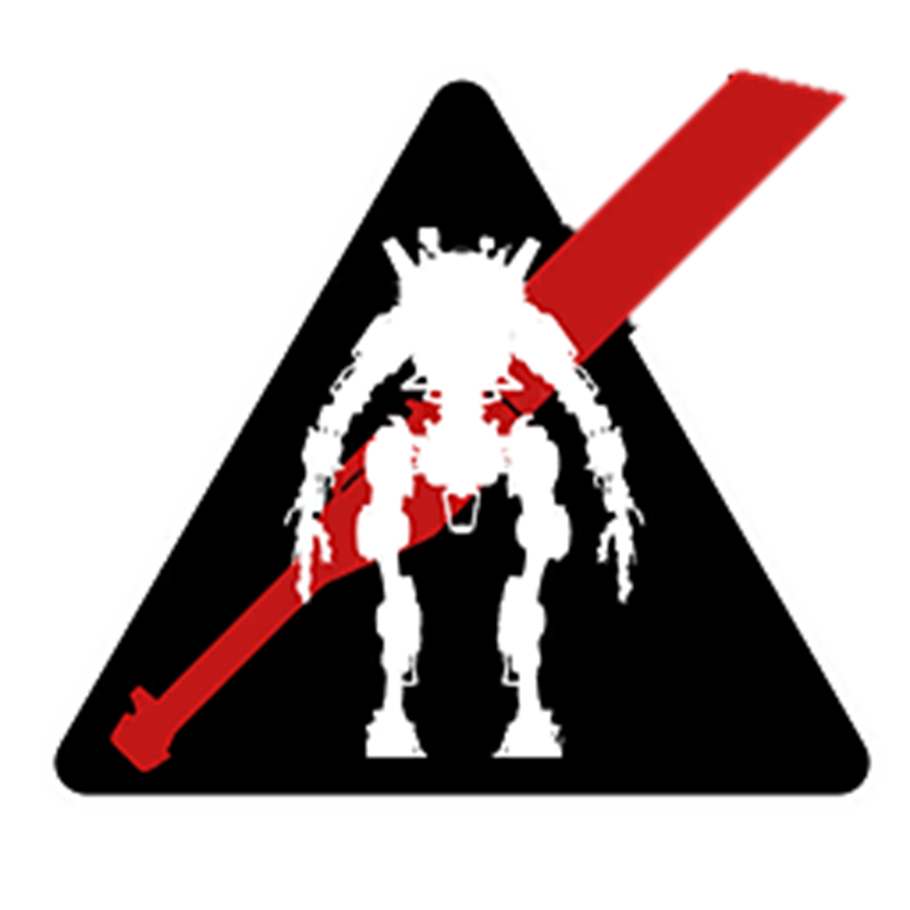

# 🗂️ Table of Contents

## [<mark style="color:yellow;">Welcome to the Titanfall 2 Handbook</mark>](./)

[feedback-form.md](welcome-to-the-titanfall-2-handbook/feedback-form.md "mention")

[credits.md](welcome-to-the-titanfall-2-handbook/credits.md "mention")

[change-log.md](welcome-to-the-titanfall-2-handbook/change-log.md "mention")

:map: [Handbook Legend](handbook-legend.md)

## <mark style="color:yellow;">General Titan Mechanics</mark>

:toolbox: [Titan Kits in Depth](titan-kits-in-depth.md)

 <a href="dodging-homing-missiles/">Dodging Homing Missiles</a> 

*  [VTOL Hover Missile Dodging](dodging-homing-missiles/hover-missile-dodging.md)
*  [Stryder Chassis Missile Dodging](dodging-homing-missiles/stryder-missile-dodging.md)
*  [Atlas Chassis Missile Dodging](dodging-homing-missiles/atlas-missile-dodging.md)
*  [Ogre Chassis Missile Dodging ](dodging-homing-missiles/ogre-missile-dodging.md)

📚 <mark style="color:yellow;">Universal Mechanics</mark>

* :information\_source: [Damage, HP, and Core Gain Fundamentals](universal-mechanics/damage-hp-and-core-gain-fundamentals.md)
* :information\_source: [Titan Weak Spots](universal-mechanics/titan-weak-points.md)
* :information\_source: [Disembark vs. Ejection](universal-mechanics/disembark-vs.-ejection.md)
* :information\_source: [Rodeo Damage Explained](universal-mechanics/rodeo-damage-explained.md)
* :information\_source: [Titan Ability Interactions](universal-mechanics/titan-ability-interactions.md)
* :green\_circle: [Movement Tech](universal-mechanics/movement-tech.md)
* :green\_circle: [Melee Tech](universal-mechanics/melee-tech.md)
* :green\_circle: [Extended Melee Range/Toe-Tech](universal-mechanics/extended-melee-range-toe-tech.md)
* :green\_circle: [Quickswap (Crouch Tech)](universal-mechanics/quickswap-crouch-tech.md)
* :green\_circle: [Auto Titan Tricks](universal-mechanics/auto-titan-tricks.md)
* :green\_circle: [Shield Bypass with Entity Clipping](universal-mechanics/shield-bypass-with-entity-clipping.md)
* :small\_red\_triangle\_down: [Embark Forced Core Activation Bug](universal-mechanics/embark-forced-core-activation-bug.md)
* :biohazard: [Doomed State Skip (Doomskip)](universal-mechanics/doomed-state-skip-doomskip.md)

## <mark style="color:yellow;">Titan-Specific Tech and Guides</mark>

### <mark style="color:yellow;">Ion</mark>

:shield: [Ion's Arsenal](ion/ions-arsenal.md)

&#x20;:book: [Ion Index](ion/ion-index.md)

🛠️ <mark style="color:yellow;">Ion Guides</mark>

* :movie\_camera: [Video Guides](ion/ion-guides/video-guides.md)

#### :gear: <mark style="color:yellow;">Ion Tech</mark>

ℹ️ <mark style="color:yellow;">General Information or Movement Tech</mark> 🟢 <mark style="color:yellow;">Advantageous Tech</mark> 🔰 <mark style="color:yellow;">Tradeoff Tech</mark>

* :information\_source: [Reflected Projectile Properties](ion/ion-tech/reflected-projectile-properties.md)
* :green\_circle: [Pulling out Firestars/Satchels](ion/ion-tech/pulling-out-firestars-satchels.md)
* :green\_circle: [Zero Point Laser Shot (ZPL)](ion/ion-tech/zero-point-laser-shot-zpl.md)
* :green\_circle: [Embark Energy Refill](ion/ion-tech/embark-energy-refill.md)
* :green\_circle: [Long-Range Tripwire Throw](ion/ion-tech/long-range-tripwire-throw.md)
* :green\_circle: [Blocking Wave Attacks with Vortex Shield](ion/ion-tech/blocking-wave-attacks-with-vortex-shield.md)
* :green\_circle: [Power Shot Upcycle and Salvage with Vortex](ion/ion-tech/power-shot-upcycle-and-salvage-with-vortex.md)
* :beginner:[Energy Refill/Waste from Executions](ion/ion-tech/energy-refill-waste-from-executions.md)

🔻 <mark style="color:yellow;">Disadvantageous Tech</mark>  ☣️ <mark style="color:yellow;">Not Fully Understood</mark>

* :small\_red\_triangle\_down: [Vortex Reflect Delay](ion/ion-tech/vortex-reflect-delay.md)
* :small\_red\_triangle\_down: [Vortex Shield Pierce](ion/ion-tech/vortex-shield-pierce.md)
* :small\_red\_triangle\_down: [Disappearing Thrown Tripwire Bug](ion/ion-tech/disappearing-thrown-tripwire-bug.md)
* :biohazard: [Double Hit Laser Shot](ion/ion-tech/double-hit-laser-shot.md)

### <mark style="color:yellow;">Scorch</mark>&#x20;

:shield: [Scorch's Arsenal](scorch/scorchs-arsenal.md)

:book: [Scorch index](scorch/scorch-index.md)

🛠️ <mark style="color:yellow;">Scorch Guides</mark>

* :movie\_camera: [Video Guides](scorch/scorch-guides/video-guides.md)

#### :gear: <mark style="color:yellow;">Scorch Tech</mark>

ℹ️ <mark style="color:yellow;">General Information or Movement Tech</mark> 🟢 <mark style="color:yellow;">Advantageous Tech</mark> 🔰<mark style="color:yellow;">Tradeoff Tech</mark> 

* :information\_source: [Thermite Droplets Pierce Shield](scorch/scorch-tech/thermite-droplets-pierce-shield.md)
* :information\_source: [Overlapping Canister Damage Radius](scorch/scorch-tech/overlapping-canister-damage-radius.md)
* :green\_circle: [Throwing Firewall Over Tall Obstacles](scorch/scorch-tech/throwing-firewall-over-tall-obstacles.md)
* :green\_circle: [Long-Range Canister Throw](scorch/scorch-tech/long-range-canister-throw.md)
* :green\_circle: [Advanced Reload Cancel](scorch/scorch-tech/advanced-reload-cancel.md)
* :green\_circle: [Blocking Wave Attacks with Thermal Shield](scorch/scorch-tech/blocking-wave-attacks-with-thermal-shield.md)
* :green\_circle: [Amped Canisters](scorch/scorch-tech/amped-canisters.md)

🔻 <mark style="color:yellow;">Disadvantageous Tech</mark>  ☣️ <mark style="color:yellow;">Not Fully Understood</mark>

* :small\_red\_triangle\_down:[ Flame Shield Pierce](scorch/scorch-tech/thermal-shield-pierce.md)
* :small\_red\_triangle\_down: [Slow Firewall Deployment](scorch/scorch-tech/slow-firewall-deployment.md)
* :small\_red\_triangle\_down: [Canister Despawn](scorch/scorch-tech/canister-despawn.md)
* :small\_red\_triangle\_down: [Disappearing Thrown Canister Bug](scorch/scorch-tech/disappearing-thrown-canister-bug.md)
* :biohazard: [Spammable Firewall Sound](scorch/scorch-tech/spammable-firewall-sound.md)

### <mark style="color:yellow;">Northstar</mark>

:shield: [Northstar's Arsenal](northstar/northstars-arsenal.md)

&#x20;:book: [Northstar Index](northstar/northstar-index.md)

🛠️ <mark style="color:yellow;">Northstar Guides</mark>

* :bulb: [Tips](northstar/northstar-guides/tips.md)
* :pencil: [Written Guides](northstar/northstar-guides/written-guides.md)
* :movie\_camera: [Video Guides](northstar/northstar-guides/video-guides.md)

#### :gear: <mark style="color:yellow;">Northstar Tech</mark>

ℹ️ <mark style="color:yellow;">General Information or Movement Tech</mark> 🟢 <mark style="color:yellow;">Advantageous Tech</mark> 🔰 <mark style="color:yellow;">Tradeoff Tech</mark> 

* :information\_source: [Hover Mechanics](northstar/northstar-tech/hover-mechanics.md)
* :information\_source: [Hover Spots](northstar/northstar-tech/hover-spots.md)
* :green\_circle: ⁣[“Cluster Cancel” for Faster Melee Recovery](northstar/northstar-tech/cluster-cancel-for-faster-melee-recovery.md)
* :green\_circle: [Tossing Tether Trap into Vortex Shield](northstar/northstar-tech/tossing-tether-trap-into-vortex-shield.md)
* :green\_circle: [Tether Trapped Cars](northstar/northstar-tech/tether-trapped-cars.md)
* :green\_circle: [Moonboots](northstar/northstar-tech/moonboots.md)
* :green\_circle: [Hover Eject Goose](northstar/northstar-tech/hover-eject-goose.md)

🔻<mark style="color:yellow;">Disadvantageous Tech</mark>  ☣️ <mark style="color:yellow;">Not Fully Understood</mark>

* :biohazard: [Flight Core Holstering (Infinite Flight Core)](northstar/northstar-tech/flight-core-holstering-infinite-flight-core.md)

### <mark style="color:yellow;">Ronin</mark>

:shield: [Ronin's Arsenal](ronin/ronins-arsenal.md)

&#x20;:book: [Ronin Index](ronin/ronin-index.md)

🛠️ <mark style="color:yellow;">Ronin Guides</mark>

* :bulb: [Tips](ronin/ronin-guides/tips.md)
* :pencil: [Written Guides](ronin/ronin-guides/written-guides.md)
* :movie\_camera: [Video Guides](ronin/ronin-guides/video-guides.md)

#### :gear: <mark style="color:yellow;">Ronin Tech</mark>

ℹ️ <mark style="color:yellow;">General Information or Movement Tech</mark> 🟢 <mark style="color:yellow;">Advantageous Tech</mark> 🔰 <mark style="color:yellow;">Tradeoff Tech</mark> 

* :green\_circle: [Phase Movement Tech](ronin/ronin-tech/phase-movement-tech.md)
* :green\_circle: [Surviving Phase](ronin/ronin-tech/surviving-phase.md)
* :green\_circle: [Anti-Rodeo Phase Tech](ronin/ronin-tech/anti-rodeo-phase-tech.md)
* :green\_circle: [Shotblock](ronin/ronin-tech/shotblock.md)
* :green\_circle: [Tripwire Sword Damage Doubling](ronin/ronin-tech/tripwire-sword-damage-doubling.md)
* :green\_circle: [Arc Wave Shield Pierce](ronin/ronin-tech/arc-wave-shield-pierce.md)
* :green\_circle: [Advanced Sword Core Arc Wave Cancel](ronin/ronin-tech/advanced-sword-core-arc-wave-cancel.md)
* :green\_circle: [Sword Core Dash Unlock](ronin/ronin-tech/sword-core-dash-unlock.md)
* :beginner: [Shift Core / Lead Core](ronin/ronin-tech/shift-core-lead-core.md)

🔻 <mark style="color:yellow;">Disadvantageous Tech</mark>  ☣️ <mark style="color:yellow;">Not Fully Understood</mark>

* :small\_red\_triangle\_down: [Sword Core Melee Whiff](ronin/ronin-tech/sword-core-melee-whiff.md)
* :small\_red\_triangle\_down: [Sword Pierce](ronin/ronin-tech/sword-pierce.md)

### <mark style="color:yellow;">Tone</mark>

:shield: [Tone's Arsenal](tone/tones-arsenal.md)

:book: [Tone Index ](tone/tone-index.md)

🛠️ <mark style="color:yellow;">Tone Guides</mark>

* :bulb: [Tips](tone/tone-guides/tips.md)

#### :gear: <mark style="color:yellow;">Tone Tech</mark>

ℹ️ <mark style="color:yellow;">General Information or Movement Tech</mark> 🟢 <mark style="color:yellow;">Advantageous Tech</mark> 🔰 <mark style="color:yellow;">Tradeoff Tech</mark> 

* :green\_circle: [Missile Chaining](tone/tone-tech/missile-chaining.md)
* :green\_circle: [Invisible Lock-On](tone/tone-tech/invisible-lock-on.md)
* :beginner: [P2W Prime Execution](tone/tone-tech/p2w-prime-execution.md)
* :beginner: [Sonar Melee Cancel](tone/tone-tech/sonar-melee-cancel.md)

🔻 <mark style="color:yellow;">Disadvantageous Tech</mark>   ☣️ <mark style="color:yellow;">Not Fully Understood</mark>

* :small\_red\_triangle\_down: [Full Missile Explosive Self-Damage](tone/tone-tech/full-missile-explosive-self-damage.md)

### <mark style="color:yellow;">Legion</mark>

:shield: [Legion's Arsenal](legion/legions-arsenal.md)

:book: [Legion Index](legion/legion-index.md)

🛠️ <mark style="color:yellow;">Legion Guides</mark>

* :pencil: [Written Guides](legion/legion-guides/written-guides.md)
* :movie\_camera: [Video Guides](legion/legion-guides/video-guides.md)

#### :gear: <mark style="color:yellow;">Legion Tech</mark>

ℹ️ <mark style="color:yellow;">General Information or Movement Tech</mark> 🟢 <mark style="color:yellow;">Advantageous Tech</mark> 🔰 <mark style="color:yellow;">Tradeoff Tech</mark>

* :information\_source: [Smart Core 20% Damage Boost](legion/legion-tech/smart-core-20-damage-boost.md)
* :green\_circle: [Smart Core Free-Aiming](legion/legion-tech/smart-core-free-aiming.md)
* :green\_circle: [Legion Melee/Sprint Quick Swap](legion/legion-tech/legion-melee-sprint-quick-swap.md)
* :green\_circle: [Stalled/Quickdraw Power Shot](legion/legion-tech/stalled-quickdraw-power-shot.md)
* :green\_circle: [Retrievable Gun Shield](legion/legion-tech/retrievable-gun-shield.md)
* :green\_circle: [Glow Gun Glitch](legion/legion-tech/glow-gun-glitch.md)
* :green\_circle: [Spartan Shield](legion/legion-tech/spartan-shield.md)
* :green\_circle: [Full Gun Shield Movement](legion/legion-tech/full-gun-shield-movement.md)
* :green\_circle: [Spool & Unspool Walking Speed Boost](legion/legion-tech/spool-and-unspool-walking-speed-boost.md)
* :green\_circle: [Invisible Reload Animation](legion/legion-tech/invisible-reload-animation.md)
* :beginner: [(Auto-Titan) Hold Power Shot](legion/legion-tech/auto-titan-hold-power-shot.md)
* :beginner: [Hold Power Shot in Titan](legion/legion-tech/hold-power-shot-in-titan.md)

🔻 <mark style="color:yellow;">Disadvantageous Tech</mark>   ☣️ <mark style="color:yellow;">Not Fully Understood</mark>

* :small\_red\_triangle\_down: [No Disembark Bug](legion/legion-tech/no-disembark-bug.md)

### <mark style="color:yellow;">Monarch</mark>

:shield: ⁣⁣[Monarch's Arsenal](monarch/monarchs-arsenal.md)

&#x20;:book: [Monarch Index](monarch/monarch-index.md)

🛠️ <mark style="color:yellow;">Monarch Guides</mark>

* :pencil: [Written Guides](monarch/monarch-guides/written-guides.md)
* :movie\_camera: [Video Guides](monarch/monarch-guides/video-guides.md)

#### :gear: <mark style="color:yellow;">Monarch Tech</mark>

ℹ️ <mark style="color:yellow;">General Information or Movement Tech</mark> 🟢 <mark style="color:yellow;">Advantageous Tech</mark> 🔰 <mark style="color:yellow;">Tradeoff Tech</mark> 

* :information\_source: [Rocket Variants vs. Particle Shields](monarch/monarch-tech/rocket-variants-vs.-particle-shields.md)
* :information\_source: [XO-16 Chaingun Variants vs. Shields](monarch/monarch-tech/xo-16-chaingun-variants-vs.-shields.md)
* :green\_circle: [One Bar Monarch Glitch](monarch/monarch-tech/one-bar-monarch-glitch.md)
* :green\_circle: [Broken Rodeo Damage Glitch](monarch/monarch-tech/broken-rodeo-damage-glitch.md)
* :green\_circle: [Single-Shot Rocket Fire](monarch/monarch-tech/single-shot-rocket-fire.md)
* :green\_circle: [Overclock Rearm](monarch/monarch-tech/overclock-rearm.md)
* :beginner: [Instant Dash Rearm](monarch/monarch-tech/instant-dash-rearm.md)

🔻 <mark style="color:yellow;">Disadvantageous Tech</mark>  ☣️ <mark style="color:yellow;">Not Fully Understood</mark>

* :small\_red\_triangle\_down: [Accelerator Acceleration Bug](monarch/monarch-tech/accelerator-acceleration-bug.md)
* :small\_red\_triangle\_down: [MTMS Last Missile Not Firing Bug](monarch/monarch-tech/mtms-last-missile-not-firing-bug.md)
* :biohazard: [Double-Hit Energy Siphon](monarch/monarch-tech/double-hit-energy-siphon.md)

## <mark style="color:yellow;">Competitive Stuff</mark>

#### :speaking\_head: [General Callouts](titan-competitive-stuff/general-callouts.md)

#### :crossed\_swords: [Titan Matchups](titan-competitive-stuff/titan-matchups.md)

#### :arrows\_counterclockwise: [Titan Spawns](titan-competitive-stuff/titan-spawns.md)

🏛️ <a href="titan-competitive-stuff/matches-breakdown/">Matches Breakdown</a>

:scroll: [Boomtown Historical Fights](titan-competitive-stuff/matches-breakdown/boomtown-historical-fights.md)

🧠 <a href="titan-competitive-stuff/questionable-strategies/">Questionable Strategies</a>

:shield::gun: [R-97 Vortex Gimmick](titan-competitive-stuff/questionable-strategies/r-97-vortex-gimmick.md)

💥😵 [Softball Torture](titan-competitive-stuff/questionable-strategies/softball-torture.md)

:crossed\_swords::skull: [Kamikaze Ronin](titan-competitive-stuff/questionable-strategies/kamikaze-ronin.md)

🌫️🎯 [Threat Optics E-Smoke](titan-competitive-stuff/questionable-strategies/threat-optics-e-smoke.md)

## <mark style="color:yellow;">Speedrunning</mark>

#### :large\_blue\_diamond: [Frontier Defense](speedrunning/frontier-defense/) :arrow\_down:

:trophy: [Current World Records](speedrunning/frontier-defense/current-world-records.md)

📚 <a href="speedrunning/frontier-defense/useful-resources/">Useful Resources</a>

:star2: [Perfect Solo Insane Rise](speedrunning/frontier-defense/useful-resources/perfect-solo-insane-rise.md)

:green\_circle: [Invisibility Glitch](speedrunning/frontier-defense/useful-resources/invisibility-glitch.md)

🗺️ <a href="speedrunning/frontier-defense/fd-map-spawns/">FD Map Spawns</a>

:wrench: [Spawn Mechanics Explained (Start Here)](speedrunning/frontier-defense/fd-map-spawns/spawn-mechanics-explained-start-here.md)

:sunrise\_over\_mountains: [Forwardbase Kodai](speedrunning/frontier-defense/fd-map-spawns/forwardbase-kodai.md)

