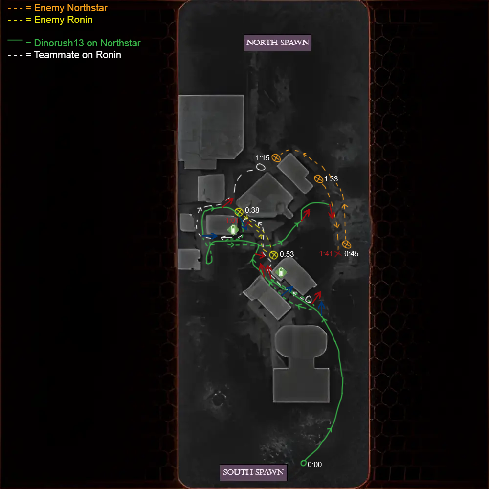
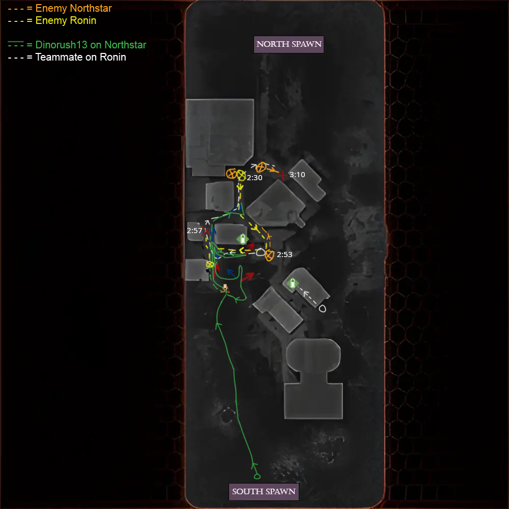

# 📜 Boomtown Historical Fights

First-ever example of a match breakdown.

Read [.](./ "mention") for context about how this works.

## <mark style="color:yellow;">Dinorush13 | Set 1 vs. kalashnikookies | 2v2 Tournament</mark>&#x20;

Date: 10/11/2019


Round 1: 0:00-1:50\
Round 2: 2:14-3:20\
Rest: 3:20-9:30




<h3 align="center"><mark style="color:yellow;">Round 1 (0:00-1:50)</mark></h3>

<figure><figcaption></figcaption></figure>



<h3 align="center"><mark style="color:yellow;">Round 2 (2:14-3:20)</mark></h3>

<figure><figcaption></figcaption></figure>




Dinorush13's excuse for not having round 3: “I just completely forgot to record the third round, sadly.”


