# 🧰 Titan Kits in Depth

## <mark style="color:yellow;">Universal</mark> <mark style="color:yellow;">**Titan Kits**</mark>

<table data-full-width="true"><thead><tr><th width="176" align="center">Kit Icon</th><th width="152.33333333333331" align="center">Kit Name</th><th>Kit Description and Info</th></tr></thead><tbody><tr><td align="center">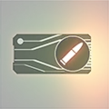</td><td align="center"><mark style="color:yellow;"><strong>Assault Chip</strong></mark></td><td><em>“Improves Auto-Titan precision and enables the use of offensive and utility abilities.”</em> (Excludes Auto-Northstar Hover.)</td></tr><tr><td align="center"></td><td align="center"><mark style="color:yellow;"><strong>Stealth Auto-Eject</strong></mark></td><td>
<em>“Automatically eject and cloak when your Titan is doomed, preventing Pilot death.”</em> 

(Overrides “Survival of the Fittest” and “Phase Reflex” kits. Still requires the Low Profile kit to hide the Pilot jet trails.)
</td></tr><tr><td align="center"></td><td align="center"><mark style="color:yellow;"><strong>Turbo Engine</strong></mark></td><td>
For Ronin, Northstar, Tone, Ion, and Monarch: <em>“1 extra dash.”</em> For Legion, Scorch: <em>“Dash cooldown is reduced.”</em>
<ul><li>Gives an extra 1 dash capacity to Atlas and Stryder chassis Titans.<mark style="color:orange;"><strong>⟨1⟩</strong></mark></li><li>Decreases dash cooldown for Ogre chassis Titans from 10 sec to 5 sec.<mark style="color:orange;"><strong>⟨1⟩</strong></mark></li></ul></td></tr><tr><td align="center"></td><td align="center"><mark style="color:yellow;"><strong>Overcore</strong></mark></td><td><em>“Titan core always starts with 20% build time.”</em> (also means you get access to e-smoke instantly)</td></tr><tr><td align="center">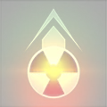</td><td align="center"><mark style="color:yellow;"><strong>Nuke Eject</strong></mark></td><td><em>“Ejecting while doomed causes your Titan to detonate its core causing nearby enemies massive damage.”</em></td></tr><tr><td align="center"></td><td align="center"><mark style="color:yellow;"><strong>Counter Ready</strong></mark></td><td>
<em>“1 extra Electric Smoke countermeasure.”</em>

(Start with an additional e-smoke and get the 2nd one at 20% core meter.)
</td></tr></tbody></table>


<mark style="color:orange;">**⟨1⟩**<mark style="color:orange;"> For reference, dash cooldown for each chassis \
Stryder = 5 sec\
Atlas = 6 sec\
Ogre = 10 sec (5 sec with turbo kit)\
Sword Core and Rearm will recharge all dashes upon activation, even with Turbo Boost.


## <mark style="color:yellow;">Titanfall Kits</mark>

Both variants can instakill enemy Titans when dropped directly on top of.

<table><thead><tr><th width="174.33333333333331" align="center">KIt Icon</th><th width="197" align="center">Kit Name</th><th>Kit Description and Info</th></tr></thead><tbody><tr><td align="center">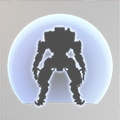</td><td align="center"><mark style="color:yellow;"><strong>Dome Shield</strong></mark></td><td>
<em>“Protects your titan after Titanfall.”</em>

(Titan arrives in 5 sec, fully impervious to damage with an enemy damaging Dome Shield that lasts 17 secs.)<mark style="color:orange;"><strong>⟨1⟩</strong></mark>
</td></tr><tr><td align="center"></td><td align="center"><mark style="color:yellow;"><strong>Warpfall Transmitter</strong></mark></td><td>
<em>“Fast and unprotected Titanfall.”</em>

(Titan arrives in 3 sec, unprotected.)
</td></tr></tbody></table>


<mark style="color:orange;">**⟨1⟩**<mark style="color:orange;">The Dome Shield can fit inside several friendly Titans and Pilots, due to its nature of being invulnerable to damage, with the only exception being Titan melee being able to go through the shield. The dome-shielded Titan will still be immune to any damage, even if another Titan falls on it.\
\
The Dome Shield will disappear early if you embark (standing still and looking around won't disable the shield) and move your Titan or when you wake up your Titan by using the guard/follow mode key.


## <mark style="color:yellow;">**Ion-Specific Kits**</mark>

<table data-full-width="true"><thead><tr><th width="175.33333333333331" align="center">Ion Kit Icon</th><th width="204" align="center">Ion Kit Name</th><th>Ion Kit Description and Info</th></tr></thead><tbody><tr><td align="center"></td><td align="center"><mark style="color:yellow;"><strong>Entangled Energy</strong></mark></td><td><em>“Splitter Rifle critical hits restore energy.”</em> (Normal shots restore 3% energy per crit., split bullets restore 0.8% energy per shot [up to 2.4% total].) [For reference split shot costs 3% energy, so hitting all shots on crit reduces the cost to 0.6%.]</td></tr><tr><td align="center"></td><td align="center"><mark style="color:yellow;"><strong>Zero-Point Tripwire</strong></mark></td><td><em>“Tripwire deployment uses zero energy.”</em></td></tr><tr><td align="center"></td><td align="center"><mark style="color:yellow;"><strong>Vortex Amplifier</strong></mark></td><td><em>“Increases Vortex Shield's hitscan return damage output by 35%.”</em> (Excludes projectiles.)</td></tr><tr><td align="center">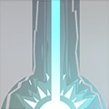</td><td align="center"><mark style="color:yellow;"><strong>Grand Cannon</strong></mark></td><td><em>“Laser Core lasts longer.”</em> (1.5 sec longer, from 3.5 seconds to 5 seconds.)</td></tr><tr><td align="center">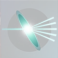</td><td align="center"><mark style="color:yellow;"><strong>Refraction Lenses</strong></mark></td><td><em>“Splitter Rifle splits 5 ways.”</em> (Increases energy cost by 13%, but increases total damage by 30.95%.)</td></tr></tbody></table>

## <mark style="color:yellow;">**Scorch-Specific Kits**</mark>

<table data-full-width="true"><thead><tr><th width="167" align="center">Scorch Kit Icon</th><th width="168.33333333333331" align="center">Scroch Kit Name</th><th>Scorch Kit Discription and Info</th></tr></thead><tbody><tr><td align="center"></td><td align="center"><mark style="color:yellow;"><strong>Wildfire Launcher</strong></mark></td><td>
<em>“Increased direct hit damage and thermite spread from the T-203 Thermite Launcher.”</em>
<ul><li>+25% direct impact damage.</li><li>Increased thermite droplet spread upon impact by a 4x multiplier.</li><li>Total droplet count increased from 5 to 9.</li></ul></td></tr><tr><td align="center">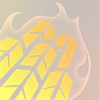</td><td align="center"><mark style="color:yellow;"><strong>Tempered Plating</strong></mark></td><td><em>“Removes weak points and eliminates self damage from thermite.”</em> (The only exceptions are self-damage from the T-203 launcher explosive damage when shot point-blank near you and the canisters' explosion damage after extinguishing.)</td></tr><tr><td align="center"></td><td align="center"><mark style="color:yellow;"><strong>Inferno Shield</strong></mark></td><td>
<em>“Increased damage and duration for the Thermal Shield.”</em>
<ul><li>Damage increased by 20%</li><li>Total duration increased by 50%, increasing total refill time by 50% to compensate.</li><li>80% more total damage for full duration.</li></ul></td></tr><tr><td align="center"></td><td align="center"><mark style="color:yellow;"><strong>Fuel for the fire</strong></mark></td><td><em>“Firewall's cooldown is reduced by 2 seconds.”</em> (From 10 seconds to 8 seconds, 20% shorter cooldown.)</td></tr><tr><td align="center"></td><td align="center"><mark style="color:yellow;"><strong>Scorched Earth</strong></mark></td><td><em>“Flame Core ignites the ground, leaving thermite in its wake.”</em> (Flame Core leaves behind 3 firewalls that last 1.5 seconds.)</td></tr></tbody></table>

## <mark style="color:yellow;">**Northstar-Specific Kits**</mark>

<table data-full-width="true"><thead><tr><th width="185" align="center">Northstar Kit Icon</th><th width="180.33333333333331" align="center">Northstar Kit Name</th><th>Northstar Kit Discription and Info</th></tr></thead><tbody><tr><td align="center">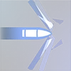</td><td align="center"><mark style="color:yellow;"><strong>Piercing Shot</strong></mark></td><td>
<em>“Plasma Railgun rounds fire through targets.”</em>

(Pierces through teammates and enemies alike.)
</td></tr><tr><td align="center"></td><td align="center"><mark style="color:yellow;"><strong>Enhanced Payload</strong></mark></td><td><em>“Cluster Missile's secondary explosions hit a larger range and last longer.”</em> (<a href="https://www.reddit.com/r/titanfall/comments/jrgnwo/enhanced_payload_is_terrible_and_you_should_not/?rdt=48423">+50% spawn range, +12% spawn count, +18.7% longer duration, and -10% spawn rate [-10-20% DPS]</a>)</td></tr><tr><td align="center"></td><td align="center"><mark style="color:yellow;"><strong>Twin Traps</strong></mark></td><td><em>“Tether Trap fires two traps.”</em> (Doubles max Tether Trap amount cap from 4 to 8, and deploys them in a V-shape at an upwards angle [~17° or less, depending on pitch].)</td></tr><tr><td align="center"></td><td align="center"><mark style="color:yellow;"><strong>Viper Thrusters</strong></mark></td><td>

<em>“Move faster during Hover and Flight Core.”</em>
<ul><li>VTOL Hover max speed is increased by 33.33% (from 300 to 400 u/s).</li><li>Flight Core max speed is increased by 60% (from 250 to 400 u/s).</li><li>(Both of them now match sprinting speed with <a href="northstar/northstar-tech/hover-mechanics.md#hover-strafing-0-97-0-56">hover strafing.</a>)</li></ul></td></tr><tr><td align="center">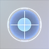</td><td align="center"><mark style="color:yellow;"><strong>Threat Optics</strong></mark></td><td><em>“Enemies are highlighted while zooming in.”</em> (Highlights enemies in red, and works through e-smoke.) </td></tr></tbody></table>

## <mark style="color:yellow;">**Ronin-Specific Kits**</mark>

<table data-full-width="true"><thead><tr><th width="156" align="center">Ronin Kit Icon</th><th width="165.33333333333331" align="center">Ronin Kit Name</th><th>Ronin Kit Discription and Info</th></tr></thead><tbody><tr><td align="center"></td><td align="center"><mark style="color:yellow;"><strong>Ricochet Rounds</strong></mark></td><td><em>“The Leadwall's rounds bounce off surfaces.”</em> (Projectiles bounce once and move at 50% speed after bouncing. Projectile lifetime doesn't refresh upon bounce.)</td></tr><tr><td align="center">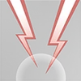</td><td align="center"><mark style="color:yellow;"><strong>Thunderstorm</strong></mark></td><td><em>“Arc Wave has two charges.”</em></td></tr><tr><td align="center"></td><td align="center"><mark style="color:yellow;"><strong>Temporal Anomaly</strong></mark></td><td>
<em>“Phase Dash is available more often”</em>

(Reduces the recharge time of Phase Dash by 33%, from 12 seconds to 8 seconds.<em>)</em>
</td></tr><tr><td align="center">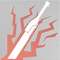</td><td align="center"><mark style="color:yellow;"><strong>Highlander</strong></mark></td><td>
<em>“Titan kills extend the duration of Sword Core.”</em>

(Extend the duration by 8 sec, but cannot overflow the max duration cap. For reference a Sword Core lasts 12 seconds.)
</td></tr><tr><td align="center"></td><td align="center"><mark style="color:yellow;"><strong>Phase Reflex</strong></mark></td><td>
“<em>When doomed, Ronin phases out of danger.”</em>

(Phase lasts for 5 sec and doesn't consume your Phase Dash. Affects Auto-Ronin too, but you can still embark him. Can be executed in phase if timed perfectly.)
</td></tr></tbody></table>

## <mark style="color:yellow;">**Tone-Specific Kits**</mark>

<table data-full-width="true"><thead><tr><th width="156.33333333333331" align="center">Tone Kit Icon</th><th width="150" align="center">Tone Kit Name</th><th>Tone Kit Description and Info</th></tr></thead><tbody><tr><td align="center">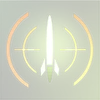</td><td align="center"><mark style="color:yellow;"><strong>Enhanced Tracker Rounds</strong></mark></td><td><em>“Critical hits apply 2 tracker marks on targets.”</em> (Limited reliability due to Ronin's and Northstar's visually wrong <a href="universal-mechanics/titan-weak-points.md#displayed-titan-weak-points">weakspots.</a>)</td></tr><tr><td align="center"></td><td align="center"><mark style="color:yellow;"><strong>Reinforced Particle Wall</strong></mark></td><td>
<em>“Particle Wall lasts longer and blocks more damage.”</em>

(Lasts 50% longer and increases its health by 50%, from 2,000 to 3,000.) {Cooldown starts the moment you place the wall, meaning you'll have a wall for longer before it comes back.}
</td></tr><tr><td align="center"></td><td align="center"><mark style="color:yellow;"><strong>Pulse-Echo</strong></mark></td><td>
<em>“After a short delay, Sonar Pulse echoes a second pulse.”</em>

(After a 2-second delay, to be exact.)
</td></tr><tr><td align="center"></td><td align="center"><mark style="color:yellow;"><strong>Rocket Barrage</strong></mark></td><td><em>“Tracker Rockets fire 2 additional missiles.”</em> (8 rockets in total, a 33% increase in damage, from 2,100 to 2,800.)</td></tr><tr><td align="center">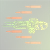</td><td align="center"><mark style="color:yellow;"><strong>Burst Loader</strong></mark></td><td><em>“Aiming allows the 40 mm to store up to 3 shots to burst fire.”</em> (Decreases semi-auto fire rate by 24% and reduces recoil, making it more horizontal.)</td></tr></tbody></table>

## <mark style="color:yellow;">**Legion-Specific Kits**</mark>

<table data-full-width="true"><thead><tr><th width="164.33333333333331" align="center">Legion Kit Icon</th><th width="188" align="center">Legion Kit Name</th><th>Legion Kit Description and Info</th></tr></thead><tbody><tr><td align="center">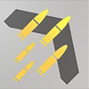</td><td align="center"><mark style="color:yellow;"><strong>Enhanced Ammo Capacity</strong></mark></td><td>
<em>“Increases the ammo capacity of the Predator Cannon.”</em>

(From 100 to 140 bullets.)
</td></tr><tr><td align="center">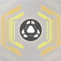</td><td align="center"><mark style="color:yellow;"><strong>Sensor Array</strong></mark></td><td><em>“Smart core lasts longer.”</em> (50% longer, from 12 sec to 18 sec.)</td></tr><tr><td align="center">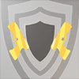</td><td align="center"><mark style="color:yellow;"><strong>Bulwark</strong></mark></td><td><em>“Gun Shield blocks twice as much damage.”</em> (From 2,500 hp to 5,000 hp.)</td></tr><tr><td align="center"></td><td align="center"><mark style="color:yellow;"><strong>Light-Weight Alloys</strong></mark></td><td><em>“Move faster while the Predator Cannon is spun up.”</em> (Reduced movement speed penalty when aiming down sights from 55% to 75% of base walking speed.)</td></tr><tr><td align="center"></td><td align="center"><mark style="color:yellow;"><strong>Hidden Compartment</strong></mark></td><td><em>“Power Shot has two charges.”</em>  <em>Note:</em> Power Shot damage is reduced by 15%. (Long-range Power Shot splash damage is not impacted by the 15% damage reduction.)</td></tr></tbody></table>

## <mark style="color:yellow;">**Monarch-Specific Kits**</mark>

<table data-full-width="true"><thead><tr><th width="176.33333333333331" align="center">Monarch Kit Icon</th><th width="172" align="center">Monarch Kit Name</th><th>Monarch Kit Description and Info</th></tr></thead><tbody><tr><td align="center"></td><td align="center"><mark style="color:yellow;"><strong>Shield Amplifier</strong></mark></td><td><em>“Energy Siphon's shield gain is increased by 25%.”</em> (You also gain extra shields when you get energy transferred by a Monarch using this kit, doesn't work vice versa)</td></tr><tr><td align="center"></td><td align="center"><mark style="color:yellow;"><strong>Energy Thief</strong></mark></td><td><em>“Core meter is earned 10% faster and Titan executions steal a battery.</em>  <em>Note: replaces your regular execution.”</em></td></tr><tr><td align="center">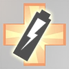</td><td align="center"><mark style="color:yellow;"><strong>Survival of the Fittest</strong></mark></td><td><em>“Batteries can repair the Monarch out of Doomed State.”</em></td></tr><tr><td align="center"></td><td align="center"><mark style="color:yellow;"><strong>Rapid Rearm</strong></mark></td><td><em>“Reduces the cooldown of Rearm by 5 seconds.”</em> (Actually reduces the cooldown by 5.6 seconds, from 17.6 seconds to 12 seconds. 11% faster than the simplified 5 seconds.)</td></tr></tbody></table>
