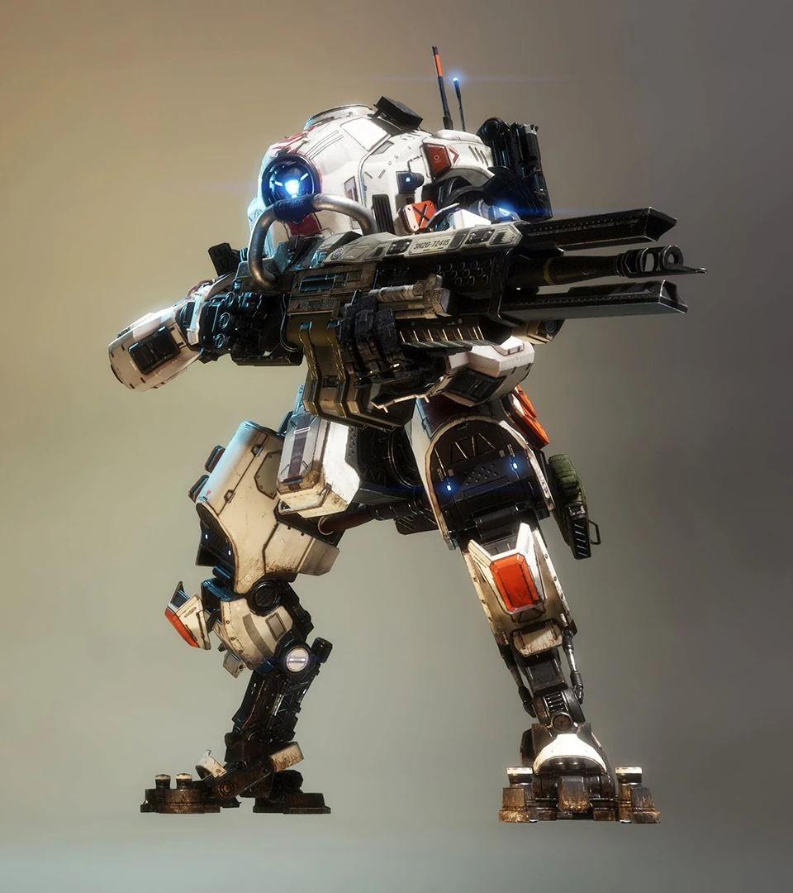
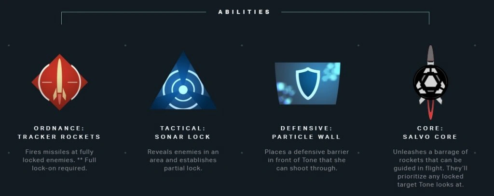
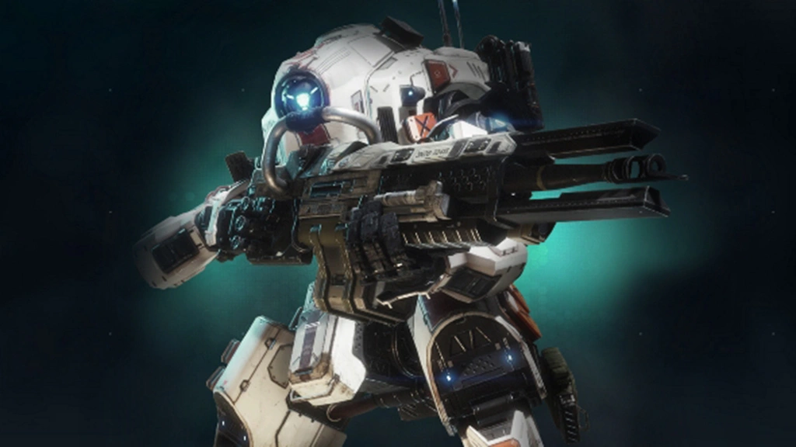

# 🛡️ Tone's Arsenal

## <mark style="color:yellow;">Tone</mark>

|                           Tone Loadout Screen                          |                                                                       Quote                                                                      |
| :--------------------------------------------------------------------: | :----------------------------------------------------------------------------------------------------------------------------------------------: |
|  | 
<em><strong>Tone is about accurately laying waste to enemies both efficiently and explosively.</strong></em> — Old Website Description
 |



<figure><figcaption></figcaption></figure>



<figure><figcaption></figcaption></figure>







| General Information                                                                        | Chassis & Loadout Specifications                                                                                                                            |
| ------------------------------------------------------------------------------------------ | ----------------------------------------------------------------------------------------------------------------------------------------------------------- |
| <mark style="color:yellow;">**File Name:**</mark> Wraith                                   | <mark style="color:yellow;">**Base Health:**</mark> 10,000                                                                                                  |
| <mark style="color:yellow;">**Class:**</mark> Tone                                         | <mark style="color:yellow;">**Aegis Health:**</mark> 12,500                                                                                                 |
| <mark style="color:yellow;">**Type:**</mark> Titan                                         | 
<mark style="color:yellow;"><strong>Dash Capacity:</strong></mark> 1 → 2 <mark style="color:yellow;"><strong>Dash Cooldown:</strong></mark> 6 sec
 |
| <mark style="color:yellow;">**Parent Chassis:**</mark> Atlas                               | <mark style="color:yellow;">**Primary Weapon:**</mark> 40 mm Tracker Cannon                                                                                 |
| <mark style="color:yellow;">**Manufacturer:**</mark> Hammond Robotics                      | <mark style="color:yellow;">**Ordnance Ability:**</mark> Tracking Rockets                                                                                   |
| <mark style="color:yellow;">**Sub-Variant:**</mark> Tone Prime, Sniper Titan, Mortar Titan | <mark style="color:yellow;">**Tactical Ability:**</mark> Sonar Lock                                                                                         |
| <mark style="color:yellow;">**User(s):**</mark> Richter, Pilots                            | <mark style="color:yellow;">**Defensive Ability:**</mark> Particle Wall                                                                                     |
| <mark style="color:yellow;">**Conflict(s):**</mark> Frontier War                           | <mark style="color:yellow;">**Core:**</mark> Salvo Core                                                                                                     |
| <mark style="color:yellow;">**Appears in:**</mark> Titanfall 2                             | <mark style="color:yellow;">**Other Equipment:**</mark> 2 acolyte pods                                                                                      |

### <mark style="color:yellow;">Overview</mark>

Tone is a mid-to-long-range defensive Titan built around battlefield control, sustained pressure, and smart target tracking. Designed on the Atlas chassis, Tone excels at locking down sightlines and gradually building pressure through guided firepower. Rather than relying on burst damage or close-range aggression, Tone focuses on marking enemies and delivering consistent, calculated damage from a safe distance over the biggest of obstacles.

Her playstyle rewards positioning, awareness, and timing, allowing her to dominate open areas and control key points like battery spawn locations. However, she is less effective in close-range brawls where her lack of mobile defensive ability can be exploited.

<mark style="color:yellow;">**Tone's Loadout**</mark>

* <mark style="color:yellow;">**40 mm Tracker Cannon:**</mark> Tone's primary weapon, firing explosive shells that can acquire lock-ons from hitting Titans. One shots Pilots and can splash enemies behind defensive abilities.
* <mark style="color:yellow;">**Tracker Rockets:**</mark> Fires a volley of homing missiles at Titans with 3 lock-ons, delivering burst damage while being curvable over the most difficult of obstacles.
* <mark style="color:yellow;">**Sonar Lock:**</mark> Highlights enemies for you and your team through walls and cloak, and also applies a singular lock-on for each Titan.
* <mark style="color:yellow;">**Particle Wall:**</mark> Deploys a large immobile wall that acts as an energy barrier that blocks incoming fire from the front while allowing Tone to safely shoot from behind it.
* <mark style="color:yellow;">**Salvo Core:**</mark> Tone’s core ability, unleashing a massive volley of smart missiles that follow the cursor until you set your sights on an enemy Titan, to which they'll home in onto.

Tone is a control-oriented Titan that dominates through information, pressure, and curving missiles. When played effectively, she can pressure enemies with lock-ons to hide behind cover or use their defensive abilities.

## <mark style="color:yellow;">40 mm Tracker Cannon</mark>

|                                 40 mm Tracker Cannon                                |                                                                        Quote                                                                        |
| :---------------------------------------------------------------------------------: | :-------------------------------------------------------------------------------------------------------------------------------------------------: |
|  | 
<em><strong>The 40mm Tracker Cannon shoots semi-auto explosive rounds. *Acquires partial lock-on.</strong></em> — Old Website Description
 |

| General Information                                                                                                                            | Weapon Specifications                                                                                                                                                                |
| ---------------------------------------------------------------------------------------------------------------------------------------------- | ------------------------------------------------------------------------------------------------------------------------------------------------------------------------------------ |
| <mark style="color:yellow;">**File Name:**</mark> sticky 40mm                                                                                  | <mark style="color:yellow;">**Fire Mode:**</mark> Semi-automatic                                                                                                                     |
| <mark style="color:yellow;">**Weapon Class:**</mark> Primary Weapon                                                                            | <mark style="color:yellow;">**Magazine Capacity:**</mark> 12                                                                                                                         |
| <mark style="color:yellow;">**Weapon Type:**</mark> Cannon                                                                                     | <mark style="color:yellow;">**Reload Time:**</mark> 3 sec                                                                                                                            |
| <mark style="color:yellow;">**Manufacturer:**</mark> Brockhaurd Manufacturing                                                                  | <mark style="color:yellow;">**Hit Registration:**</mark> Projectile                                                                                                                  |
| <mark style="color:yellow;">**Special Feature:**</mark> Applies lock-ons on hit, one-shots Pilots at any range, can change firemode with a kit | 
<mark style="color:yellow;"><strong>Vortex Absorbable:</strong></mark> Yes <mark style="color:yellow;"><strong>Fire Rate:</strong></mark> 1.75 explosive shells per second
 |

### <mark style="color:yellow;">Overview</mark>

The 40 mm Tracker Cannon is Tone’s primary weapon, designed for sustained mid-range combat and target marking. It fires explosive shells that can cause a full lock-on on the enemy Titans when 3 partial lock-ons are applied onto a target, turning raw positioning and awareness into guided damage output.

Unlike traditional explosive cannons, the 40 mm Tracker Cannon rewards consistent fire on a single target to build lock-on stacks. Once fully marked, Tone can fire her Tracking Rockets at said target, allowing her to convert steady pressure into high burst damage.

* <mark style="color:yellow;">Fires explosive 40 mm shells for mid-range engagements.</mark>
* <mark style="color:yellow;">Applies tracking marks called “partial lock-ons” to enemy Titans on impact.</mark>
* <mark style="color:yellow;">Locks on after 3 sufficient partial lock-ons are built.</mark>
* <mark style="color:yellow;">Combos with Tracker Rockets ability on fully locked-on targets.</mark>
* <mark style="color:yellow;">Can apply partial lock-ons onto Titans, Reapers, dropships, and sentries.</mark>
* <mark style="color:yellow;">Effective at one-shotting Pilots, and damaging Pilots near cover.</mark>
* <mark style="color:yellow;">Rewards consistent aim and target focus.</mark>
* <mark style="color:yellow;">Has no damage falloff over range.</mark>
* <mark style="color:yellow;">Can acquire partial and full lock-ons on multiple different enemies at once.</mark>
* <mark style="color:yellow;">Partial and full lock-ons last for 15 seconds and can be refreshed.</mark>
* <mark style="color:yellow;">Tone doesn't need direct hits to apply a partial lock-on, her splash can even apply partial lock-ons onto multiple enemies at once with one shot.</mark>

The 40 mm Tracker Cannon forms the foundation of Tone’s combat style, allowing her to control engagements through pressure, information, and reliable explosive damage.

### <mark style="color:yellow;">Enhanced Tracker Rounds Kit</mark>

The Enhanced Tracker Rounds kit lets you get 2 partial lock-ons per shot if you get a critical hit on the target. It's not really reliable since Titans can block crit spots with overshield or defensive abilities, splashing with 40 mm is easier for getting lock-ons. Also Ronin and Northstar's [weak points are deceptively visually wrong,](../universal-mechanics/titan-weak-points.md) making it even harder to land crits on them. Not to forget, the Rocket Barrage kit is unmatched when it comes to damage.

### <mark style="color:yellow;">Burst Loader Kit</mark>

The Burstloader kit lets you slowly store up to 3 shots when aiming in with the weapon, which will be lost when you unaim the weapon. Firing at any point will fire all the currently stored shots, essentially letting her get 3 lock-ons quickly on a target. The main drawback that discourages anyone sane from using the kit is that the semi-auto fire rate is reduced by 24%! Yes, it nerfs your general fire rate. It also reduces recoil, making it more horizontal, which is not worth the fire rate nerf.

### <mark style="color:yellow;">40 mm Tracker Cannon Stats</mark>

| Damage Type                                |           Base Damage per Shot           |      Crit (1.5x) / Headshot (1.0x)     |
| ------------------------------------------ | :--------------------------------------: | :------------------------------------: |
| Direct Impact Damage                       |                                          |                                        |
| <mark style="color:yellow;">Titan</mark>   |  <mark style="color:yellow;">330</mark>  | <mark style="color:yellow;">495</mark> |
| <mark style="color:yellow;">Entity</mark>  |  <mark style="color:yellow;">200</mark>  |                  N.A.                  |
| Explosive Damage                           |                                          |                                        |
| <mark style="color:yellow;">Titan</mark>   | <mark style="color:yellow;">200-0</mark> |                  N.A.                  |
| <mark style="color:yellow;">Entity</mark>  |  <mark style="color:yellow;">75-0</mark> |                  N.A.                  |


40 mm Tracker cannon deals 577.5 Titan DPS, 866.25 DPS with crits, and\
350 Entity DPS.


<h2 align="center"><mark style="color:yellow;">Tracking Rockets</mark></h2>

<figure><figcaption></figcaption></figure>

<table data-card-size="large" data-column-title-hidden data-view="cards"><thead><tr><th>General Information</th><th>Ability Specifications</th></tr></thead><tbody><tr><td><mark style="color:yellow;"><strong>File Name:</strong></mark> tracker rockets</td><td><mark style="color:yellow;"><strong>Ability Mode:</strong></mark> Deploy</td></tr><tr><td><mark style="color:yellow;"><strong>Weapon Class:</strong></mark> Ordnance</td><td><mark style="color:yellow;"><strong>Cooldown:</strong></mark> 1 sec (0.1 sec refill start delay)</td></tr><tr><td><mark style="color:yellow;"><strong>Weapon Type:</strong></mark> Rockets</td><td><mark style="color:yellow;"><strong>Rocket Count:</strong></mark> 6</td></tr><tr><td><mark style="color:yellow;"><strong>Special:</strong></mark> Requires 3 partial lock-ons on a target before firing homing rockets</td><td><mark style="color:yellow;"><strong>Charges:</strong></mark> infinite</td></tr></tbody></table>

### <mark style="color:yellow;">Overview</mark>

Tracking Rockets are Tone’s ordnance ability, launching a volley of 6 guided explosive missiles that lock onto fully locked-on targets. They are designed to convert Tone’s tracking system into direct burst damage, rewarding players who consistently apply full lock-ons by building partial lock-on stacks on enemy Titans.

Once fired, the rockets home in on locked targets, making them highly effective against slow and distracted enemies and applying pressure behind cover. Their effectiveness is heavily dependent on maintaining locks, meaning they work best as part of Tone’s full tracking cycle rather than as a standalone damage tool.

* <mark style="color:yellow;">Most complex ordnance ability in the game.</mark>
* <mark style="color:yellow;">Fires a volley of 6 homing missiles.</mark>
* <mark style="color:yellow;">Requires fully locked-on targets to fire.</mark>
* <mark style="color:yellow;">Deals high burst damage when fully locked.</mark>
* <mark style="color:yellow;">Will fire multiple volleys of missiles at once if multiple targets are fully locked on.</mark>
* <mark style="color:yellow;">The missile knows where the target is because it knows where the target is not.</mark>
* <mark style="color:yellow;">Will fly towards the locked-on targets not taking any obstacles into account.</mark>
* <mark style="color:yellow;">Once an enemy has a full lock-on, you have up to 15 sec to fire the missiles or relock.</mark>
* <mark style="color:yellow;">It can be angled by looking in different directions, you don't need to look at the target.</mark>
* <mark style="color:yellow;">Has a slow turning rate so can be easily dodged by</mark> [Atlas and Stryder Titans,](../dodging-homing-missiles/) <mark style="color:yellow;">unless curved.</mark>
* <mark style="color:yellow;">Excellent against slow and distracted enemies or enemies hiding behind cover.</mark>
* <mark style="color:yellow;">Synergizes directly with Sonar Lock and 40 mm Tracker Cannon.</mark>
* <mark style="color:yellow;">Less effective without active tracking stacks.</mark>
* <mark style="color:yellow;">Deals full missile</mark> [self-damage.](tone-tech/full-missile-explosive-self-damage.md)
* <mark style="color:yellow;">Struggles to hit a hovering / flight-coring Northstar, unless missiles come directly from above or below her.</mark>

Tracking Rockets are the payoff of Tone’s combat loop, turning sustained pressure and tracking setup into decisive burst damage that can quickly eliminate enemy Titans.

### <mark style="color:yellow;">Rocket Barrage Kit</mark>

The Rocket Barrage kit lets you fire 2 extra missiles per missile volley, from 6 to 8 missiles, increasing the total damage per volley from 2,100 to 2,800 Titan and entity damage, a flat 33% damage increase. This is by far the strongest Tone kit that allows Tone to brawl against other Titans in close range or apply tons of damage against Titans at a distance. One Rocket Barrage volley is also more than enough to break Gun Shield.

### <mark style="color:yellow;">Tracker Rockets Stats</mark>

<table><thead><tr><th width="210">Damage Type</th><th width="230" align="center">Base Damage per Shot</th><th width="159" align="center">Crit (N.A.) / Headshot (N.A.)</th><th align="center">Total Damage per Volley</th></tr></thead><tbody><tr><td>Direct Impact Damage</td><td align="center"></td><td align="center"></td><td align="center"></td></tr><tr><td><mark style="color:yellow;">Titan</mark> <mark style="color:orange;">(RB kit)</mark><mark style="color:orange;"><strong>⟨1⟩</strong></mark></td><td align="center"><mark style="color:yellow;">350</mark></td><td align="center">N.A.</td><td align="center"><mark style="color:yellow;">2,100</mark> <mark style="color:orange;">(2,800)</mark></td></tr><tr><td><mark style="color:yellow;">Entity</mark> <mark style="color:orange;">(RB kit)</mark></td><td align="center"><mark style="color:yellow;">350</mark></td><td align="center">N.A.</td><td align="center"><mark style="color:yellow;">2,100</mark> <mark style="color:orange;">(2,800)</mark></td></tr><tr><td>Explosive Damage</td><td align="center"></td><td align="center"></td><td align="center"></td></tr><tr><td><mark style="color:yellow;">Titan</mark> <mark style="color:orange;">(RB kit)</mark></td><td align="center"><mark style="color:yellow;">250</mark></td><td align="center">N.A.</td><td align="center"><mark style="color:yellow;">1,500</mark> <mark style="color:orange;">(2,000)</mark></td></tr><tr><td><mark style="color:yellow;">Entity</mark> <mark style="color:orange;">(RB kit)</mark></td><td align="center"><mark style="color:yellow;">100</mark></td><td align="center">N.A.</td><td align="center"><mark style="color:yellow;">600</mark> <mark style="color:orange;">(800)</mark></td></tr></tbody></table>


<mark style="color:orange;">**⟨1⟩**<mark style="color:orange;"> <mark style="color:yellow;">“RB kit”</mark> <mark style="color:yellow;">stands for “Rocket Barrage kit”.</mark>


<h2 align="center"><mark style="color:yellow;">Sonar Lock</mark></h2>

<figure><figcaption></figcaption></figure>

<table data-card-size="large" data-column-title-hidden data-view="cards"><thead><tr><th>General Information</th><th>Ability Specifications</th></tr></thead><tbody><tr><td><mark style="color:yellow;"><strong>File Name:</strong></mark> sonar pulse</td><td><mark style="color:yellow;"><strong>Ability Mode:</strong></mark> Deploy</td></tr><tr><td><mark style="color:yellow;"><strong>Weapon Class:</strong></mark> Tactical</td><td><mark style="color:yellow;"><strong>Cooldown:</strong></mark> 16,66 sec (no refill start delay) </td></tr><tr><td><mark style="color:yellow;"><strong>Weapon Type:</strong></mark> Sonar <mark style="color:yellow;"><strong>Sonar Duration:</strong></mark> 5 sec </td><td><mark style="color:yellow;"><strong>Sonar Pulse Radius:</strong></mark> 31,75 m</td></tr><tr><td><mark style="color:yellow;"><strong>Function:</strong></mark> Reveals enemies (even cloaked Pilots) through walls for you and your team, applies 1 partial lock-on onto every revealed eligible target</td><td></td></tr></tbody></table>

### <mark style="color:yellow;">Overview</mark>

Sonar Lock is Tone’s tactical ability, firing a scanning pulse projectile that upon impact reveals enemies and applies 1 partial lock-on to each eligible target, also revealing Pilots and other units. Enemies that walk away from the sonar impact area will remain sonared for the full duration.

When activated, Sonar Lock exposes nearby enemies through walls and terrain and even cloaked Pilots. Knowing exactly where enemies are is wonderful for knowing how to curve the Tracker Rockets to hit the Titans behind cover properly. Sonar Lock is a key tool for both enemy locating and missile setup.

* <mark style="color:yellow;">Sends out a sonar pulse that detects enemies, even cloaked Pilots, once on impact.</mark>
* <mark style="color:yellow;">Works differently than the Pilot Pulse Blade ability.</mark>
* <mark style="color:yellow;">Reveals enemies for you and your team even when behind cover.</mark>
* <mark style="color:yellow;">Enemies that leave the scan impact area will remain sonared for the full duration of 5 seconds.</mark>
* <mark style="color:yellow;">Applies 1 partial lock-on per eligible target to build lock-on stacks.</mark>
* <mark style="color:yellow;">Effective for initiating engagements and controlling sightlines.</mark>
* <mark style="color:yellow;">It can be used to pressure enemies or know where they're going to before direct combat begins.</mark>
* <mark style="color:yellow;">Knowing exactly where enemies are makes curving Tracking Rockets around obstacles so much easier.</mark>

Sonar Lock is the starting point of Tone’s combat loop, providing both battlefield awareness and the setup required to convert sustained fire into lethal guided attacks.

### <mark style="color:yellow;">Pulse-Echo Kit</mark>

The Pulse-Echo kit lets Tone's Sonar Lock to pulse a 2nd time after a 2-second delay. Letting her reveal enemies for a total of like 7 seconds and to apply 2 partial lock-ons on eligible targets, assuming they remain in the sonar pulse radius for the 2nd pulse.

<h2 align="center"><mark style="color:yellow;">Particle Wall</mark></h2>

<figure><figcaption></figcaption></figure>

<table data-card-size="large" data-column-title-hidden data-view="cards"><thead><tr><th>General Information</th><th>Ability Specifications</th></tr></thead><tbody><tr><td><mark style="color:yellow;"><strong>File Name:</strong></mark> particle wall</td><td><mark style="color:yellow;"><strong>Ability Mode:</strong></mark> Deploy</td></tr><tr><td><mark style="color:yellow;"><strong>Weapon Class:</strong></mark> Defensive</td><td><mark style="color:yellow;"><strong>Duration:</strong></mark> 6 sec</td></tr><tr><td><mark style="color:yellow;"><strong>Weapon Type:</strong></mark> One-way particle wall</td><td><mark style="color:yellow;"><strong>Cooldown:</strong></mark> 14 sec (no refill start delay)</td></tr><tr><td><mark style="color:yellow;"><strong>Function:</strong></mark> Can shoot through one side, front side blocks shots, deployable stationary wall</td><td><mark style="color:yellow;"><strong>Durability:</strong></mark> 2,000 entity health</td></tr></tbody></table>

### <mark style="color:yellow;">Overview</mark>

Particle Wall is Tone’s defensive ability, deploying a large energy barrier that blocks incoming fire while providing a protected firing position. It is primarily used to control sightlines, safely build tracking locks, and maintain pressure on enemy Titans without exposing Tone to direct retaliation.

The wall is most effective when used in mid-range engagements, where Tone can steadily apply particle lock-ons with the 40 mm Tracker Cannon while remaining shielded. Although it does not provide full immunity from flanking or explosions, it significantly reduces incoming damage from the front and helps Tone anchor[^1] important positions and lanes.

* <mark style="color:yellow;">Deploys a large directional energy shield.</mark>
* <mark style="color:yellow;">Blocks most incoming projectile fire from the front.</mark>
* <mark style="color:yellow;">It can be shot through from anyone from behind.</mark>
* <mark style="color:yellow;">Provides safe positioning for building lock-on stacks.</mark>
* <mark style="color:yellow;">Anyone can walk through it.</mark>
* <mark style="color:yellow;">Enables sustained mid-range pressure with reduced risk.</mark>
* <mark style="color:yellow;">It can't be moved again once placed.</mark>
* <mark style="color:yellow;">Does not fully protect against flanking or area denial attacks.</mark>
* <mark style="color:yellow;">Enemies can use your wall against you if they force you out.</mark>
* <mark style="color:yellow;">Cooldown starts immediately when the wall is placed down, so you'll spend 6 out of 14 seconds behind a wall until your next wall comes back.</mark>

Particle Wall is a core part of Tone’s defensive toolkit, allowing her to safely control engagements while gradually building toward high-damage guided attacks.

### <mark style="color:yellow;">Reinforced Particle Wall</mark>

The Reinforced Particle Wall kit makes Tone's defensive ability last for and have 50% more health. Longer duration from 6 to 8 seconds and more health from 2,000 to 3,000. The underrated secret bonus of the Reinforced Particle Wall kit is that just like with the regular Particle Wall, the cooldown starts immediately when it's placed down. So since this kit makes Particle Wall last longer, you'll spend 8 out of 14 seconds behinds a wall before you'll have a new wall ready.

<h2 align="center"><mark style="color:yellow;">Salvo Core</mark></h2>

<figure><figcaption></figcaption></figure>

<table data-card-size="large" data-column-title-hidden data-view="cards"><thead><tr><th>General Information</th><th>Core Specifications</th></tr></thead><tbody><tr><td><mark style="color:yellow;"><strong>File Name:</strong></mark> salvo core</td><td><mark style="color:yellow;"><strong>Core Type:</strong></mark> Ultimatum</td></tr><tr><td><mark style="color:yellow;"><strong>Weapon Class:</strong></mark> Titan core ability</td><td><mark style="color:yellow;"><strong>Max Lifetime Duration:</strong></mark> 10 sec</td></tr><tr><td><mark style="color:yellow;"><strong>Weapon Type:</strong></mark> Homing missile swarm</td><td><mark style="color:yellow;"><strong>Fire Duration:</strong></mark> 1.66 seconds</td></tr><tr><td><mark style="color:yellow;"><strong>Special:</strong></mark> Has 3 different homing stages</td><td><mark style="color:yellow;"><strong>Rocket Count:</strong></mark> 60</td></tr><tr><td><mark style="color:yellow;"><strong>Explosion Blast Range:</strong></mark> 3.8 m</td><td><mark style="color:yellow;"><strong>Fire Rate:</strong></mark> 36 missiles per second</td></tr></tbody></table>

### <mark style="color:yellow;">Overview</mark>

Salvo Core is Tone’s Ccoreability, unleashing a devastating barrage of guided missiles that have 3 different homing stages. When activated, Tone converts her accumulated tracking data into sustained burst damage, allowing her to overwhelm multiple targets or rapidly eliminate a single locked enemy.

The 3 homing stages consist of.\
Fox 1: Missiles follow your crosshair.\
Fox 2: If you place your crosshair once on a teammate/enemy Titan, so long as you see them, the missiles will lock onto them, you can break lock by quickly looking away from the target.\
Fox 3: If you have the target locked on via Fox 2, then the moment the target hides behind cover, the missiles will smartly follow that target behind cover so long as you're looking in the general direction.

* <mark style="color:yellow;">Most complex core ability in the game.</mark>
* <mark style="color:yellow;">Launches a massive barrage of 20 3-stage homing missiles.</mark>
* <mark style="color:yellow;">Depending on the stage, it has different homing capabilities.</mark>
* <mark style="color:yellow;">Deals extremely high burst damage over a short duration.</mark>
* <mark style="color:yellow;">Can lock onto team Titans too.</mark>
* <mark style="color:yellow;">Can break the lock-on by quickly looking away fully from the Titan.</mark>
* <mark style="color:yellow;">It can lock onto only 1 Titan at a time, look away to change targets.</mark>
* <mark style="color:yellow;">Most of the missiles can be tanked by strong particle defensives like Reinforced Particle Wall and Gun Shield, due to low entity damage.</mark>
* <mark style="color:yellow;">Struggles to hit a hovering / flight-coring Northstar, unless missiles come directly from above or below her.</mark>

Salvo Core represents the peak of Tone’s combat cycle, turning sustained tracking pressure into overwhelming explosive force capable of quickly deciding engagements.

### <mark style="color:yellow;">Salvo Core Stats</mark><mark style="color:orange;">**⟨1⟩**<mark style="color:orange;">

<table><thead><tr><th width="224">Damage Type</th><th width="213" align="center">Base Damage per Shot</th><th width="182" align="center">Total Damage per Volley</th><th align="center">DPS</th></tr></thead><tbody><tr><td>Direct Impact Damage</td><td align="center"></td><td align="center"></td><td align="center"></td></tr><tr><td><mark style="color:yellow;">Titan</mark></td><td align="center"><mark style="color:yellow;">140</mark></td><td align="center"><mark style="color:yellow;">8,400</mark></td><td align="center"><mark style="color:yellow;">5,040</mark></td></tr><tr><td><mark style="color:yellow;">Entity</mark></td><td align="center"><mark style="color:yellow;">60</mark></td><td align="center"><mark style="color:yellow;">3,600</mark></td><td align="center"><mark style="color:yellow;">2,160</mark></td></tr><tr><td>Explosive Damage<mark style="color:orange;"><strong>⟨2⟩</strong></mark></td><td align="center"></td><td align="center"></td><td align="center"></td></tr><tr><td><mark style="color:yellow;">Titan</mark> </td><td align="center"><mark style="color:yellow;">140</mark></td><td align="center"><mark style="color:yellow;">8,400</mark></td><td align="center"><mark style="color:yellow;">5,040</mark></td></tr><tr><td><mark style="color:yellow;">Entity</mark></td><td align="center"><mark style="color:yellow;">60</mark></td><td align="center"><mark style="color:yellow;">3,600</mark></td><td align="center"><mark style="color:yellow;">2,160</mark></td></tr></tbody></table>


<mark style="color:orange;">**⟨1⟩**<mark style="color:orange;"> <mark style="color:yellow;">Salvo Core can't crit, so may as well add a DPS table inplace of crit / headshot table.</mark>

<mark style="color:orange;">**⟨2⟩**<mark style="color:orange;"> <mark style="color:yellow;">Apparently Salvo Core missiles have 0 damage fall off, so they deal full damage to their max blast range.</mark>


[^1]: Block off for teammates
