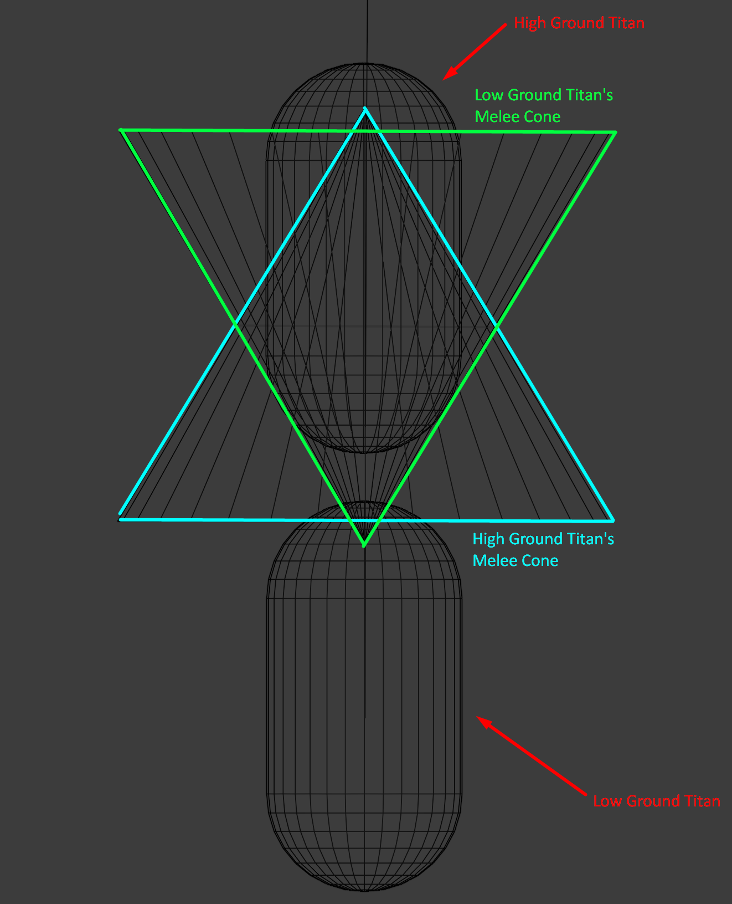

# 🟢 Melee Tech

## <mark style="color:yellow;">Melee Pin</mark>

Melee pinning is the act of making the enemy Titan's melee attack not register. Basically, preventing enemy melee from dealing damage and executing a doomed Titan.\
\
To activate, have your melee reach the enemy Titan before their melee does. It stacks with more than one Titan, so you can have 2 Titans melee one Titan at different times to completely stop his melee from dealing any damage.&#x20;

### <mark style="color:yellow;">**Melee Pin Facts**</mark>

* <mark style="color:yellow;">Melee Pin makes enemy titan melee not register.</mark>
* <mark style="color:yellow;">Multiple Titans can melee pin a singular Titan.</mark>
* <mark style="color:yellow;">Works against Sword Core melee too.</mark>
* <mark style="color:yellow;">Works better against Ronin due to Ronin having by default a slower melee than the other Titans.</mark>

“Insert Video Here”

## <mark style="color:yellow;">Melee Pin Reset/Counter</mark>

You can prevent melee pin by meleeing the enemy faster or if the enemy misses their melee.\
If you're already getting melee pinned, you can reset the enemy pin by waiting out their melee.\
\
There's a few seconds time delay after the enemy melee hits and then needs to redeploy. Meleeing right after their melee hits you will guarantee that your melee registers, and you'll be able to melee pin the enemy Titan.

### <mark style="color:yellow;">**Possible ways to reset/counter Melee Pin:**</mark>

* <mark style="color:yellow;">Melee earlier than the enemy</mark> (even earlier as Ronin).
* <mark style="color:yellow;">Wait out the enemy Titan's first melee and immediately counter-melee them.</mark>
* <mark style="color:yellow;">Phasing after meleeing will prevent the enemy from melee pinning you.</mark>
* <mark style="color:yellow;">Dash out to make the enemy miss their melee.</mark>
* <mark style="color:yellow;">Ronin's sword has a slightly longer melee reach than Titan melee; you can melee edge enemy Titans right out of their melee range, preventing melee pin.</mark>
* <mark style="color:yellow;">Activating melee right as you start ejecting will make it impossible for an enemy to melee pin you due to damage immunity; moreover, you'll deal eject damage to them too.</mark>

“Insert Video Here”

## <mark style="color:yellow;">Melee Dash Penalty</mark>

Melee pin might be an intentionally created mechanic by Respawn, as you'll be unable to dash back right after hitting a Titan with melee to prevent an enemy from melee pinning you right afterward. \
\
If you dash in a time frame of 0-1 sec after your melee hits a Titan, your dash will be exhausted without moving you, similar to an Arc Wave affecting your dash. This will mess up your Phase movement too; the only way to counter this is to activate Sword Core right after your melee hits.

### &#x20; <mark style="color:yellow;">**Key Features**</mark>

* <mark style="color:yellow;">Trying to dash right after your melee hits a Titan will exhaust your dash</mark> (roughly 0-1 sec after melee lands).
* [Activating Sword Core after melee hits will ignore this issue.](../ronin/ronin-tech/sword-core-dash-unlock.md)

“Insert Video Here”

## <mark style="color:yellow;">Low Ground vs. High Ground Vertical Melee</mark>

Melee range is highly influenced by the verticality of both players. Simply put, if you are below an enemy player, you have more effective melee range than they do. Especially when in Sword Core, you can position yourself lower than your opponent (lower on a ramp or slope or underneath them on map geometry like bridges and such). This is a trade-off and not a universal rule, however, since playing off height can give you a mobility advantage when dashing off height. This verticality range difference can also be exaggerated or mitigated by both players by using crouch. If the high-ground player crouches, then he can INCREASE his downward-facing effective melee range, while the low-ground player's crouch will DECREASE the effective melee ranges of both players in the engagement at the same time.&#x20;

The rule of thumb here is if you have high ground and are worried your swing might be out of range, crouch to extend your downward range. If you are playing from the low ground and want max reach for yourself, do not crouch. If you are worried their melee will hit you, then crouching might increase the range gap enough to let you dodge the swing.

### <mark style="color:yellow;">Model and Video Showcase</mark>&#x20;



<figure><figcaption></figcaption></figure>







## <mark style="color:yellow;">Angled Melee</mark>

Melee applies a set amount of knockback _in the direction you are looking_. Crouching lets you get a higher punch angle, and if you can get them into the air, they will go farther because they are no longer slowed by ground friction.\
\
It's so strong that you can literally knock back an Ogre Titan (despite them having by default 20% reduced knockback) into the air and cause them to jump backwards.

It's straightforward and useful to perform, yet it's so hardly known by many players.&#x20;

### <mark style="color:yellow;">Use Cases for Angled Melee</mark>

* <mark style="color:yellow;">Push enemies off spots</mark> (into a pit, over a small obstacle, off a flag, etc.)<mark style="color:yellow;">.</mark>
* <mark style="color:yellow;">Punch away a Scorch that's Flame-Shielding you while taking minimal damage and making distance</mark> (useful as Legion)<mark style="color:yellow;">.</mark>
* <mark style="color:yellow;">To activate the</mark> [double-hit Laser-Shot/Energy-Siphon glitch.](../ion/ion-tech/double-hit-laser-shot.md) <mark style="color:yellow;">Since the Titan is moving, even though not on its own.</mark>

“Insert Video Here”
