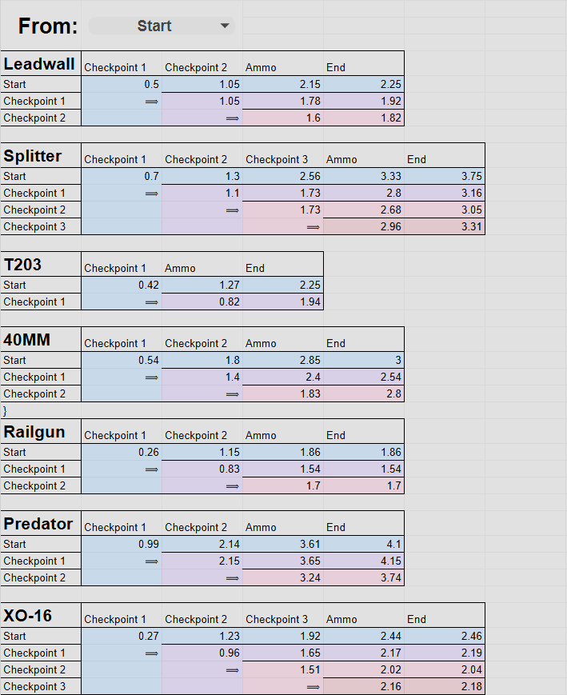
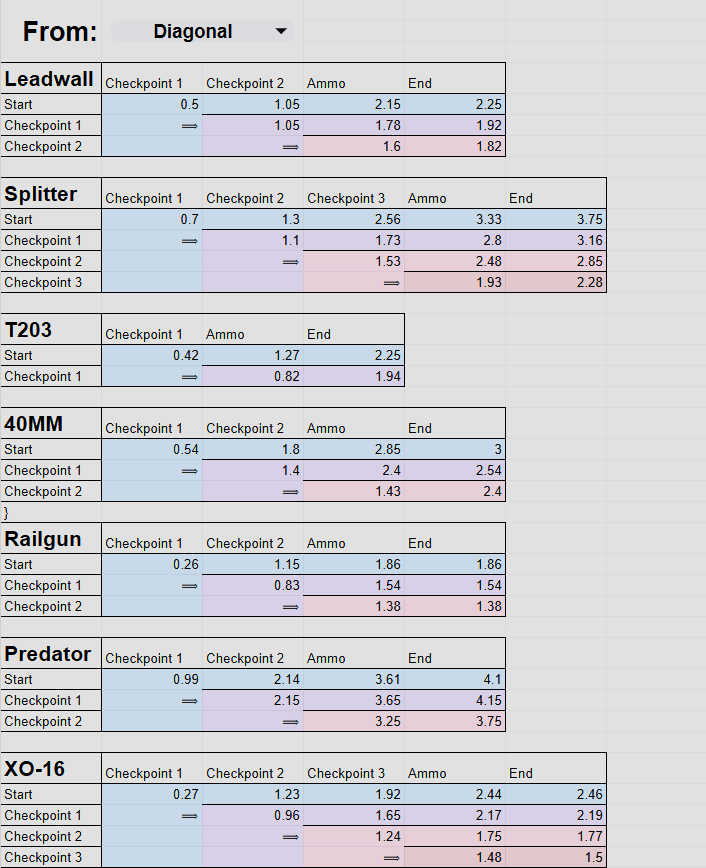

# 🟢 Reload Cancel & Checkpoints

## <mark style="color:yellow;">Reload Cancel & Checkpoints</mark>

It's handy tech that lets you pause/cycle/reset a segment of your reload when you interrupt your reload with melee, ability, and even cores that hide your weapon.

Each Titan has 2 or more reload checkpoints, but only Scorch's and Ion's reload gets sped up. Reload checkpoints are essentially little segments inside of a reload; if you interrupt your reload (checkpoint cycle) when you've reached said segment, your reload will cycle to the next reload checkpoint.&#x20;

But if you interrupt before reaching the next reload checkpoint, you'll revert to the previous checkpoint, so if you constantly interrupt your reload, you'll keep going back to said checkpoint.

### <mark style="color:yellow;">Reload Terms</mark>

* <mark style="color:yellow;">Checkpoint Cycling</mark> (1-3)<mark style="color:yellow;">:</mark> aka. Simply as “checkpoints”, they continue the current reload segment in the background without finishing it. The amount of time cycled[^1] varies, usually medium to long (if specified).<mark style="color:orange;">**⟨1⟩**<mark style="color:orange;">&#x20;
* <mark style="color:yellow;">Reload Cancel:</mark> Exclusive to Scorch and Tone<mark style="color:orange;">**⟨2⟩**<mark style="color:orange;">, it lets you immediately fire your gun without delay after interruption.
* <mark style="color:yellow;">Ammo Refill:</mark> When your weapon gets ammo refilled in the ammo counter, but you're not yet able to shoot.
* <mark style="color:yellow;">End</mark> <mark style="color:yellow;">Point:</mark> Point at which you're finally able to fire your gun after the reload.
* <mark style="color:yellow;">Commit Point:</mark> It's a short time after activating reload when you may revert your reload. More to it in the “Commit Point” section at the bottom.


<mark style="color:orange;">**⟨1⟩**<mark style="color:orange;">“Reload Cancel” and “Ammo Refill” don't count unless specified, since they either are instant with no return point or are too close to the end.

<mark style="color:orange;">**⟨2⟩**<mark style="color:orange;">Though Tone needs to do “checkpoint 2” first to reload cancel.


## <mark style="color:yellow;">Titan Reloads with Timestamps & Checkpoints</mark>

This is a simple overview of everything excluding <mark style="color:yellow;">“Commit Point”</mark> and <mark style="color:yellow;">“Ammo Refill”</mark> for the sake of simplicity. See Dinorush13's “Reload Timings Timetable” for detailed reloads. The reloads below are listed via timestamps that show when the checkpoints and end point appear; this list doesn't show time changed by using checkpoints.

### <mark style="color:yellow;">Ion</mark>

* <mark style="color:yellow;">3 Reload Checkpoints</mark> (Use Vortex at Checkpoints 1 and 3 for Faster Reload)<mark style="color:orange;">**⟨1⟩**<mark style="color:orange;">
  1. <mark style="color:yellow;">Checkpoint 1</mark> <mark style="color:yellow;">{0.7s}</mark> (When the left hand appears.)
  2. <mark style="color:yellow;">Checkpoint 2 \[medium] {1.3s}</mark> (When the hand pulls out the ammo cylinder.)&#x20;
  3. <mark style="color:yellow;">Checkpoint 3 \[medium] {2.56s}</mark> (When the ammo cylinder gets put inside the weapon.)
  4. Ammo Refill {3.33s}
  5. <mark style="color:yellow;">End Point {3.75}</mark>



















### <mark style="color:yellow;">Scorch DONE</mark>

* <mark style="color:yellow;">1 Reload Checkpoint</mark>&#x20;
  1. <mark style="color:yellow;">Checkpoint 1</mark> <mark style="color:yellow;">{0.42s}</mark> (When the shell fully ejects.)&#x20;
  2. <mark style="color:yellow;">Checkpoint 2: Reload Cancel</mark><mark style="color:orange;">**⟨2⟩**<mark style="color:orange;"> <mark style="color:yellow;"><-></mark> <mark style="color:yellow;">Ammo Refill</mark> <mark style="color:yellow;">{1.27s}</mark> (When the shell touches the inside of the weapon.)
  3. <mark style="color:yellow;">End Point {2.25s}</mark>















### <mark style="color:yellow;">Northstar DONE</mark>

* <mark style="color:yellow;">2 Reload Checkpoints</mark>&#x20;
  1. <mark style="color:yellow;">Checkpoint 1</mark> <mark style="color:yellow;">{0.26s}</mark> (When the magazine falls out of view.)
  2. <mark style="color:yellow;">Checkpoint 2</mark> <mark style="color:yellow;">{1.15s}</mark> (When the magazine gets placed inside.)
  3. <mark style="color:yellow;">Ammo Refill <-> End Point {1.86s}</mark>















### <mark style="color:yellow;">Ronin</mark>

* <mark style="color:yellow;">3 Reload Checkpoints</mark>
  1. <mark style="color:yellow;">Checkpoint 1 {0.5s}</mark>&#x20;
  2. <mark style="color:yellow;">Checkpoint 2 \[long] {1.05}</mark> (Large time window to interrupt: From when the hand reappears fully from the left until the new drum gets placed inside of the Leadwall.)
     * <mark style="color:yellow;">Bugged Checkpoint 3</mark><mark style="color:orange;">**⟨3⟩**<mark style="color:orange;"> (when you interrupt before reaching checkpoint 2.)
  3. <mark style="color:yellow;">Checkpoint 3 <-> Ammo Refill {2.15}</mark> (The spinning drum animation that happens after interrupting on checkpoint 2.) &#x20;
  4. <mark style="color:yellow;">End Point {2.25s}</mark>



















### <mark style="color:yellow;">Tone DONE</mark>

* <mark style="color:yellow;">2 Reload Checkpoints</mark>&#x20;
  1. <mark style="color:yellow;">Checkpoint 1</mark> <mark style="color:yellow;">{0.54s}</mark> (When the drum fully falls out.)
  2. <mark style="color:yellow;">Checkpoint 2</mark> <mark style="color:yellow;">\[medium]</mark> <mark style="color:yellow;">{1.8s}</mark> (The moment the drum touches the gun.)
     1. <mark style="color:yellow;">Bonus Checkpoint 3: Reload Cancel</mark> <mark style="color:yellow;"><-></mark> <mark style="color:yellow;">Ammo Refill {2.85}</mark><mark style="color:orange;">**⟨4⟩**<mark style="color:orange;"> (Requires checkpoint 2; interrupt once the gun reappears fully and is about to do the jerk-up animation.)
  3. <mark style="color:yellow;">End Point</mark> <mark style="color:yellow;">{3s}</mark>



















### <mark style="color:yellow;">Legion</mark>

* <mark style="color:yellow;">3 Reload Checkpoints</mark>
  1. <mark style="color:yellow;">Checkpoint 1</mark> <mark style="color:yellow;">{0.99s}</mark>
  2. <mark style="color:yellow;">Checkpoint 2</mark> <mark style="color:yellow;">{2.14s}</mark>
  3. <mark style="color:yellow;">Ammo Refill</mark> <mark style="color:yellow;">{3.61s}</mark>
  4. <mark style="color:yellow;">End Point</mark> <mark style="color:yellow;">{4.1s}</mark>



















### <mark style="color:yellow;">Monarch</mark>

* <mark style="color:yellow;">2 Reload Checkpoints</mark><mark style="color:orange;">**⟨5⟩**<mark style="color:orange;">
  1. <mark style="color:yellow;">Checkpoint 1 {0.27s}</mark>
  2. <mark style="color:yellow;">Checkpoint 2</mark> <mark style="color:yellow;">{1.23s}</mark>
  3. <mark style="color:yellow;">Checkpoint 3</mark> <mark style="color:yellow;">{1.92s}</mark>
  4. <mark style="color:yellow;">Ammo Refill <-> End Point {2.46s}</mark> (Literally just 0.02s apart from each other.)




















<mark style="color:orange;">**⟨1⟩**<mark style="color:orange;"><mark style="color:yellow;">Ion can speed up her reload by like 0.3-0.4 seconds if you use Vortex Shield to interrupt her reload on checkpoints 1 and 3, especially with</mark> [Quickswap](quickswap-crouch-tech.md)<mark style="color:yellow;">. A 0.3-0.4 sec reduction corresponds to 8-10% faster reload.</mark>

<mark style="color:orange;">**⟨2⟩**<mark style="color:orange;"><mark style="color:yellow;">Scorch can also do an</mark> [advanced reload cancel.](../scorch/scorch-tech/advanced-reload-cancel.md)

<mark style="color:orange;">**⟨3⟩**<mark style="color:orange;"><mark style="color:yellow;">The bugged checkpoint is weird and unique to Ronin. Basically prevents Ronin from doing checkpoint 2. Letting you only do checkpoints 1 and 3. Moreover, t</mark><mark style="color:yellow;">he ammo refill conveniently happens at the same time as this reload cancel, so I tagged it too. This doesn't mean you need to do this bug to activate the ammo refill.</mark>

<mark style="color:orange;">**⟨4⟩**<mark style="color:orange;"><mark style="color:yellow;">Unlike with Scorch it's faster to finish reloading normally. This just lets you get in a melee/sonar and immediately shoot afterward without waiting for the reload animation to play again.</mark>

<mark style="color:orange;">**⟨5⟩**<mark style="color:orange;"><mark style="color:yellow;">Monarch's reload checkpoints are the same with the Rearm and Reload Upgrade Core.</mark>


### <mark style="color:yellow;">Dinorush13's Reload Timings Timetable</mark>

Dinorush13 went ahead and made a timetable for all the checkpoint timings, so massive thanks to him for doing this work and uploading it onto Google Drive. [Here's the link to the timetable.](https://docs.google.com/spreadsheets/d/1uog2CAEXKVuL5Q34p4jAsBzBOqS8ZfqWN_qNYlmz-3U/edit?gid=0#gid=0) The data provided the time for interruptions themselves. So going from x to x means an instant 0-second ability/melee interruption happened.

But if you don't have a Google account to copy and edit the timetable to see all functions, or you just don't want to. Don't worry, I made sure to screenshot all available functions of the timetable.



### <mark style="color:yellow;">Reload Timings by Dinorush13</mark>

<table data-header-hidden="false" data-header-sticky><thead><tr><th>Left Info Box</th></tr></thead><tbody><tr><td>Titanfall 2's reload system has “checkpoints” or “stages”, where interrupting the reload with another action will pick back up from the last checkpoint. However, contrary to what you would expect, checkpoints are not consistent points in the animation and can change the reload time.</td></tr><tr><td>The point at which a checkpoint is reached depends on which checkpoint you were at before. The time to complete a reload from a checkpoint depends on its own unique reload time.</td></tr><tr><td>This sheet measures, in seconds, the time to reach each checkpoint and finish the reload from any given starting point. Start refers to the initial, normal reload, while each checkpoint represents the points at which you can interrupt the reload and resume. The ammo timing represents when the magazine is refilled.</td></tr></tbody></table>

| Right Info Box                                                                                                                                                                      |
| ----------------------------------------------------------------------------------------------------------------------------------------------------------------------------------- |
| “From” determines where subsequent checkpoint times start. E.g. <mark style="color:yellow;">“Start”</mark> changes the timings of checkpoints to be relative to the initial reload. |
| <mark style="color:yellow;">“Diagonal”</mark> instead adds the Start → Checkpoint 1 → Checkpoint 2 times (the diagonal of the table).                                               |
| **If you want to change the “From” setting, make a copy and change it there.**                                                                                                      |
| Numbers obtained with a Northstar mod that retrieved the current checkpoint every frame and printed the time when it changed.                                                       |



<figure><figcaption></figcaption></figure>



<figure><figcaption></figcaption></figure>



<figure><figcaption></figcaption></figure>



<figure><figcaption></figcaption></figure>



## <mark style="color:yellow;">Reverting the Reload/</mark><mark style="color:yellow;">Commit Point</mark>

You can actually stop your gun from reloading entirely, letting you revert it and still have your remaining ammo. You can do it by interrupting (melee, ability, core, etc.) a reload before the ammo number disappears, so before you reach any checkpoints.&#x20;

Some Titans have stricter time windows than others, Legion offers the biggest time window to revert a reload. Useful if you missclicked or a Ronin/Scorch jumps at you 0.1 seconds after you started reloading.

Scorch is the only Titan unable to do this due to having only 1 shot. You can't stop a reload if the magazine is empty. By “stop,” I imply “revert a reload.” Sure, you can technically stop Scorch's reload by meleeing or holding a shield, but it'll auto-reload the moment you stop interrupting it.

### <mark style="color:yellow;">Video of Reverting a Reload</mark>

[^1]: Progressed through part of the reload without being shown.
