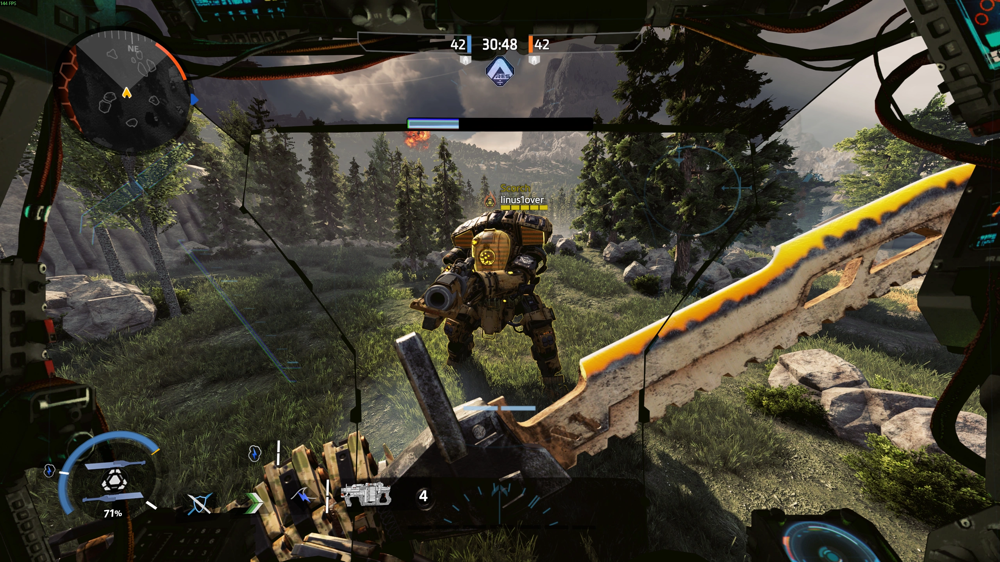
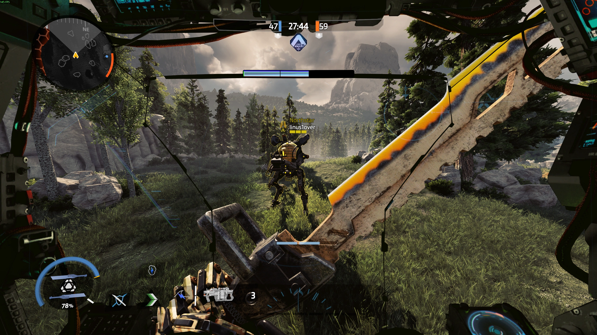
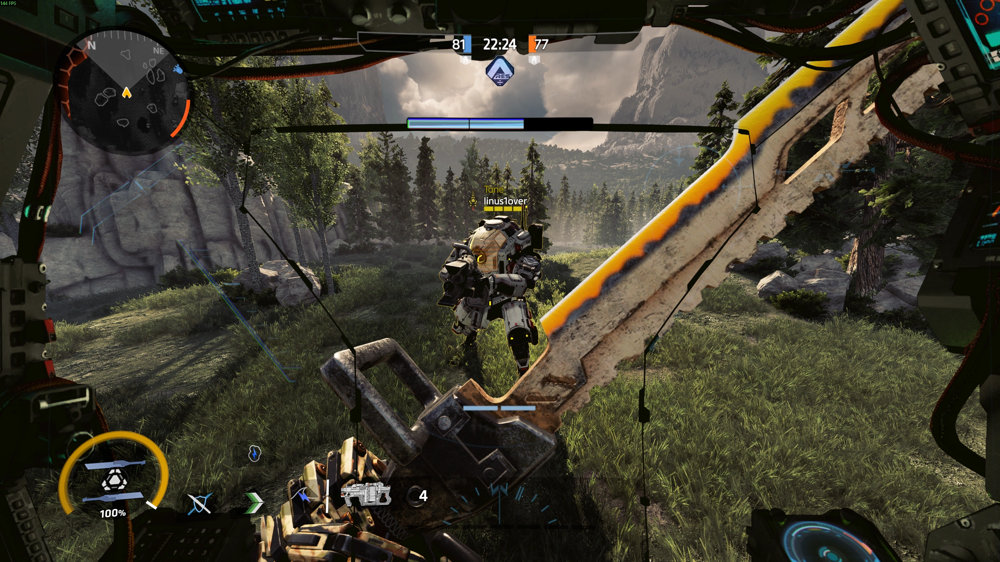
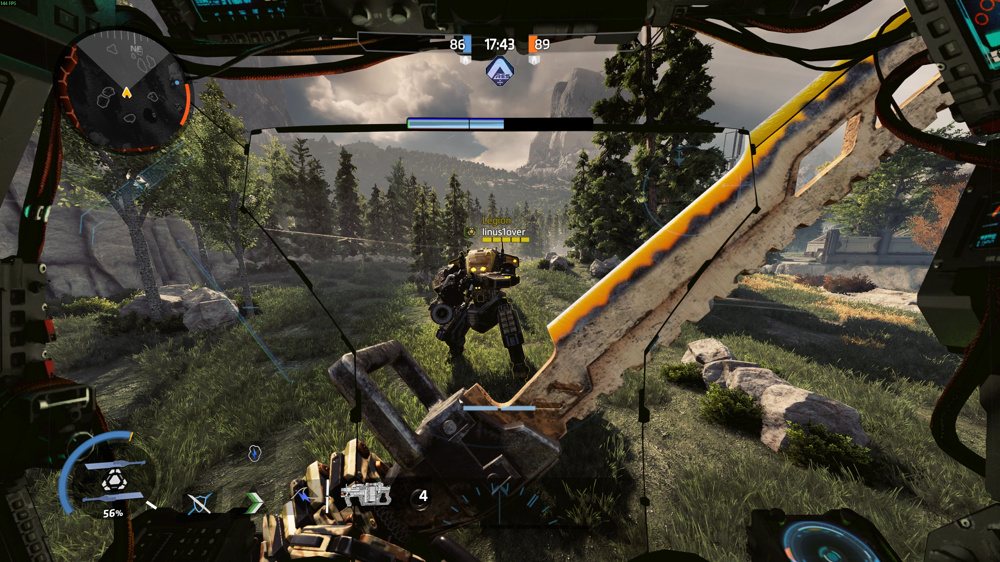
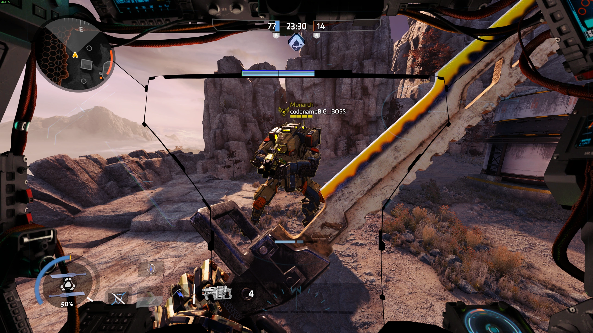

# ℹ️ Titan Weak Points

## <mark style="color:yellow;">What Are Titans' Weak Points?</mark>

Titan weak points are red-outlined areas on a Titan's face but can also show on Legion/Scorch's vents. Those spots are important because, depending on the weapon you use, you'll deal additional damage. This also allows Pilots to damage Titans with Pilot weapons while also dealing a tad more damage depending on the weapon.&#x20;

### <mark style="color:yellow;">Titan Weapon/Ability Crit Table</mark>

Scorch will be fully excluded from the table because Scorch doesn't have a _**single**_ way to crit a Titan!

By “damage increase,” the value in brackets is considered the far damage value, due to most weapons having a damage falloff at range, meaning they deal less damage the farther away the target is.\
Some weapons/abilities don't have any damage falloff.

“N.A.” implies that the weapon/ability can't crit.

<table data-full-width="false"><thead><tr><th width="239">Weapon/Ability</th><th width="146" align="center">Crit Multiplier</th><th align="center">Total Titan Damage Increase per Shot (far range)</th></tr></thead><tbody><tr><td><mark style="color:yellow;">Splitter Rifle (Not Split)</mark></td><td align="center"><mark style="color:yellow;">1.5x</mark></td><td align="center"><mark style="color:yellow;">80</mark> <mark style="color:red;">(60)</mark> <mark style="color:yellow;">-></mark> <mark style="color:yellow;">120</mark> <mark style="color:red;">(90)</mark></td></tr><tr><td><mark style="color:yellow;">Splitter Rifle (Split Total)</mark></td><td align="center"><mark style="color:yellow;">1.5x</mark></td><td align="center"><mark style="color:yellow;">168</mark> <mark style="color:red;">(126)</mark> <mark style="color:yellow;">-></mark> <mark style="color:yellow;">252</mark> <mark style="color:red;">(189)</mark></td></tr><tr><td>Vortex Shield</td><td align="center">N.A.</td><td align="center">N.A.</td></tr><tr><td>Tripwire</td><td align="center">N.A.</td><td align="center">N.A.</td></tr><tr><td><mark style="color:yellow;">Laser Shot</mark></td><td align="center"><mark style="color:yellow;">1.5x</mark></td><td align="center"><mark style="color:yellow;">1,200</mark> <mark style="color:yellow;">-></mark> <mark style="color:yellow;">1,800</mark></td></tr><tr><td>Laser Core</td><td align="center">N.A.</td><td align="center">N.A.</td></tr><tr><td></td><td align="center"></td><td align="center"></td></tr><tr><td><mark style="color:yellow;">Plasma Railgun (Full Charge)</mark></td><td align="center"><mark style="color:yellow;">1.5x</mark></td><td align="center"><mark style="color:yellow;">2,050 -> 3,075</mark></td></tr><tr><td>Cluster Rocket</td><td align="center">N.A.</td><td align="center">N.A.</td></tr><tr><td>Flight Core</td><td align="center">N.A.</td><td align="center">N.A.</td></tr><tr><td></td><td align="center"></td><td align="center"></td></tr><tr><td><mark style="color:yellow;">Leadwall (8 Shells per Shot)</mark></td><td align="center"><mark style="color:yellow;">1.5x</mark></td><td align="center"><mark style="color:yellow;">800</mark> <mark style="color:red;">(600)</mark> <mark style="color:yellow;">-> 1,200</mark> <mark style="color:red;">(900)</mark></td></tr><tr><td>Arc Wave</td><td align="center">N.A.</td><td align="center">N.A.</td></tr><tr><td></td><td align="center"></td><td align="center"></td></tr><tr><td><mark style="color:yellow;">40 mm Tracker Cannon</mark></td><td align="center"><mark style="color:yellow;">1.5x</mark></td><td align="center"><mark style="color:yellow;">330 -> 495</mark></td></tr><tr><td>Tracker Rockets</td><td align="center">N.A.</td><td align="center">N.A.</td></tr><tr><td>Salvo Core</td><td align="center">N.A.</td><td align="center">N.A.</td></tr><tr><td></td><td align="center"></td><td align="center"></td></tr><tr><td><mark style="color:yellow;">Predator Cannon</mark></td><td align="center"><mark style="color:yellow;">1.5x</mark></td><td align="center"><mark style="color:yellow;">100</mark> <mark style="color:red;">(72)</mark> <mark style="color:yellow;">-> 150</mark> <mark style="color:red;">(108)</mark></td></tr><tr><td><mark style="color:yellow;">Power Shot</mark></td><td align="center"><mark style="color:yellow;">1.5x</mark></td><td align="center"><mark style="color:yellow;">2,000 -> 3,000</mark></td></tr><tr><td><mark style="color:yellow;">Smart Core Predator Cannon</mark></td><td align="center"><mark style="color:yellow;">1.5x</mark></td><td align="center"><mark style="color:yellow;">120</mark> <mark style="color:red;">(86)</mark> <mark style="color:yellow;">-> 180</mark> <mark style="color:red;">(130)</mark></td></tr><tr><td><mark style="color:yellow;">Smart Core Power Shot</mark></td><td align="center"><mark style="color:yellow;">1.5x</mark></td><td align="center"><mark style="color:yellow;">2,400 -> 3,600</mark></td></tr><tr><td></td><td align="center"></td><td align="center"></td></tr><tr><td><mark style="color:yellow;">XO-16 Chaingun</mark></td><td align="center"><mark style="color:yellow;">1.5x</mark></td><td align="center"><mark style="color:yellow;">120</mark> <mark style="color:red;">(100)</mark> <mark style="color:yellow;">-></mark> <mark style="color:yellow;">180</mark> <mark style="color:red;">(150)</mark></td></tr><tr><td><mark style="color:yellow;">XO-16 Accelerator</mark></td><td align="center"><mark style="color:yellow;">1.5x</mark></td><td align="center"><mark style="color:yellow;">150</mark> <mark style="color:red;">(125)</mark> <mark style="color:yellow;">-> 225</mark> <mark style="color:red;">(187)</mark></td></tr><tr><td>Energy Siphon</td><td align="center">N.A.</td><td align="center">N.A.</td></tr><tr><td>Rocket Salvo</td><td align="center">N.A.</td><td align="center">N.A.</td></tr></tbody></table>


All the values above show only Titan damage; Pilots don't get crits but instead headshots for a damage multiplier, which on its own has different values, so no point in doing it here.

Some weapons/abilities can have a 1x crit multiplier, which basically technically makes them crit but  not increase damage, I'll exclude those since they serve no purpose.

Leadwall and other weapons that involve multiple projectiles per shot, I list only total damage per shot, not per single projectile in a shot.


## <mark style="color:yellow;">Displayed Titan Weak Points</mark>

Here are the Titans' weak points shown in-game in tritanopia colorblind mode (so Titans are displayed in yellow instead of red). The weak points only show up when you look directly at a Titan, flashing in the same color as the Titan's outline color.&#x20;

I found out that the visible Titan weak points are not accurate at all, especially for Northstar and Ronin, so I spent [2-3 hours](#user-content-fn-1)[^1] in total shooting all Titans and their Prime variants with the CAR SMG. The red outlines are as close as possible to true weak points. Do keep in mind that those red outlines are very precise, even though it may seem wrong, but there are instances of the true weak spot being outside of the visual one or it being inside but disproportionately smaller. The true weak points images will be underneath the normal ones for side-to-side comparison.

Displaying each Titan as well as their Prime counterpart in not zoomed-in format in the “Example” tab, both variants in idle and reload state while zoomed out. The other 2 tabs have only zoomed-in images for the sake of reduced clutter and easier readability when comparing weak points to true weak points. The red outlines will only be shown in the “Idle State” and “Reload State”.


If you noticed, it seems like Respawn made weak points for each Chassis type, but not for different Titan nor Prime variant. So for example, Northstar, Northstar Prime, Ronin, and Ronin Prime, all share same weak points. Though depending on the shape of the face, it might be a bit different, but in general it's same weak points but with a different Titan face structure. \
So there are 3 different types of weak points layouts, Stryder, Atlas, and Ogre.


### <mark style="color:yellow;">Ion and Ion Prime Weak Points</mark>



Believe me, you would rather not open this page and be forced to load up 22 images every time. :)\
This tab is mainly a cover to not force your browser to load images, press other tabs to view the images.



<figure><figcaption></figcaption></figure>

<figure><figcaption></figcaption></figure>

<figure><figcaption></figcaption></figure>

<figure><figcaption></figcaption></figure>



<figure><figcaption></figcaption></figure>

<figure><figcaption></figcaption></figure>

<figure><figcaption></figcaption></figure>

<figure><figcaption></figcaption></figure>



<figure><figcaption></figcaption></figure>

<figure><figcaption></figcaption></figure>

<figure><figcaption></figcaption></figure>

<figure><figcaption></figcaption></figure>



### <mark style="color:yellow;">Scorch and Scorch Prime Weak Points</mark>



Believe me, you would rather not open this page and be forced to load up 22 images every time. :)\
This tab is mainly a cover to not force your browser to load images, press other tabs to view the images.



<figure><figcaption></figcaption></figure>

<figure><figcaption></figcaption></figure>

<figure><figcaption></figcaption></figure>

<figure><figcaption></figcaption></figure>



<figure><figcaption></figcaption></figure>

<figure><figcaption></figcaption></figure>

<figure><figcaption></figcaption></figure>

<figure><figcaption></figcaption></figure>



<figure><figcaption></figcaption></figure>

<figure><figcaption></figcaption></figure>

<figure><figcaption></figcaption></figure>

<figure><figcaption></figcaption></figure>



### <mark style="color:yellow;">Northstar and Northstar Prime Weak Points</mark>



Believe me, you would rather not open this page and be forced to load up 22 images every time. :)\
This tab is mainly a cover to not force your browser to load images, press other tabs to view the images.




<figure><figcaption></figcaption></figure>

<figure><figcaption></figcaption></figure>

<figure><figcaption></figcaption></figure>

<figure><figcaption></figcaption></figure>



<figure><figcaption></figcaption></figure>

<figure><figcaption></figcaption></figure>

<figure><figcaption></figcaption></figure>

<figure><figcaption></figcaption></figure>



<figure><figcaption></figcaption></figure>

<figure><figcaption></figcaption></figure>

<figure><figcaption></figcaption></figure>

<figure><figcaption></figcaption></figure>



### <mark style="color:yellow;">Ronin and Ronin Prime Weak Points</mark>



Believe me, you would rather not open this page and be forced to load up 22 images every time. :)\
This tab is mainly a cover to not force your browser to load images, press other tabs to view the images.



<figure><figcaption></figcaption></figure>

<figure><figcaption></figcaption></figure>

<figure><figcaption></figcaption></figure>

<figure><figcaption></figcaption></figure>



<figure><figcaption></figcaption></figure>

<figure><figcaption></figcaption></figure>

<figure><figcaption></figcaption></figure>

<figure><figcaption></figcaption></figure>



<figure><figcaption></figcaption></figure>

<figure><figcaption></figcaption></figure>

<figure><figcaption></figcaption></figure>

<figure><figcaption></figcaption></figure>



### <mark style="color:yellow;">Tone and Tone Prime Weak Points</mark>



Believe me, you would rather not open this page and be forced to load up 22 images every time. :)\
This tab is mainly a cover to not force your browser to load images, press other tabs to view the images.



<figure><figcaption></figcaption></figure>

<figure><figcaption></figcaption></figure>

<figure><figcaption></figcaption></figure>

<figure><figcaption></figcaption></figure>



<figure><figcaption></figcaption></figure>

<figure><figcaption></figcaption></figure>

<figure><figcaption></figcaption></figure>

<figure><figcaption></figcaption></figure>



<figure><figcaption></figcaption></figure>

<figure><figcaption></figcaption></figure>

<figure><figcaption></figcaption></figure>

<figure><figcaption></figcaption></figure>



### <mark style="color:yellow;">Legion and Legion Prime Weak Points</mark>



Believe me, you would rather not open this page and be forced to load up 22 images every time. :)\
This tab is mainly a cover to not force your browser to load images, press other tabs to view the images.



<figure><figcaption></figcaption></figure>

<figure><figcaption></figcaption></figure>

<figure><figcaption></figcaption></figure>

<figure><figcaption></figcaption></figure>



<figure><figcaption></figcaption></figure>

<figure><figcaption></figcaption></figure>

<figure><figcaption></figcaption></figure>

<figure><figcaption></figcaption></figure>



<figure><figcaption></figcaption></figure>

<figure><figcaption></figcaption></figure>

<figure><figcaption></figcaption></figure>

<figure><figcaption></figcaption></figure>



### <mark style="color:yellow;">Monarch Weak Points</mark>



Believe me, you would rather not open this page and be forced to load up 22 images every time. :)\
This tab is mainly a cover to not force your browser to load images, press other tabs to view the images.



<figure><figcaption></figcaption></figure>

<figure><figcaption></figcaption></figure>



<figure><figcaption></figcaption></figure>

<figure><figcaption></figcaption></figure>



<figure><figcaption></figcaption></figure>

<figure><figcaption></figcaption></figure>



[^1]: :sob:
